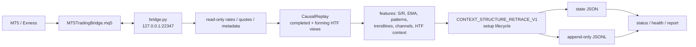
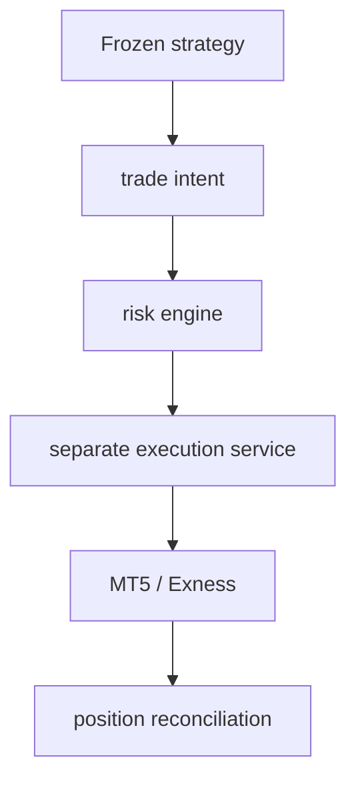

# Architecture



The current V1 path is read-only at the broker boundary. It reads symbol
metadata, quotes and rates; it causally synchronizes M5/M15/H1/H4 context;
creates descriptive setup events; monitors retracement; and records simulated
economic positions and shadow hypotheses. It does not send, modify or close
broker orders.

The reusable `context_structure_retrace/` package owns causal replay,
normalization, indicators, S/R zones, attention candidates, patterns and
feature schemas. The forward runner owns persistence and lifecycle orchestration.

## Future, not implemented



This execution architecture is intentionally outside V1. The bridge contains
live-capable primitives, but the V1 runner's explicit read-tool allow-list and
order-isolation tests prevent access to them.
## Signal orchestration layer

The separate `SIGNAL_ORCHESTRATOR_SHADOW_V1` process observes enabled
strategy ledgers through adapters and translates them into immutable
`StrategySignal` records. It routes each signal independently to audit,
shadow account sizing, and the internal distribution queue. It does not write
Phase 6 or Phase 7 state and has no broker-write path.

```text
strategy ledger -> adapter -> StrategySignal -> audit
                                      |-> portfolio/account shadow sizing
                                      `-> internal distribution queue
```

Live execution remains a future, separate consumer and is disabled here.
# Execution boundary (Phase 1)

The separate `live_execution_consumer.py` reads prospective orchestrator
signals and executable sizing decisions into isolated `ExecutionIntent`
records. It is currently `DRY_RUN` and depends only on `BrokerReadAdapter`.
Distribution remains an independent route. No broker-write adapter is
reachable.
