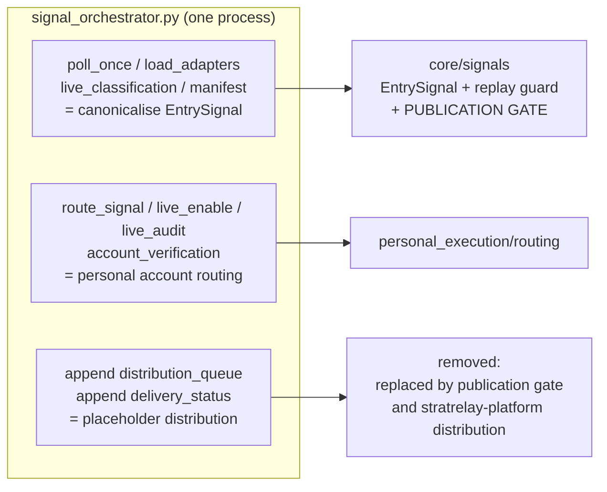

# Current modules → target domains

Machine-readable and complete: `data/module_domain_map.csv` (all 503 tracked files at
`eda827c`: domain, target repo, **domain-aligned path**, split notes, live-reachability).
Generated tables: `data/domain_tables.md`.  Regenerate with
`python3 docs/architecture/tools/map_domains.py`.  This page explains the *reasoning*.

## 1. What the current names mean in the new model

| Current name | What it actually contains | Target | Verdict |
|---|---|---|---|
| **`orchestration/`** + `signal_orchestrator.py` | (a) strategy-event → `StrategySignal` canonicalisation (`adapters/`, `poll_once`); (b) per-account sizing, tradeability, `order_check`, live arming, account verification (`route_signal`, `live_enable`, `risk.py`, `tradeability.py`); (c) `distribution_queue` / `delivery_status`; (d) strategy registry and portfolio routing; (e) the replay guard; (f) MT5 read adapter; (g) JSONL store | (a)(e) → `core/signals`; (b)(d-portfolio) → `personal_execution`; (c) **dropped**; (d-strategy) → `core/strategy`; (f) → `adapters/mt5`; (g) → `kernel/transitional` | **the name is retired**; it is three domains sharing a process |
| **Trade Manager** (`trade_manager/`) | broker-free evaluator, policies, observation, counterfactual/prospective research — **plus** `central.py` (ownership registry, broker-state stream, management proposals, authorisation) | evaluator/policies/state/observation/counterfactual → `core/trade_management`; `central.py` → `personal_execution` | **core product capability, correctly broker-free except `central.py`** |
| **`execution/`** + `live_execution_consumer.py` | execution intents, arming, fail-closed risk policy, demo/real broker adapter, the REAL consumer | `personal_execution` (+ MT5 wire in `adapters/mt5`) | **optional consumer** — nothing in the commercial path may depend on it |
| **`control_api/`** | read-only operational API and strategy observability | `ops_api` (Trading Ops API) | internal only; **not** a customer API |
| **`strategies/`** | per-strategy README/STATUS/output docs | `core/strategy` (docs) | keep |
| **`context_structure_retrace/`** + root strategy runners | Context strategy detector package and runner; Liquidity Displacement detector and per-instrument runners | `core/strategy` | keep (byte-identical in Stage 1) |
| **`research/`**, `archive/`, root studies | backtests, discovery, audits, normalisation | `research`, `legacy` | keep; must emit evidence bundles for `performance` |
| **`postgres/`** | trading-DB persistence layer + Phase-6 import tooling | `kernel/persistence` (+ migration tools) | reuse; re-place schemas (`05_…` §5) |
| `scripts/mt5_stack*`, `scripts/start/stop_mt5_*` | MT5 terminal/bridge supervision **and** platform service supervision | bridge / platform split (A1) | as A1 |
| `docs/` | mixed | by domain | `DISTRIBUTION_PIPELINE.md` superseded |
| `MT5TradingBridge.mq5`, `bridge*.py`, `mt5_read_once.py` | MT5 integration | `mt5-native-bridge` | as A1 |

## 2. The three jobs of `signal_orchestrator.py` (642 lines)

Evidence: it writes the streams `signals`, `route_decisions`, `sizing_decisions`,
`tradeability_decisions`, `account_snapshots`, `classification_corrections`,
`distribution_queue`, `delivery_status`, `events`, and imports the MT5 provider, the risk
engine and the tradeability gate alongside the strategy adapters.  The existing docs
already describe the fan-out (`audit`, `shadow account sizing`, `internal distribution
queue`), i.e. the design intent was always separable routes.

## 3. The Trade Manager is already almost broker-independent

* `TradeManager.evaluate()` is documented and implemented as a *pure evaluator*; its
  action vocabulary (`HOLD, PROTECT_STOP, MOVE_BREAKEVEN, TRAIL_STOP, REDUCE_POSITION,
  CLOSE_POSITION, …`) already maps onto the required customer vocabulary
  (`02_…` §5).
* `CounterfactualPosition` keeps a hypothetical managed ledger **separate from the frozen
  position** ("update only the hypothetical ledger; never the frozen position") — the
  seed of the raw-vs-managed separation in `06_…`.
* Broker/account concepts enter only through `central.py` and through three fields on the
  decision record (`account_context_id`, `position_size`, `unrealized_pnl`).  Removing
  those and relocating `central.py` makes the Trade Manager a pure Trading-Core context.

## 4. Where the counts land

From `data/domain_tables.md` (503 files):

| domain | files | | domain | files |
|---|--:|---|---|--:|
| `core/strategy` | 122 | | `kernel` | 24 |
| `legacy` | 116 | | `core/trade_management` | 23 |
| `research` | 113 | | `ops_api` | 13 |
| `personal_execution` | 25 | | `core/signals` | 12 |
| `docs` | 18 | | `adapters/mt5` | 4 |
| `bridge` | 15 | | `core/performance` | 3 |
| `migration` | 14 | | `core/market` | 1 |

`core/performance` (3 files) and `core/market` (1 file) are nearly empty — those are the
capabilities that are **missing**, not merely misplaced.

## 5. Capabilities the target model needs that do not exist in the repository

| Capability | Status | Notes |
|---|---|---|
| Publication Gate, `PublishedSignal`, `ManagementSignal` | **absent** | replaces auto `distribution_queue`; reuses `replay_guard`, tradeability subset |
| `MarketDataProvider` port + `Instrument` catalogue | **absent** | today each runner embeds an MCP client; symbols hard-coded (`rstrip("m")`) |
| `BrokerClient` port | **partial** | `BrokerReadAdapter` / `BrokerExecutionAdapter` stubs in `execution/adapters.py`; write path is `DemoExecutionAdapter` |
| ManagedTrade reference model | **partial** | strategy economic positions + `ManagementState`; not published-signal-linked or version-bound |
| `SignalStream`, `StreamBinding`, `strategy_key` | **absent** | `instance_id` / composite `strategy_id` stand in |
| Performance observation / series / snapshot | **absent** | results registry docs + ledgers only |
| LIVE evidence ingest | **absent** | `LIVE_REAL_MONEY: none` despite REAL execution running |
| Commerce (customers, subscriptions, pricing, distribution, portal) | **absent** | not started; nothing to migrate |
| Outbox/inbox, consumer checkpoints (DB), fencing leases | **absent** | file equivalents exist (`fanout` checkpoints, ownership registry) |

## 6. Existing structure worth reusing (not replacing)

`stable_id` deterministic identities; `strategy-signal-v1` immutability and "no account
data" rule; `replay_guard` startup watermark; `TradeManager` purity and `idempotency_key`;
`CounterfactualPosition` separation; Phase 6/7 freeze boundaries and evidence
classifications; fail-closed `RiskPolicyResolver`; ownership proof + snapshot-version
authorisation in `central.py` (relocated, not rewritten); the Control API's read-only
guarantee; the Postgres foundation (checksummed migrations, stable-id upserts,
append-only lifecycle rows).
