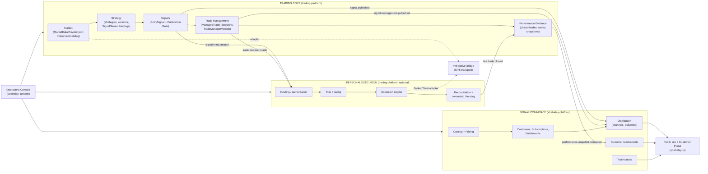
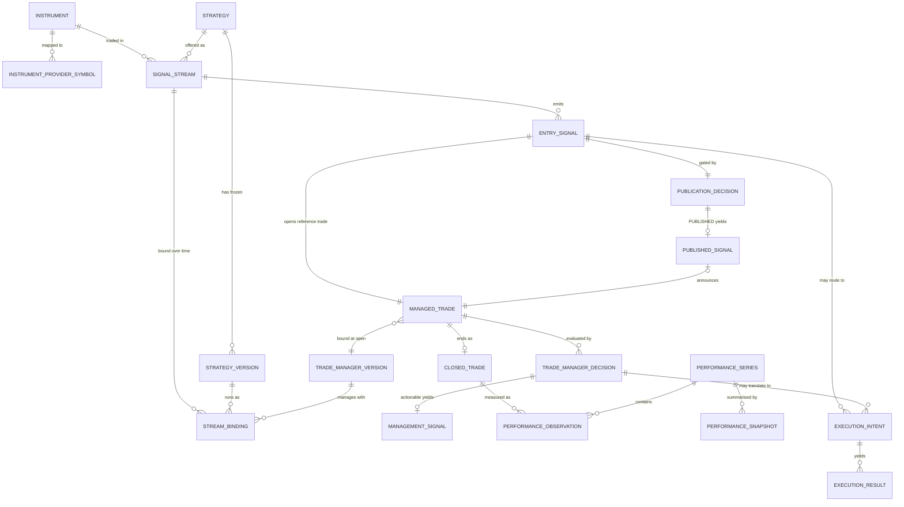
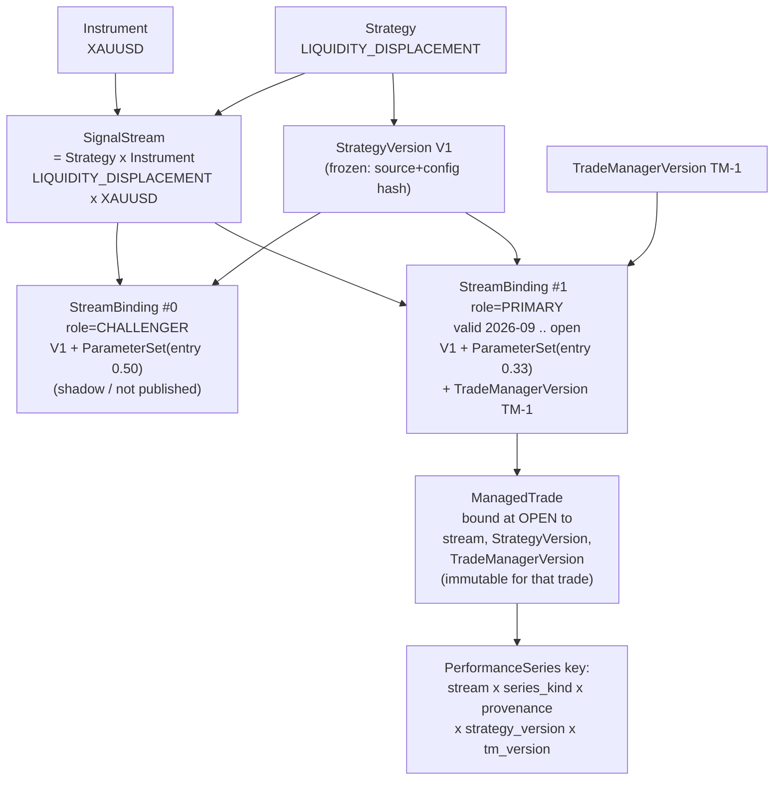
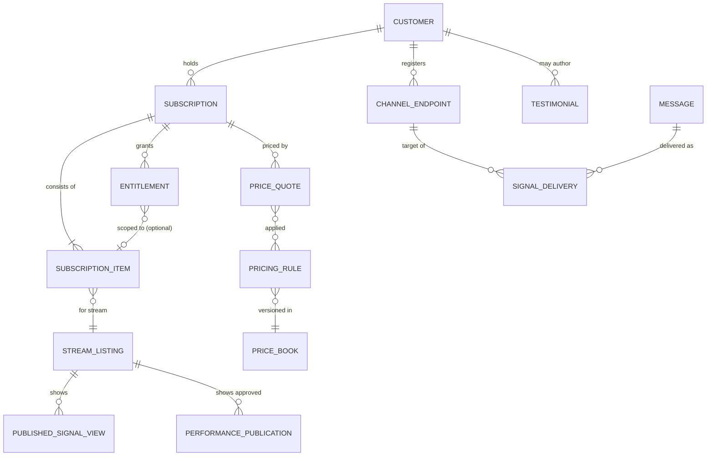

# Canonical domain model

Status: **proposed** (ADR-0001).  Nothing here is implemented.  Existing code that
already realises a concept is cited so the model *reuses working structure* rather
than replacing it.

## 1. Context map

Logical boundaries first; deployment units are a separate decision (`08_…`).
Arrows are *published events or read-only ports*, never shared tables.

Dependency rule (enforced by import-linter, `08_…` §4): **Trading Core knows nothing
about customers, subscriptions, distribution or brokers.  Personal Execution depends on
Trading Core, never the reverse.  The commercial platform depends only on published
events/contracts, never on trading code.**

## 2. Ubiquitous language (one definition each)

| Term | Definition | Owner | Existing seed |
|---|---|---|---|
| **Instrument** | canonical tradable market identity (`XAUUSD`), independent of any provider symbol | Trading Core / Market | `symbol_mappings` in `platform.json`; ad-hoc `canonical_symbol = symbol.rstrip("m")` |
| **InstrumentProviderSymbol** | mapping Instrument → provider symbol (`XAUUSDm` on the MT5 broker) | Market | `broker_symbol`, `demo_symbol_mappings` |
| **Strategy** | a named detection method (`LIQUIDITY_DISPLACEMENT`, `CONTEXT_RETRACEMENT`) | Strategy | `strategy_id` (currently conflates strategy+instrument+variant) |
| **StrategyVersion** | an immutable frozen version: source hash, config hash, freeze manifest | Strategy | `strategy_version`, freeze manifests (`FROZEN_CONFIG`, `digest_files`) |
| **ParameterSet** | instrument-specific parameters of one StrategyVersion (e.g. entry fraction 0.25 / 0.33 / 0.50, max retrace candles) | Strategy | `LiquidityInstanceDefinition.entry_fraction`, `max_retrace_candles` |
| **SignalStream** | the commercially meaningful **Strategy × Instrument**; stable identity across versions | Strategy (identity, publication state); Commerce (listing/price) | `instance_id` (`liquidity-xau33`) is the closest existing concept |
| **StreamBinding** | time-boxed link SignalStream → (StrategyVersion, ParameterSet, TradeManagerVersion) with a role | Strategy | none (implicit in config) |
| **StrategyOpportunity** | an *internal* strategy event (setup detected / qualifying / retracing). **Never customer-visible.** | Strategy | setups, `market_event_id`, `entry_opportunity_id` |
| **EntrySignal** | immutable, canonical *instruction to enter*: direction, entry, stop, target, timeframe, provenance. Carries no account, size or customer data | Signals | `StrategySignal` (`orchestration/models.py`) — schema `strategy-signal-v1` |
| **PublicationDecision** | the explicit gate outcome for an EntrySignal: `PUBLISHED` or `WITHHELD(reason)` | Signals | *absent* (today every signal auto-enters `distribution_queue`) |
| **PublishedSignal** | customer-safe, immutable projection of an EntrySignal with an authoritative `published_at` and per-stream `sequence` | Signals | *absent* |
| **ManagedTrade** | the **reference trade** created for **every EntrySignal** of a stream in `SHADOW` or later (so Trade Manager and FORWARD evidence work before anything is published); canonical geometry (entry/stop/target), state, bound TradeManagerVersion; links to its `PublishedSignal` when one exists. Broker-independent | Trade Management | `economic_position` (strategy ledger) + `ManagementState` |
| **TradeManagerVersion** | frozen management policy set (`policy_id`+`version`) bound at trade open | Trade Management | `ManagementPolicy`, `PolicyRegistry` (`trade_manager/policies.py`) |
| **TradeManagerDecision** | immutable, broker-independent advice about a ManagedTrade at a time: `HOLD, MOVE_STOP, MOVE_TO_BREAKEVEN, TRAIL_STOP, PARTIAL_PROFIT, EXIT` (+ future) with parameters, reason codes, evidence | Trade Management | `TradeManager.evaluate()` output (actions `HOLD/PROTECT_STOP/MOVE_BREAKEVEN/TRAIL_STOP/REDUCE_POSITION/CLOSE_POSITION/…`) |
| **ManagementSignal** | customer-safe projection of an *actionable* decision, ordered per ManagedTrade | Signals (publication) | *absent* |
| **ExecutionIntent** | an instruction for the **personal** broker account derived from an EntrySignal or a decision, after routing, sizing and risk | Personal Execution | `ExecutionIntent` (`execution/models.py`), `management_intent()` |
| **ExecutionResult** | broker-confirmed (or rejected) outcome of an intent | Personal Execution | `ExecutionDecision`, broker_result, ownership record |
| **ClosedTrade** | terminal record of a ManagedTrade with **two outcomes**: `entry_only` and `managed` (§4) | Performance | strategy ledger exit + counterfactual ledger |
| **PerformanceObservation** | one measured trade result attributed to a series, with provenance | Performance | ledger rows; `evidence classification` |
| **PerformanceSeries** | the *definition* of a comparable population (§5) | Performance | none (one global result per strategy today) |
| **PerformanceSnapshot** | computed, immutable aggregate over a series, methodology-versioned | Performance (compute) / Commerce (publish) | `results_registry.json` entries |
| **Customer / Subscription / SubscriptionItem / Entitlement** | commercial identity and rights | Commerce | *absent* |
| **DeliveryChannel / ChannelEndpoint / NotificationPreference** | how a customer is reached | Commerce | *absent* (`INTERNAL_QUEUE` stub only) |
| **PricingComponent / PricingRule / PriceQuote** | configurable price composition | Commerce | *absent* |
| **SignalDelivery** | one attempt-tracked delivery of one message to one endpoint | Commerce | `delivery_status` JSONL stub |
| **Testimonial** | customer-authored content; **never** measured evidence | Commerce | *absent* |

## 3. Trading-side model

A ManagedTrade exists whether or not its entry was published; `PUBLISHED_SIGNAL |o--|| MANAGED_TRADE` is the optional public face.  `EXECUTION_INTENT`/`EXECUTION_RESULT` belong to Personal Execution; they are drawn
here only to show that they hang **off** the core entities and nothing in the core
points back at them.

## 4. Strategy × Instrument × Version × Trade Manager: the required relationships

Rules:

1. **SignalStream identity = (Strategy, Instrument).**  It survives version changes so
   the public history of "Liquidity Displacement × XAUUSD" is continuous.  Performance
   is nevertheless *segmented by version* (rule 5) — continuity of identity is not
   permission to pool different rulesets.
2. A stream has **at most one `PRIMARY` binding at a time**; only the primary publishes.
   `CHALLENGER`/`SHADOW` bindings run and accumulate FORWARD evidence unpublished.
   *Today:* `liquidity-xau-base` (0.50) and `liquidity-xau33` (0.33) both run on XAUUSD
   as separate `strategy_id`s — the model treats them as two bindings of one stream
   (Open decision **O3**; the alternative is two sellable streams).
3. **A ManagedTrade binds StrategyVersion and TradeManagerVersion at open and never
   rebinds.**  A TM upgrade affects only trades opened afterwards; this is what makes a
   managed series homogeneous.
4. `TradeManagerVersion` is bound to a *binding*, because management policy is
   strategy-specific today (`PolicyRegistry` resolves by strategy).
5. **PerformanceSeries key** =
   `(stream_id, series_kind ∈ {ENTRY_ONLY, ENTRY_PLUS_TM}, provenance ∈ {BACKTEST, FORWARD, LIVE}, strategy_version_id, trade_manager_version_id | null, window)`.
   A cross-version aggregate exists only as an explicit `VERSION_SPAN` series that lists
   the versions it spans; it is never the default public number.

## 5. Broker-independence of Trade Management

A `ManagedTrade` is a **reference trade**, not a broker position.

* Geometry: the EntrySignal's (not the PublishedSignal's) entry/stop/target and the strategy's *reference fill*
  (its existing paper model — executable bid/ask semantics, `trade_manager/semantics.py`).
* Prices come from the `MarketDataProvider` port (`bid/ask/spread/bars`), never from an
  account.
* A decision states levels and **fractions**, not lots or tickets:
  `MOVE_STOP{to_price}`, `MOVE_TO_BREAKEVEN{reference_price, offset_r}`,
  `TRAIL_STOP{distance, basis}`, `PARTIAL_PROFIT{fraction, reference_price}`, `EXIT{reference_price}`.
* Fields present in today's decision record that must **leave** the broker-independent
  contract: `account_context_id`, `position_size`, `unrealized_pnl`
  (`TradeManager._record`, `trade_manager/engine.py`).  They are account concepts that
  the Personal Execution *translator* adds.

Today's split already points this way — `TradeManager` is documented "pure evaluator,
no broker/provider dependency" — but `trade_manager/central.py` (`OwnershipRegistry`,
`BrokerStateStream`, `ManagementProposal`, `authorize`) places account/ownership logic in
the same package.  Those move to Personal Execution (`01_…` §3).

### Vocabulary mapping (existing → canonical)

| Existing `ACTIONS` (`engine.py`) | Canonical decision | Customer-publishable in V1 |
|---|---|---|
| `HOLD` | `HOLD` | no (audited; optional "still valid" heartbeat later) |
| `PROTECT_STOP` | `MOVE_STOP` | yes |
| `MOVE_BREAKEVEN` | `MOVE_TO_BREAKEVEN` | yes |
| `TRAIL_STOP` | `TRAIL_STOP` | yes |
| `REDUCE_POSITION` | `PARTIAL_PROFIT` (fraction) | yes |
| `CLOSE_POSITION` | `EXIT` | yes |
| `ADD_POSITION` | *(not in V1)* — ADR-011 "no scale-in" | no |
| `REENTRY_ELIGIBLE` | **not a management decision**: re-entry is a new `StrategyOpportunity` (ADR-010) | no |

## 6. Commercial-side model

* **`STREAM_LISTING`** is the commercial face of a trading `SignalStream`: it holds a
  `stream_id` **by value** (no cross-database key) plus marketing copy, visibility and
  price eligibility.
* **`ENTITLEMENT{type=TRADE_MANAGER_ASSISTANT}`** may be scoped to one subscription item
  or to the whole subscription (pricing configurable).  It is evaluated **only** by
  Distribution and the Customer Portal API.  It is invisible to Trading Core.
* **`PricingComponent` kinds:** `STREAM_BASE`, `CHANNEL`, `TM_ASSISTANT`,
  `PREMIUM_CAPABILITY`, `BUNDLE_DISCOUNT`.  A `PriceQuote` is immutable and records
  the price-book version and rules applied; a subscription stores the quote it was
  sold under.
* **Testimonial** has no reference to any performance object and carries
  `is_measured_evidence = false` as a table constraint (`06_…` §7).
* Card/payment data is never stored; the billing provider is the system of record for
  payments and StratRelay keeps only subscription state driven by provider webhooks.
