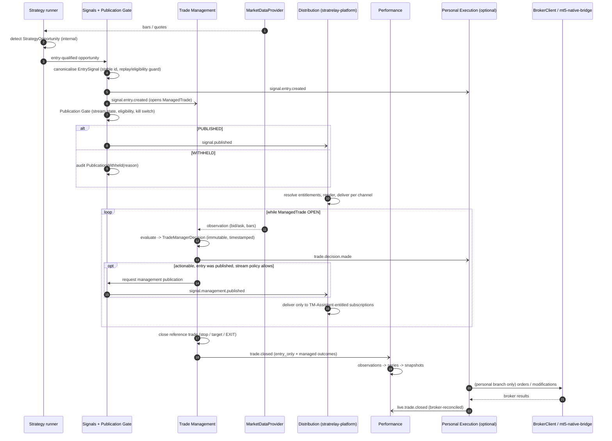
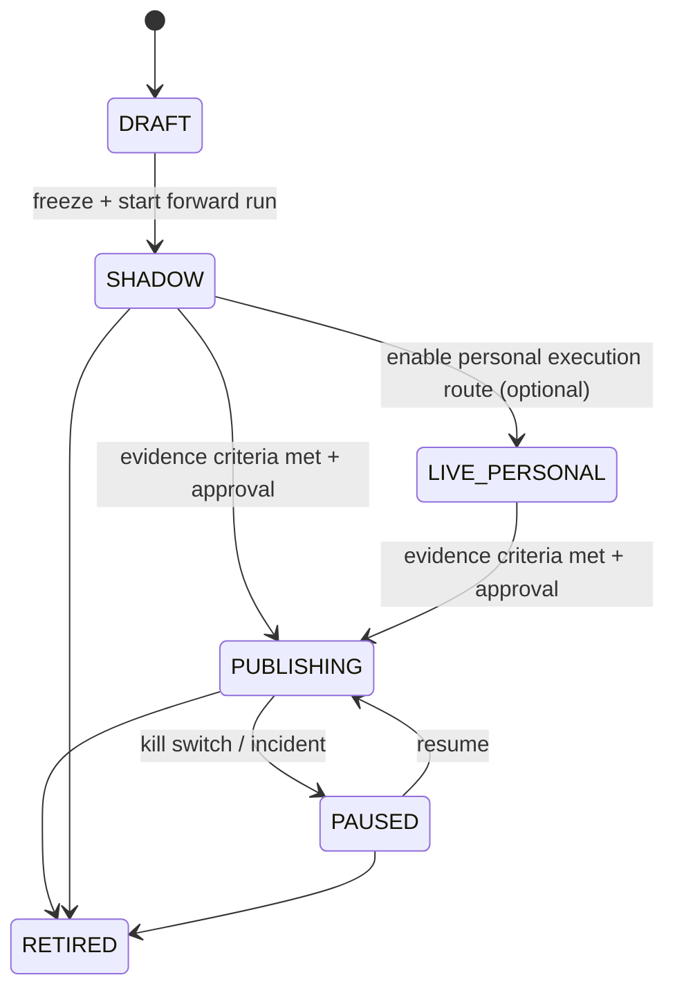
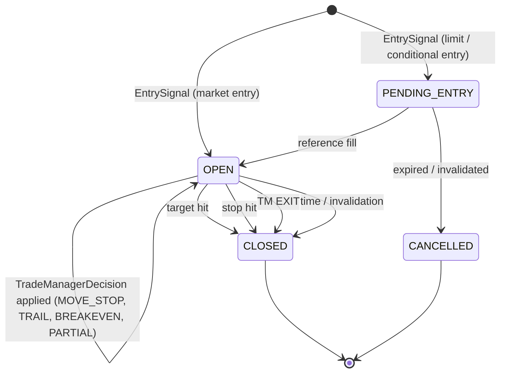
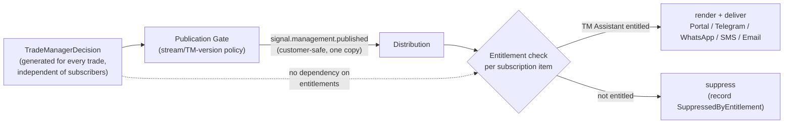
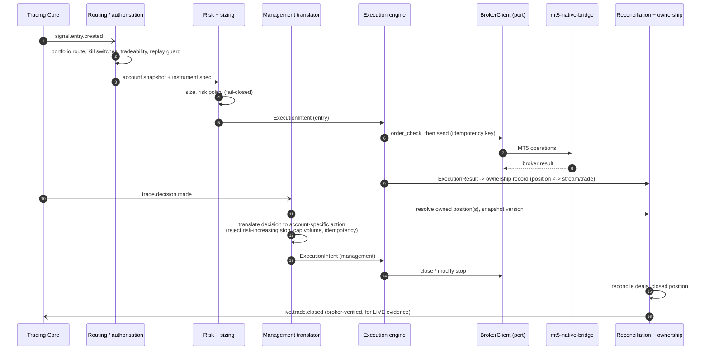

# Signal and trade lifecycle

Two invariants drive everything below:

1. **An internal strategy event never becomes a customer signal without an explicit
   Publication Decision.**
2. **A TradeManagerDecision never implies broker execution.**  Distribution and
   execution are independent consumers of the same facts; neither depends on, blocks or
   is a precondition of the other.

## 1. Stage overview

| # | Object | Created by | Immutable? | Customer-visible | Broker-touching |
|---|---|---|---|---|---|
| 1 | `StrategyOpportunity` | Strategy runner | append-only lifecycle | no | no |
| 2 | `EntrySignal` | Signals (canonicalisation of an entry-qualified opportunity) | yes | no | no |
| 3 | `PublicationDecision` → `PublishedSignal` | Publication Gate | yes | **yes** (after gate) | no |
| 4 | `ManagedTrade` | Trade Management, on **every** `EntrySignal` of a stream in `SHADOW` or later | state machine, event-sourced | only if its entry was published | no |
| 5 | `TradeManagerDecision` | Trade Management (for every ManagedTrade, published or not) | yes | no (internal) | no |
| 6 | `ManagementSignal` | Publication Gate (actionable decisions only) | yes | **yes** (entitled only) | no |
| 7 | `ExecutionIntent` / `ExecutionResult` | Personal Execution | yes | never | **yes** |
| 8 | `ClosedTrade` | Trade Management / Performance | yes | via history | no |
| 9 | `PerformanceObservation` | Performance | yes | via performance | no |

Note the direction of dependency: the personal execution branch (row 7) hangs off rows 2
and 5; rows 3, 4, 6 do not depend on it.

## 2. End-to-end (commercial path + optional personal branch)

## 3. The publication boundary

The **Publication Gate** lives in the Trading Core (Signals context).  It is the single
place where an internal fact becomes a product fact.

Inputs: `EntrySignal` or actionable `TradeManagerDecision`.
Outputs: `PublishedSignal` / `ManagementSignal`, or an audited `PublicationWithheld(reason)`.

**Stream publication state** (owned by Strategy, changed by an operator through the Ops
API, audited):

`LIVE_PERSONAL` and `PUBLISHING` are independent capabilities, not a sequence: a stream
may be personally executed without being published (this is how LIVE evidence can be
accumulated before selling a stream) and may be published with personal execution
disabled (the commercial platform must work without MT5).

**Gate checks** (all fail-closed, each recorded on withhold):

| Check | Source today |
|---|---|
| stream state == `PUBLISHING` and binding role == `PRIMARY` | new |
| **not a replay / stale**: signal event time after the startup market watermark; freshness within limit | `orchestration/replay_guard.py` (`STARTUP_REPLAY_BLOCKED`) — reused, *now also for publication* |
| trustworthy emission timestamp present | `signal_emitted_at`, `_trusted_signal_emission_time` |
| market open / quote sane | subset of `orchestration/tradeability.py` |
| duplicate suppression (idempotent on `signal_id`) | `stable_id`, dedupe keys |
| no active kill switch | new (Ops API) |
| StrategyVersion / TradeManagerVersion approved for publication | new |
| optional manual-review mode | new |

`PublishedSignal.published_at` (assigned by the gate, monotonic per stream `sequence`) is
the **authoritative customer-facing time** and the anchor for "since publication"
performance.

**Corrections** never mutate a published record: a `SignalRetracted` / `SignalCorrected`
event is issued and distribution sends a correction message.

## 4. ManagedTrade state machine

`entry_type` already distinguishes market and conditional entries in `StrategySignal`.
`MOVE_STOP` never widens risk (the existing `stop_is_safe` rule becomes a **domain
invariant** of the ManagedTrade, not only a personal-execution check).

### Two outcomes per trade (raw vs managed)

A trade closes with **both** outcomes recorded; they answer different questions and are
never blended:

| Outcome | Rule | Who experiences it |
|---|---|---|
| `entry_only` | the strategy's own frozen stop/target logic on the reference trade, ignoring every TradeManagerDecision | subscribers **without** the TM Assistant (they hold the original plan) |
| `managed` | the reference trade with **only the decisions actually emitted, in real time, by the bound TradeManagerVersion** applied in order | subscribers **with** the TM Assistant who followed every management signal |

## 5. TradeManagerDecision and ManagementSignal

* `TradeManagerDecision` is generated for every evaluated observation regardless of who
  is subscribed or entitled.  **Entitlement has zero influence on its generation** (see
  §6).  `HOLD` decisions are persisted for audit and replay but not published.
* Decisions are **idempotent** (`idempotency_key` over strategy, trade, action, time —
  existing `idempotency_key()` in `engine.py`) and **causal**: each records the
  observation it used; a decision may not reference data later than its `decision_time`
  (the existing `future_data_used: false` flag on observation events becomes a contract
  assertion).
* A `ManagementSignal` is only ever produced for a trade **whose entry was published**; management updates for a trade customers never saw are meaningless.  Unpublished (SHADOW / personal-only) trades still get decisions, both outcomes and evidence.
* `ManagementSignal` carries: `managed_trade_id`, `sequence` (per trade), action,
  human-readable parameters (new stop, fraction, reference price), reason (customer-safe
  text from reason codes), `published_at`, and the original `signal_id`.
* Ordering: per-`managed_trade_id` sequence; distribution guarantees in-order delivery
  per recipient/channel or marks a gap.

## 6. Trade Manager Assistant — entitlement affects distribution only

Enforcement points (defence in depth, both server-side, deny-by-default):

1. **Distribution** — the only path that pushes management content to channels.
2. **Customer Portal API** — the management timeline of `/trades/{id}` returns
   management entries only for entitled subscriptions; non-entitled callers get the
   entry, the original stop/target and the **final closed outcome**, plus an
   "add Trade Manager Assistant" affordance with no management content.

Consequences: adding/removing an entitlement changes only what is *shown or sent*;
it can never change what the Trade Manager decides, what is stored, what performance is
computed, or what personal execution does.  A test in the Trading Core asserts that no
Trading Core module imports or references entitlement/subscription concepts.

## 7. Personal execution branch

* The **translator** is where account-specific facts enter: it resolves
  `MOVE_TO_BREAKEVEN{reference_price, offset_r}` against the *actual* fill, applies
  ownership (`OwnershipRegistry.prove`), snapshot-version and duplicate checks
  (`authorize`), and produces the broker-shaped action.  This is exactly today's
  `trade_manager/central.py` logic, relocated.
* Personal execution consumes **EntrySignal**, not PublishedSignal, so a stream can be
  traded personally before it is published (LIVE evidence) and the personal route keeps
  working if publication is disabled.  It is governed by its own route policy and kill
  switches (Open decision **O4** covers fairness/ordering disclosure).
* If personal execution is disabled or MT5 is down, nothing in §2–§6 is affected.
* Future customer auto-execution would be another consumer of `signal.published` and
  `signal.management.published` behind a new bounded context with its own credentials
  vault; V1 neither designs nor stubs it.

## 8. Where today's code sits in this lifecycle

| Lifecycle step | Today | Gap |
|---|---|---|
| Opportunity | strategy runners + ledgers | — |
| EntrySignal | `StrategySignal` via adapters in `poll_once` | mixed into `signal_orchestrator.py` |
| Publication Gate | **absent**; every signal auto-enters `distribution_queue` (`docs/DISTRIBUTION_PIPELINE.md`) | build |
| ManagedTrade | economic position + `ManagementState` | broker-independent reference model needed |
| Decision | `TradeManager.evaluate` (advisory/shadow) | strip account fields; canonical vocabulary |
| ManagementSignal | **absent** | build |
| Translation to broker | `trade_manager/central.py` `ManagementProposal`/`authorize` + consumer `process_management_intents` | relocate to Personal Execution |
| Execution | `live_execution_consumer.py` | behind `BrokerClient` |
| Closed / performance | strategy ledger + counterfactual ledger, results registry docs | series/snapshot model absent |
