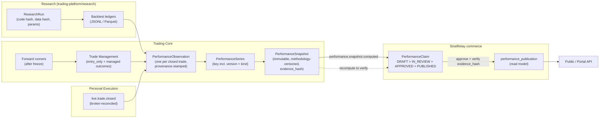

# Performance evidence model

Goal: publishable performance that is **attributable** (strategy × instrument × version ×
period × sample size), **provenance-labelled** (BACKTEST / FORWARD / LIVE), and
**structurally incapable** of presenting hindsight or reconstructed management results
as actual history.  Testimonials are a different content type and never touch it.

## 1. Provenance and evidence classes

Customer-visible provenance has exactly three values.  The repository already has a
finer evidence vocabulary (`docs/RESULTS_REGISTRY.md`); it is kept as an internal
`evidence_class` and mapped:

| Provenance (public) | Meaning | Internal `evidence_class` (existing vocabulary) |
|---|---|---|
| **BACKTEST** | simulated on historical data; hindsight was possible | `HISTORICAL_DISCOVERY`, `EXPOSED_DEVELOPMENT_ONLY`, `HISTORICAL_VALIDATION_EXPOSED`, `RESEARCH_ONLY`; plus new `UNTOUCHED_OOS` |
| **FORWARD** | generated in real time **after** the strategy/TM freeze by the running system, with the reference execution model (no broker order) | `PROSPECTIVE_PAPER` |
| **LIVE** | realised results of real broker execution, reconciled to broker deals | `LIVE_REAL_MONEY` (**none exist today**: the registry states no artifact is classified live) |
| *(never shown)* | excluded from every series | `SUPERSEDED_GEOMETRY_BUG`, `INVALID / DO NOT USE` |

Orthogonal attributes on every observation:

* `series_kind`: `ENTRY_ONLY` | `ENTRY_PLUS_TM` (§3)
* `publication_status`: `PUBLISHED` (entry was announced to customers) | `UNPUBLISHED` (shadow / personal-only)
* `tm_eligibility` (existing Phase 7 vocabulary): `PROSPECTIVE_ELIGIBLE` |
  `PRE_FREEZE_EXPOSED` (`PRE_PHASE7_EXPOSED_REFERENCE`) | `LEFT_TRUNCATED` (`LEFT_TRUNCATED_EXISTING_POSITION`)
* `cost_model_version`, `methodology_version`, `strategy_version_id`, `trade_manager_version_id`

**FORWARD on published signals is the reference track record of what subscribers were
told**, measured with the reference fill model; it is *not* the customers' realised P&L
(unknowable in V1 because customers do not connect brokers) and must be labelled
accordingly ("reference execution").

## 2. Evidence flow: research/trading → publishable performance



Roles:

* **Trading Core computes**; Commerce **approves and publishes**.  Commerce can never
  edit a number; it can only publish a snapshot whose `evidence_hash` it re-verified
  against the trading API, or refuse to.
* If evidence is later reclassified `INVALID`/`SUPERSEDED`, the trading side emits an
  event and the publication is automatically `WITHDRAWN`/`SUPERSEDED`, with the
  customer-visible page showing the replacement.

## 3. Raw entry performance vs entry + Trade Manager performance

Two series kinds, never blended:

| `series_kind` | Outcome used | Meaning |
|---|---|---|
| `ENTRY_ONLY` | the strategy's frozen stop/target on the reference trade | what a subscriber who ignores management would have experienced; the fair baseline for **all** subscribers |
| `ENTRY_PLUS_TM` | the reference trade with **only the decisions actually emitted in real time by the bound, frozen TradeManagerVersion** | what a subscriber with the TM Assistant who followed every update would have experienced |

Both outcomes are produced for **the same trade set**, so a **paired comparison**
(`managed − entry_only` per trade, then aggregated) is well-defined and cannot be
inflated by selecting different trades.

### The hindsight firewall (what makes reconstructed management un-presentable as actual)

| # | Control | Mechanism |
|---|---|---|
| H1 | **Freeze boundaries** | a StrategyVersion and a TradeManagerVersion each have a freeze timestamp; `FORWARD` requires `entry_event_time ≥ freeze`. Trades before it are `PRE_FREEZE_EXPOSED` and can only appear in `BACKTEST` (existing Phase 6/7 boundary logic) |
| H2 | **Emitted-decisions-only replay** | `managed` outcome = ordered application of persisted `TradeManagerDecision` rows. It is never recomputed by re-running a policy over history, and never under a newer version |
| H3 | **Causality contract** | each decision stores its observation reference and `decision_time`; a decision may not use data later than `decision_time` (`future_data_used=false` becomes a validated field) |
| H4 | **Immutable, DB-timestamped** | decisions/publications are append-only, with a database-assigned `recorded_at` that must precede the next observation the decision could have influenced |
| H5 | **Counterfactuals are BACKTEST forever** | anything from `counterfactual.py` / `experiments.py` / hypothetical policies is `BACKTEST` + `COUNTERFACTUAL`; the series key and the type system make it impossible to place it in a `FORWARD` or `LIVE` series |
| H6 | **Version pinning** | a ManagedTrade binds StrategyVersion + TradeManagerVersion at open; a later TM version never re-labels earlier trades |
| H7 | **Publication anchoring** | `PUBLISHED` series measure from `published_at`; the reference fill is the first executable quote at/after publication (per the cost/latency model), not the strategy's internal detection time |
| H8 | **Completeness invariant** | every `EntrySignal` produces exactly one observation (or is `OPEN`/`CANCELLED`); a nightly check asserts `signals = observations + open + cancelled` per stream, so losers cannot be dropped |
| H9 | **Cost model recorded** | spread from contemporaneous bid/ask (existing executable-paper-entry semantics) plus versioned commission/slippage assumptions on every observation |
| H10 | **Supersession, not mutation** | corrected observations keep a `superseded_by` link; snapshots are recomputed under a new `methodology_version`; old snapshots stay retrievable |

Live management is separate again: a `LIVE` observation records
`management_mode ∈ {NONE, TM_EXECUTED}` from what personal execution **actually did**,
so LIVE-with-management is never inferred from what the TM *would* have done.

## 4. PerformanceSeries key and snapshot content

```
series_key = (stream_id, series_kind, provenance,
              strategy_version_id, trade_manager_version_id | null,
              publication_scope ∈ {ALL, PUBLISHED_ONLY}, window)
```

A `PerformanceSnapshot` is computed at `as_of` and stores: `n_closed`, `n_open`,
`n_cancelled`, win rate, average R, expectancy R, profit factor, max drawdown (R),
best/worst trade (R), period `[from,to]`, equity curve in R, the version list, cost and
methodology versions, `evidence_hash` (over the ordered observation ids and
values), `computed_at`.  Metrics are in **R-multiples** (account-independent).
Currency/percentage figures exist only for `LIVE` and carry the account/risk disclosure.

Cross-version aggregates are separate `VERSION_SPAN` series listing every version they
include; the default public series is the *current* binding's version, with prior
versions available as their own series.

## 5. Public display contract

Every performance number returned by any API carries: `stream`, `instrument`,
`strategy_version(s)`, `provenance`, `series_kind`, `period`, `n_closed` (+`n_open`),
`cost_model_version`, `methodology_version`, `as_of`, and a disclosure key.

* Never a number without provenance and sample size.
* Never combine provenances or series kinds in one figure; `BACKTEST` is shown in its
  own section, visually distinct, defaulting to collapsed; default view is `FORWARD`.
* Below a configurable minimum `n_closed` show "insufficient sample" instead of a rate.
* `ENTRY_PLUS_TM` is labelled "with Trade Manager Assistant" and shown next to (not
  instead of) `ENTRY_ONLY`.
* Performance is public marketing content; the **TM Assistant entitlement gates
  management *signals*, not the display of measured performance**.

## 6. What exists today and what is missing

| Need | Today | Gap |
|---|---|---|
| evidence classification | `RESULTS_REGISTRY.md`, `artifacts/results/results_registry.json` | machine-enforced provenance on every observation |
| strategy outcomes | `context_structure_retrace/{ledger,outcomes}.py`, liquidity ledgers | `PerformanceObservation` normalisation |
| freeze/boundary logic | Phase 6/7 manifests, `PRE_PHASE7_EXPOSED_REFERENCE`, `LEFT_TRUNCATED_EXISTING_POSITION` | generalise to per-version freeze in the DB |
| hypothetical management ledger | `trade_manager/counterfactual.py`, `experiments.py` (already "never the frozen position") | label as BACKTEST/COUNTERFACTUAL; add emitted-decision-only managed outcome |
| live evidence | none (`LIVE_REAL_MONEY: none found`) though REAL execution runs | broker-reconciled ingest (`live.trade.closed`) |
| per-instrument attribution | per-instance state files (`liquidity-xau33`, …) | series keyed by stream |
| publication approval workflow | none | `PerformanceClaim` in Commerce |

## 7. Testimonials

* Separate content type in `commerce.content`; separate API resource and UI component.
* `is_measured_evidence boolean NOT NULL DEFAULT false CHECK (NOT is_measured_evidence)`.
* No foreign or by-value reference to any performance object; may not display metrics
  as if measured; moderation, consent and removal audit trail.
* Rendered with a fixed disclosure ("customer opinion, not a measure of performance") and
  never inside a performance panel.
