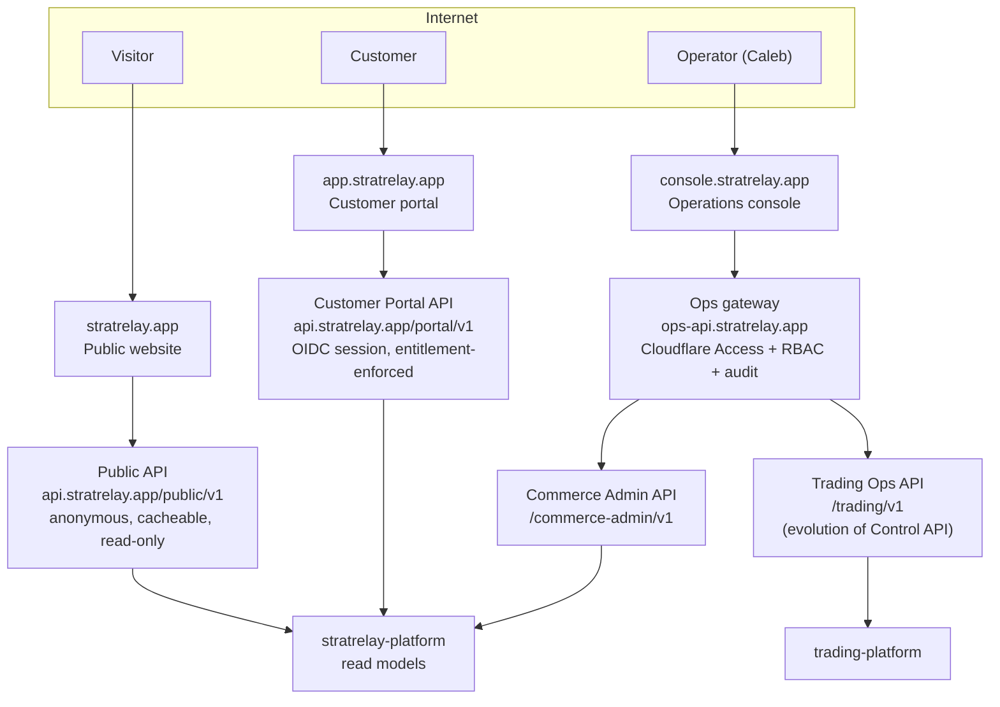

# API boundaries for the three product surfaces

The existing "Console" is **not** the customer portal.  It is the internal operations
surface and must stay one.  Three surfaces, three APIs, three trust levels:

## 1. Hostnames — and a conflict with the previous production config

| Host | Serves | Trust |
|---|---|---|
| `stratrelay.app`, `www` | public website | anonymous |
| `app.stratrelay.app` | customer portal SPA | customer session |
| `api.stratrelay.app` | **public + customer-portal APIs** | anonymous (`/public`), customer (`/portal`) |
| `console.stratrelay.app` | operations console UI | operators (Cloudflare Access) |
| `ops-api.stratrelay.app` | trading ops API + commerce admin API | operators + service tokens |

**Conflict:** earlier in this programme the *internal* Control API was configured for
`api.stratrelay.app` (`docs/PROD_DEPLOY.md`, `deploy/prod/*`, the console's
`.env.production`, and the already-built console image with the URL baked in).  Under this
model `api.stratrelay.app` belongs to the customer-facing API and the Control API moves
to `ops-api.stratrelay.app`.  **Nothing has been deployed** (no tunnel, DNS or Access
policy exists), so the change is a config edit plus a console image rebuild; it is
listed in `08_…` §3.

## 2. Public Website API — `/public/v1` (anonymous, read-only, CDN-cacheable)

Content that may be shown to anyone.  **No live signals, no customer data, no
management content.**

| Resource | Purpose |
|---|---|
| `GET /strategies`, `/strategies/{key}` | what each strategy is, how it works, current version label |
| `GET /streams`, `/streams/{stream_id}` | Strategy × Instrument catalogue, availability (`available` / `coming_soon`) |
| `GET /streams/{stream_id}/performance?provenance=&series_kind=&window=` | **approved** `performance_publication` rows only; response always carries the full display contract (`06_…` §5) |
| `GET /streams/{stream_id}/track-record?cursor=` | closed **published** trades (entry, stop, target, outcome in R) older than an embargo window (Open decision **O8**), never open trades |
| `POST /pricing/quote` | stateless price for a configuration of streams/channels/add-ons (no customer required) |
| `GET /pricing/components` | building blocks and channel/add-on descriptions |
| `GET /testimonials` | **separate content type**, own disclosure, never returned by a performance endpoint |
| `GET /disclosures/{key}` | risk / performance / data-source disclosures |

Signup/login is delegated to the identity provider (OIDC); the public API exposes no
credential endpoints.  Controls: WAF/bot protection, per-IP rate limits, `ETag` +
`Cache-Control`, no cookies.

## 3. Customer Portal API — `/portal/v1` (authenticated customer)

Every request resolves `customer_id` from the OIDC session and applies **deny-by-default
server-side entitlement checks**; the UI is never the enforcement point.

| Area | Resources |
|---|---|
| Account | `GET/PATCH /me`, `GET/PUT /consents` |
| Catalogue & pricing | `GET /catalog/streams` (with my subscription status), `POST /pricing/quote` (personalised) |
| Subscriptions | `GET /subscriptions`, `POST /subscriptions` (returns a hosted checkout session), `PATCH /subscriptions/{id}/items`, `DELETE /subscriptions/{id}`, `GET /entitlements` |
| Signals | `GET /signals?stream=&status=&cursor=`, `GET /signals/{signal_id}` (only streams I subscribe to) |
| Trades | `GET /trades/active`, `GET /trades/{managed_trade_id}` — entry, original stop/target, **final outcome for everyone**; the **management timeline only if TM-Assistant-entitled**, otherwise an upsell affordance with no management content |
| Performance | `GET /streams/{id}/performance` (same approved data as public) |
| Channels | `GET/POST /channels/endpoints`, `POST /channels/endpoints/{id}/verify`, `GET/PUT /notification-preferences` |
| Billing | `GET /billing/invoices`, `POST /billing/portal-session` (provider-hosted; no card data) |
| Realtime | `GET /live` (SSE/WebSocket) — new signals and (entitled) management updates |
| Content | `POST /testimonials` (submit for moderation) |

Notification channels: Telegram, WhatsApp, SMS, Email, Portal.  The portal is itself a
delivery channel with the same entitlement rules.

## 4. Operations APIs — `ops-api.stratrelay.app` (internal only)

Two backends behind one gateway with **role-based scopes** and an audit trail on every
write.  Roles: `viewer`, `operator`, `approver`, `admin`; broker/execution scopes are
separate (`execution:read`, `execution:control`).

### 4.1 Trading Ops API — `/trading/v1` (evolution of `control_api`)

| Group | Resources | Status |
|---|---|---|
| Runtime | `/system`, `/safety`, `/connections`, `/events`, `/audit`, `/reports`, `/reports/{id}` | **exists** (read-only) |
| Strategies | `/strategies`, `/strategies/{id}`, `/strategies/{id}/report`, `/instances`, `/shadow` | **exists** |
| Signals | `/signals`, `/signals/{id}` | **exists** (internal EntrySignals) |
| Streams | `/streams`, `/streams/{id}`, `/streams/{id}/bindings` | new |
| Publication | `/publications` (decisions incl. `WITHHELD` reasons), `/publication-policy` | new |
| Trade management | `/managed-trades`, `/managed-trades/{id}`, `/managed-trades/{id}/decisions`, `/tm-versions` | new (console already has a `ManagedTrade` type and Trade Manager overview) |
| Performance | `/performance/series`, `/performance/snapshots`, `/evidence/bundles` | new |
| Bus health | `/outbox/lag`, `/consumers` | new |
| **Execution scope** | `/executions`, `/executions/metrics`, `/broker/{account,positions,pending-orders,history-orders,deals,exposure,symbols}`, `/ownership` | **exists**; `execution:read` only — personal-account data, never customer-visible |
| Gated writes | `POST /streams/{id}/state`, `POST /streams/{id}/kill-switch`, `PUT /publication-policy`, execution arming/disarming (the console already has a *Controls* page with a real-money confirmation dialog) | new; audited, two-step for real-money actions |

The read plane keeps today's guarantee (mutating verbs return `405 READ_ONLY_API`); the
control plane is a separate route group with its own auth, so "read-only observability"
remains provable.

### 4.2 Commerce Admin API — `/commerce-admin/v1`

Customers (masked-PII support view), subscriptions, entitlements (grant/revoke),
deliveries (failed / suppressed / retry), price books and rules, stream listings,
**performance claims review/publish**, testimonial moderation, audit.

## 5. Cross-cutting rules

1. **One writer per resource, one API per writer.**  Public and Portal APIs read
   Commerce read models; only the Ops APIs can change trading control state.
2. **Contracts first:** OpenAPI documents live in `stratrelay-contracts`; TypeScript
   clients are generated for the three UIs; `v1` is additive-only.
3. **Idempotency:** all `POST`/`PUT` accept `Idempotency-Key`.
4. **Errors:** RFC 7807 problem details; no internal ids or stack traces to customers.
5. **Privacy walls:** Public/Portal responses never contain broker, account, size,
   ticket or internal strategy identifiers; the Ops execution scope never proxies to
   Public/Portal.
6. **Rate limits/quotas** per surface; portal realtime is fan-out from
   `signal.published` / `signal.management.published`, never a query of the trading DB.
7. **Latency budget** (design target): publication → first channel dispatch is a
   Distribution SLO measured from `published_at`; the API surfaces both timestamps.
