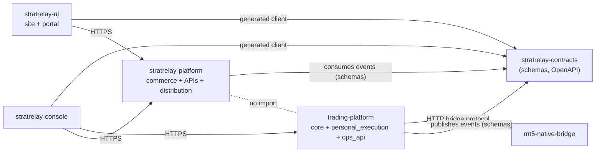

# Repository boundaries and changes to the A1 extraction plan

No repository is created or changed by this document.

## 1. Recommended repositories

Boundaries are logical first; a domain becomes its own repository only when one of the
listed **extraction triggers** is true.  Start with the fewest repositories that keep
the dependency rules enforceable.

| Repository | Owns | Form | Extraction trigger (if a package today) |
|---|---|---|---|
| **`mt5-native-bridge`** | MT5 transport, EA, bridge protocol/lifecycle/health, bridge tests (A1) | repo (already decided) | — |
| **`trading-platform`** | **Trading Core** (market, strategy, signals + publication gate, trade management, performance evidence), **Personal Execution**, **`ops_api`** (trading ops), **research**, kernel (ids, config, persistence, messaging), MT5 *adapters* | one repo, **strict package boundaries** (§4) | `personal_execution` → own private repo when: customer auto-execution is designed, or execution needs a different release cadence/access list, or compliance requires segregation |
| **`stratrelay-platform`** | **Signal Commerce**: identity integration, catalog, pricing, subscriptions/entitlements, billing adapter, **distribution** workers + channel adapters, read-model builder, Public API, Portal API, Commerce Admin API | one repo, modular monolith + workers | split `distribution` workers when channel volume/latency needs independent scaling |
| **`stratrelay-ui`** | **public website** (`apps/site`) and **customer portal** (`apps/portal`), shared design system (`packages/ui`), generated API client | monorepo of two apps | split site/portal if release cadence or hosting differ (marketing SSR vs SPA) |
| **`stratrelay-console`** | operations console (today's `trading-ops-console`, renamed) — internal only | repo | — |
| **`stratrelay-contracts`** | event schemas, OpenAPI documents, fixtures, generated Python/TypeScript packages, semver + compatibility CI | small repo, **created before the first cross-domain event is implemented** | — |

Not recommended now: one repository per bounded context, microservices per context,
a separate `research` repository (research imports frozen strategy code and would need
a published package for it), or an infrastructure repository (revisit when Kubernetes
manifests are tracked — none for the runtime images are today, A1 finding R6).



`stratrelay-platform` and `trading-platform` **never import each other**; both depend on
`stratrelay-contracts`.  Only HTTP/NATS crosses.

## 2. Package boundaries inside `trading-platform` (Stage 2 target)

```
src/trading_platform/
  core/                     # Trading Core — knows nothing about customers, brokers, accounts
    market/                 #   MarketDataProvider + Instrument ports, price semantics
    strategy/               #   strategies, versions, streams, runners
    signals/                #   EntrySignal, adapters, replay guard, PUBLICATION GATE
    trade_management/       #   ManagedTrade, decisions, TM versions, observation
    performance/            #   closed trades, observations, series, snapshots
  personal_execution/       # optional consumer; depends on core, never the reverse
    routing/ risk/ engine/ management_translation/ ownership/ broker_state/ reconciliation/
  adapters/
    mt5/                    #   implements MarketDataProvider + BrokerClient over the bridge protocol
  ops_api/                  # trading ops API (evolution of control_api)
  kernel/                   # ids, config, runtime paths, persistence, messaging, transitional stores
research/  tools/migration/  ops/  deploy/  tests/
```

`data/module_domain_map.csv` gives the exact OLD → domain-aligned path for all 503
tracked files.

## 3. Changes to the A1 extraction plan

Base: A1 manifest `eda827c`.  **The bridge extraction itself is unchanged** — the new
commercial boundaries do not touch what leaves for `mt5-native-bridge`.  What changes is
the shape of the platform side after the split.

| # | A1 said | Change | Impact |
|---|---|---|---|
| **1** | Stage 1 = byte-identical repo split; Stage 2 = namespacing under `src/trading_platform/{strategies,orchestration,execution,trade_manager,control_api,persistence,messaging}` | **Keep Stage 1 exactly.**  **Replace the Stage 2 tree** with the domain-aligned tree of §2. `a1_stage2_path` is superseded by `target_path_domain_aligned` in `data/module_domain_map.csv` | Stage 1 unaffected; Stage 2 must not start until the tree is agreed |
| **2** | package `orchestration/` moves as a unit | **The name `orchestration` is retired.**  Its contents split across `core/signals`, `core/strategy`, `personal_execution`, `adapters/mt5`, `kernel` (`01_…` §1–§2) | Stage 2 |
| **3** | `signal_orchestrator.py` → `orchestration/signal_orchestrator.py` as one process | **It performs three jobs** and splits: canonicalisation (`poll_once`) → `core/signals`; per-account routing/sizing/tradeability/live arming/account verification → `personal_execution/routing`; `distribution_queue`/`delivery_status` appends → **removed** (publication gate + commerce distribution) | Stage 3; **Stage 1 leaves it byte-identical**. Its source hash (A1 S3) covers `orchestration/**`, so any split is a re-baseline event |
| **4** | `trade_manager/*` → `trade_manager/` | `trade_manager/central.py` (`OwnershipRegistry`, `BrokerStateStream`, `ManagementProposal`, `authorize`) moves to **`personal_execution`**; the rest stays broker-free in `core/trade_management`; `account_context_id`/`position_size`/`unrealized_pnl` leave the decision contract | Stage 3 |
| **5** | platform-side `contracts/mt5_bridge/` with `Mt5ReadClient`/`Mt5ExecutionClient` as *the* boundary | The clients become **adapters** under domain ports: `adapters/mt5/` implements `MarketDataProvider` (read) and `BrokerClient` (read+write).  **`contracts/` is reserved for `stratrelay-contracts`.**  Strategy runners depend on `MarketDataProvider`, not on the MT5 client | A1 doc 03 caller table updates: runners → `MarketDataProvider`; Control API/consumer → `BrokerClient`; Stage 1.5 wrappers unchanged |
| **6** | `BrokerWriteGate` in `execution/broker_gate.py` | Lives in `personal_execution`; the `BrokerClient` **port speaks intents** (place/modify/close with idempotency key), not MT5 modes — reinforcing removal of bridge leak L2 | none for Stage 1 |
| **7** | `replay_guard.py` is an orchestration/execution safety module | It is a **signals** concern and must gate **publication** as well as execution (never publish a replayed signal) | moves to `core/signals`; re-baselines A1 S3 |
| **8** | `control_api/` → `control_api/` | → `ops_api/`; **hostname `api.stratrelay.app` → `ops-api.stratrelay.app`** (`07_…` §1); console image must be rebuilt; the latent `control_api → runners` import (A1 C6) is resolved by reading published read models | config + image; nothing deployed yet |
| **9** | `postgres/` → `persistence/`; `messaging/` placeholder | Two logical DBs and the schema set of `05_…`; **add** `platform.outbox/inbox/consumer_checkpoint`, `execution.lease`; adopt new schema names **before migration 008** (`orchestration.*` deprecated) | coordinate with Codex's Postgres reconciliation |
| **10** | `paper_runner.call_bridge` shim → `contracts.mt5_bridge` | shim → `adapters/mt5/legacy_call_bridge.py`; retire when runners use `MarketDataProvider` | Stage 3 |
| **11** | `docs/DISTRIBUTION_PIPELINE.md`, `distribution_queue` carried as platform features | **Do not carry forward**: auto-distribution of every canonical signal contradicts the explicit publication boundary; delete at Stage 3, leave untouched in Stage 1 | Stage 3 |
| **12** | strategy ids are opaque state keys | **Do not rename** `strategy_id`s (`LIQUIDITY_DISPLACEMENT_SCALP_XAUUSD_33_V1` conflates strategy+instrument+variant+version and is embedded in dedupe namespaces, state files, provenance and hashes).  Introduce `strategy_key`, `stream_id`, `binding_id` as **additional** identifiers through a mapping table | prevents a Stage 2 identity break |
| **13** | research/legacy stays with the platform | Unchanged, plus: research must emit `research_run` + evidence bundles (`06_…`); large artifacts leave git | Stage 3+ |
| **14** | new repos: none | **New**: `stratrelay-platform`, `stratrelay-ui`, `stratrelay-console` (rename), `stratrelay-contracts`. Only `stratrelay-contracts` has a prerequisite role (before the first cross-domain event) | none for Stage 1 |
| **15** | Stage 0: `TRADING_PLATFORM_RUNTIME_DIR` | Keep; **add `PERSONAL_EXECUTION_RUNTIME_DIR`** so personal-account state can be relocated/secured independently of core state | Stage 0 |
| **16** | test plan T-B*, T-C*, T-P | Unchanged; **add** import-linter architecture tests (§4) and, once contracts exist, event-contract tests | Stage 1.5 |
| **17** | K8s/runtime images named `mt5-native-bridge-*` | additionally rename to `trading-platform-*` **and** stop treating the Mac-side MT5 stack as part of the platform image | separate migration |

## 4. Fitness functions (architecture tests, enforced in CI)

1. `core.*` imports only `core.*`, `kernel`, stdlib and third-party libraries — **never**
   `personal_execution`, `adapters`, `ops_api`, any customer/subscription/entitlement
   concept, or any broker/MT5 module.
2. `personal_execution` imports `core`, `kernel`, ports; never `stratrelay-*`.
3. `adapters.mt5` is the **only** package that imports the bridge client; the write-capable
   module is unreachable from `core`, `ops_api` read routes, strategy runners and the
   shadow orchestrator (replaces the source-scanning audits that A1 S4 showed would
   go vacuous).
4. No module outside `kernel/transitional` reads or writes `runtime/*.jsonl` for
   production state (ratchet: the count may only decrease).
5. Events in the `commerce`-visible NATS account validate against schemas that contain no
   fields from the privacy-forbidden list (`04_…` §1.5).
6. `stratrelay-platform` has no dependency on `trading-platform` and vice-versa.

## 5. What can proceed now, and what must wait

| Work | Status |
|---|---|
| A1 Stage 0/1.5 prerequisites and characterization tests (Codex C2) | **proceed** — unaffected |
| A1 Stage 1 physical bridge extraction | **proceed once A1's gates are green**; unaffected by this design |
| Fix hostname in prod deploy config; decide Ops host | cheap, do before anything is deployed |
| Create `stratrelay-contracts` | before the first cross-domain event |
| A1 Stage 2 (namespacing) | **wait**: adopt the §2 tree and resolve O2–O4 first |
| Publication Gate, ManagedTrade reference model, TM contract cleanup | new work, after Stage 1; Trading Core only |
| Commerce platform, UIs | independent of the extraction; can start in parallel once contracts exist |
