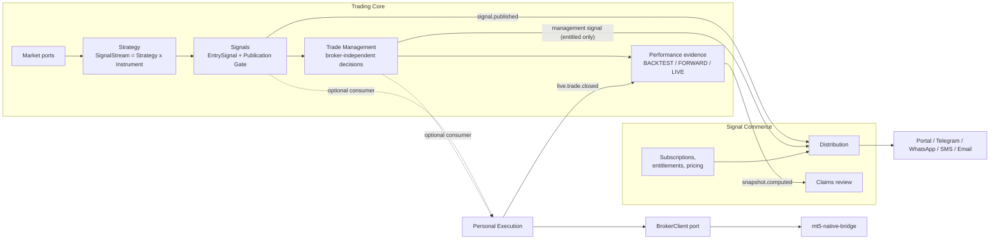

# StratRelay target architecture (design only)

Agent CLAUDE-A2-DESIGN.  Base: A1 manifest `eda827c` (tree-identical to Codex baseline
`7b5f5c0` + A1 = `f16e8ad`).  Branch `claude-a2/stratrelay-architecture`, isolated
worktree; Codex's worktree and branch were not touched.  **No production code, runtime,
broker, MT5, Kubernetes, PostgreSQL or NATS state was changed.**

## Read in this order

| # | Document | Answers |
|---|---|---|
| — | **`ADR-0001-stratrelay-target-architecture.md`** | the decisions D1–D22, alternatives, risks |
| 01 | `01_CURRENT_TO_TARGET_MAP.md` | where `orchestration`, Trade Manager, `execution`, `control_api`, `strategies`, `research` belong now; what is missing |
| 02 | `02_DOMAIN_MODEL.md` | context map, ubiquitous language, ER models, Strategy × Instrument × Version × TM × Series relationships, broker-independence |
| 03 | `03_SIGNAL_AND_TRADE_LIFECYCLE.md` | lifecycle, publication boundary, state machines, TM Assistant enforcement, personal execution branch |
| 04 | `04_DOMAIN_EVENTS.md` | events across boundaries, envelope, privacy rules, JetStream layout (design), file→event mapping |
| 05 | `05_DATA_OWNERSHIP.md` | `trading` vs `commerce` databases, cross-references, mapping of Codex's Postgres work |
| 06 | `06_PERFORMANCE_EVIDENCE.md` | provenance, evidence flow, raw vs managed performance, hindsight firewall, display contract, testimonials |
| 07 | `07_API_BOUNDARIES.md` | Public / Customer Portal / Operations APIs, hostnames |
| 08 | `08_REPOSITORIES_AND_A1_CHANGES.md` | repository recommendation, **17 changes to the A1 plan**, fitness functions, what can proceed |
| — | `data/module_domain_map.csv`, `data/domain_tables.md`, `data/domain_summary.json` | all 503 files → domain, repo and domain-aligned path |
| — | `tools/map_domains.py` | read-only generator of the above |

## The model in one page



## Headline findings

1. **`orchestration` is three domains in one process** (canonicalise signals; route to a
   personal account; placeholder distribution).  The name is retired; the process splits.
2. **The Trade Manager is already almost broker-independent** — pure evaluator, a
   hypothetical ledger kept apart from the frozen position — except `central.py`
   (ownership, broker state, proposals) and three account fields on the decision record.
3. **There is no publication boundary today**: every canonical signal auto-enters a
   distribution queue.  The Publication Gate is the central new capability and reuses
   the existing replay guard, so a replayed signal can never reach a customer.
4. **`ManagedTrade` must exist for every EntrySignal, published or not**, so the Trade
   Manager and FORWARD evidence are proven *before* a stream is sold.
5. **Two outcomes per trade (`entry_only`, `managed`)** with an emitted-decisions-only
   rule make reconstructed management un-presentable as actual performance.
6. **Two logical databases** (`trading`, `commerce`), no cross-DB keys, commerce keeps
   its own immutable copies; broker/account data never leaves the restricted schema.
7. **Conflict found in my earlier work:** the Control API was configured at
   `api.stratrelay.app`; that host belongs to the customer API.  Move ops to
   `ops-api.stratrelay.app` (nothing deployed yet).
8. **A1's bridge extraction is unaffected.**  A1's *Stage 2 target tree* is replaced by the
   domain-aligned tree; `signal_orchestrator.py` and `trade_manager/central.py` split;
   the MT5 clients become adapters under `MarketDataProvider` / `BrokerClient`.

## Open decisions

| ID | Decision | Recommendation | Gates |
|---|---|---|---|
| **O1** | create `stratrelay-contracts`; naming of the repos | create before the first cross-domain event | first event |
| **O2** | who owns the Publication Gate | **Trading Core (Signals)**, Commerce as consumer | A1 Stage 2 |
| **O3** | XAU 50% and XAU 33% variants: two bindings of one stream, or two sellable streams | one stream, two bindings (`PRIMARY` publishes) | A1 Stage 2 |
| **O4** | personal execution consumes `EntrySignal` (pre-publication) or `PublishedSignal`; fairness disclosure; optional publication delay | `EntrySignal` with an independent route; disclose ordering | A1 Stage 2 |
| **O5** | do non-TM subscribers see the final closed outcome | yes — `entry_only` outcome, no management content | portal design |
| **O6** | publish `HOLD` as a "still valid" heartbeat | not in V1 | TM publication policy |
| **O7** | billing provider, tax, currencies | hosted checkout + provider webhooks | commerce |
| **O8** | public track-record embargo and how much history is free | embargo window + closed trades only, config-driven | public API |
| **O9** | dedicated Postgres/NATS vs the existing shared cluster | **dedicated** (separate accounts, retained volumes) | A1 Stage 2 / Postgres |
| **O10** | identity provider and customer auth method | managed OIDC IdP | portal |
| **O11** | legal/regulatory posture for signals and performance claims, by jurisdiction | counsel review before any public launch | public launch |
| **O12** | licence for redistributing broker-derived prices; canonical reference price source; instrument identity across providers | resolve before publishing levels externally | publication |
| **O13** | reference fill / latency / cost model for FORWARD claims | versioned model, first executable quote after `published_at` | performance |
| **O14** | UI monorepo split (site vs portal) and hosting | one repo, two apps | UI |
| **O15** | research repository split | not yet | later |
| **O16** | minimum sample thresholds and displayed metrics | configurable; R-multiples primary | performance |
| **O17** | TM freeze policy, TM Assistant scope (per stream vs global) and pricing | freeze per `TradeManagerVersion`; scope configurable per item | pricing / TM |

## Regenerate

```sh
python3 docs/architecture/tools/map_domains.py    # data/*
```

Reads only `docs/extraction/data/file_classification.csv`; imports no repository code.
