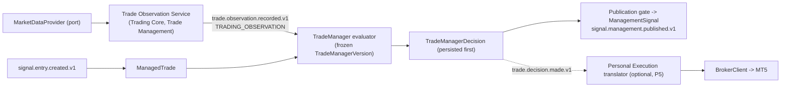

# Observation and Trade Manager boundaries (A6) - P4 architecture

Agent CLAUDE-A6-OBSERVATION-AND-MANAGEMENT-BOUNDARIES. Baseline: trading-platform `17c09b2` (Codex P0/P1 substrate) in an isolated worktree (`claude-a6/observation-management`). Inputs: A3 `26d4a40`, A4 `89ba8b2`, A5 `37321e5`. Bridge facts (stack registry, write admission) read from `mt5-native-bridge` `5d4b018` via git objects. Codex's uncommitted P2 work, production runtime, brokers, MT5, PostgreSQL, NATS and Kubernetes were not touched. **Documentation and read-only verification only; nothing is approved and nothing is implemented.**

> PostgreSQL tells us what is true. JetStream tells services what happened. The trading platform decides what should happen. The MT5 bridge tells MetaTrader what to do and reports what MT5 says.



## Documents

| # | Document | Task part |
|---|---|---|
| 01 | [`01_CURRENT_OBSERVATION_PATH.md`](01_CURRENT_OBSERVATION_PATH.md) | A trace |
| 02 | [`02_CANONICAL_OBSERVATION.md`](02_CANONICAL_OBSERVATION.md) | B definition |
| 03 | [`03_PRODUCT_EXECUTION_SEPARATION.md`](03_PRODUCT_EXECUTION_SEPARATION.md) | C |
| 04 | [`04_OBSERVATION_PRODUCER_OPTIONS.md`](04_OBSERVATION_PRODUCER_OPTIONS.md) | D |
| 05 | [`05_MARKET_DATA_PROVIDER_BOUNDARY.md`](05_MARKET_DATA_PROVIDER_BOUNDARY.md) | E |
| 06 | [`06_MANAGED_TRADE.md`](06_MANAGED_TRADE.md) | F |
| 07 | [`07_TRADE_MANAGER_VERSIONING.md`](07_TRADE_MANAGER_VERSIONING.md) | G |
| 08 | [`08_OBSERVATION_EVENT_CONTRACT.md`](08_OBSERVATION_EVENT_CONTRACT.md) | H |
| 09 | [`09_JETSTREAM_TOPOLOGY.md`](09_JETSTREAM_TOPOLOGY.md) | I |
| 10 | [`10_CHECKPOINT_REPLACEMENT.md`](10_CHECKPOINT_REPLACEMENT.md) | J |
| 11 | [`11_TRADE_MANAGER_DECISION.md`](11_TRADE_MANAGER_DECISION.md) | K |
| 12 | [`12_MANAGEMENT_SIGNAL_BOUNDARY.md`](12_MANAGEMENT_SIGNAL_BOUNDARY.md) | L |
| 13 | [`13_PERSONAL_EXECUTION_BOUNDARY.md`](13_PERSONAL_EXECUTION_BOUNDARY.md) | M, O |
| 14 | [`14_BROKER_STATE_RELATIONSHIP.md`](14_BROKER_STATE_RELATIONSHIP.md) | N |
| 15 | [`15_PERFORMANCE_EVIDENCE.md`](15_PERFORMANCE_EVIDENCE.md) | P |
| 16 | [`16_P4_MIGRATION_PLAN.md`](16_P4_MIGRATION_PLAN.md) | Q |
| 17 | [`17_P3_REDEFINITION.md`](17_P3_REDEFINITION.md) | R |
| 18 | [`18_FAILURE_MATRIX.md`](18_FAILURE_MATRIX.md) | S |
| 19 | [`19_RUNTIME_EVIDENCE_CHECKLIST.md`](19_RUNTIME_EVIDENCE_CHECKLIST.md) | T |
| 20 | [`20_CODEX_P2_REVIEW_CHECKLIST.md`](20_CODEX_P2_REVIEW_CHECKLIST.md) | U |
| 21 | [`21_ADR_CANONICAL_OBSERVATION_PRODUCER.md`](21_ADR_CANONICAL_OBSERVATION_PRODUCER.md) | V (ADR-0004, **RECOMMENDED**) |
| - | `tools/verify_management_evidence.py`, `data/management_evidence_check.json` | 26 re-runnable checks |

## Answer to OD-A5-13

The canonical observation producer is a **Trade Observation Service owned by Trade Management in the Trading Core**, fed only through the `MarketDataProvider` port (research listener adapter today). The **Phase 7 observer is retired as a producer** (not repaired, not edited, not migrated). Strategy runners and Personal Execution do not publish observations; the Trade Manager evaluator consumes them. Status: **RECOMMENDED, not approved** (`21`).

## Headline findings

1. **The legacy chain cannot produce a decision, a proposal or an execution** - on four independent counts: the only producer emits `bid=None, ask=None` and the consumer drops those (`M1`, `M4`); the only registered policy has every action disabled, so it returns `HOLD` even at +5R (`M9`, `M25`); a forced proposal is rejected `POSITION_NOT_FOUND` because it uses the strategy's `economic_position_id` where the executor matches broker tickets (`M26`); and the bridge refuses REAL close/trailing (`M24`). **There is no working behaviour to migrate; P4 builds and proves a canonical path.**
2. **Restart semantics are unsound**: checkpoint before processing (at-most-once), `started_at` reset on every start (open trades become ineligible), in-memory positions, MFE/MAE never accumulated (`M6`, `M7`, `M13`).
3. **Decision generation is coupled to an execution mode**: a policy decision is computed only when `REAL_MANAGEMENT` is on, and only non-HOLD decisions are kept (`M8`). The product must decide always and persist HOLD.
4. **Trade Manager identity is a label**: no hash of code, parameters, resolution or observation parameters (`M10`); the registry is re-resolved per observation (silent rebinding). No ManagedTrade exists; the EntrySignal already carries the geometry and the join keys (`M14`, `M15`).
5. **Three action vocabularies** (engine 8, proposals 4 broker-flavoured, executor supports 2) collapse to one product vocabulary plus a Personal Execution translator (`M11`, `03`).
6. **Broker state is not a product input at all**: the evaluator uses no broker field for any comparison (`02`); it is a Personal Execution concern, and its authority moves with P5 (`14`).
7. **The first honest TM version is `TM-NONE`** (audited `HOLD`): no validated management policy exists (Phase 7's own report says N < 20 is too small for selection). This work decides no policy.

## Key decisions recommended

| Topic | Recommendation |
|---|---|
| Observation owner / producer | Trade Observation Service in Trading Core (`04`, `21`) |
| Observation shape | trade-scoped, market facts + `bars_ref` digest, gapless per-trade `observation_seq`, deterministic `observation_id` (`08`) |
| ManagedTrade | Trading Core; created on `signal.entry.created.v1`; `MT_` id from `signal_id`; created for unpublished and unexecuted signals; bindings immutable (`06`) |
| TM version | hash of policy bundle + resolution table + code manifest + observation spec + price semantics; first version `TM-NONE` (`07`) |
| Stream | separate bounded `TRADING_OBSERVATION`; domain events stay in `TRADING_CORE` with explicit subjects; management signal subject `signal.management.published.v1` (A2 name + `.v1`) (`09`, `12`) |
| Checkpoint | none required: durable consumer + inbox + per-trade sequence + trade state in PostgreSQL (`10`) |
| Decision vs effects | decision persisted first; publication, execution, managed-track update are separate effects (`11`) |
| REAL close/trail limitation | affects only personal execution (`NOT_EXECUTABLE(...)` on the effect); never suppresses a decision or a management signal (`13`) |
| P3 | broker-state + ownership **shadow/read-model only**, kept separate, parallel to P4 (`17`) |
| P4/P5 boundary | P4 ends before any DB-authoritative management intent, ownership/broker-state authority, `activation` authority, or bridge change (`16` section 3) |

## Open decisions

| Id | Decision | Recommendation | Blocks |
|---|---|---|---|
| **OD-A6-1** | Approve or reject ADR-0004 (Trade Observation Service) | approve | P4.1+ |
| OD-A6-2 | Bar-window transport: `bars_ref` digest (recommended) vs inline delta of newly closed bars | reference | P4.1 |
| OD-A6-3 | Challenger TM versions as evaluation tracks on the same ManagedTrade vs separate ManagedTrade rows per binding role | tracks | P4.1 |
| OD-A6-4 | First frozen TM version is `TM-NONE` (audited HOLD) to prove the pipeline | yes | P4.4 |
| OD-A6-5 | Phase 7 observer's future: retire entirely, or continue as a research **consumer** | consumer or retire; never producer | P4.7 |
| OD-A6-6 | Management-signal event name: `signal.management.published.v1` (A2 + V1.2 convention) vs the task's `management.signal.published.v1` | A2 name | P4.1 |
| OD-A6-7 | Owner and timing of `PublishedSignal` / Publication Gate (Signals domain) | before P4.6; until then everything `WITHHELD(ENTRY_NOT_PUBLISHED)` | P4.6 |
| OD-A6-8 | Reference feed per StreamBinding (`market_feed_id`), especially the Liquidity `read_once` path | record and observe the reference feed | P4.3 |
| OD-A6-9 | Golden corpus inputs: owner-supplied read-only copies of `context_structure_retrace_phase7_state.json` etc. (untracked) | supply (`19` E) | P4.0 |
| OD-A6-10 | Which strategies get a TM: Context only (today) vs the Liquidity family (no policy exists) | Context first; policy per strategy is a later version | scope |
| OD-A6-11 | Per-version `max_market_age_ms` defaults and the real-time admissibility latency bound `L` (`15`) | set with measured latencies | P4.4 |
| OD-A6-12 | Cross-repo edit: remove the `trade_manager` service from the stack registry in the **bridge** repository at P4.7 | yes | P4.7 |
| OD-A6-13 | Accept the P3 redefinition and optional phase rename (`17`) | accept | P3 scope |
| OD-08 | Retention/sizing of `trade_observation`, `TRADING_OBSERVATION` | measure in P4.3 | production |
| OD-A5-14 | Runtime facts (`19`) | supply | closure of OD-01..04 |

## Tooling

```sh
PYTHONDONTWRITEBYTECODE=1 python3 docs/management_architecture/tools/verify_management_evidence.py          # table; exit 1 on FAIL
PYTHONDONTWRITEBYTECODE=1 python3 docs/management_architecture/tools/verify_management_evidence.py --write  # also data/*.json
```

Reads the platform checkout and (for the stack registry and write admission) bridge commit `5d4b018` via git; runs pure Trade Manager code in a subprocess against a temporary directory. No runtime file, broker, MT5, PostgreSQL, NATS or Kubernetes access.

## Limits

* Static analysis of `17c09b2` and `5d4b018`; **no live runtime was inspected**. Whether an unlisted process publishes observations, whether the observer or the Trade Manager consumer is running, and what any runtime file currently contains are `19` items.
* The golden corpus input for the one persisted replay case is not tracked in git.
* Event names, subjects and stream layout are proposals; sizing and retention remain OD-08.
