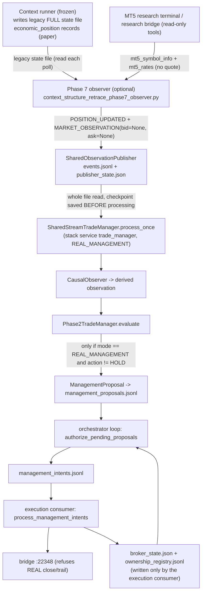

# 01 - The current observation and management path (traced from source)

Baseline `17c09b2`. Bridge facts (stack registry, write admission) come from repository `mt5-native-bridge` commit `5d4b018` via git objects. Check ids (`M1`..`M26`) refer to `tools/verify_management_evidence.py` (all pass); `B*`/`P*` refer to A5's `docs/runtime_boundaries` evidence tool. Nothing here inspects a running system.

## 1. The chain, hop by hop

## 2. Hop table

| # | Module / function | Input | Output | File / state dependency | Timing | Checkpoint / ack | Failure behaviour | Identity / ordering / dedupe | Coupling |
|---|---|---|---|---|---|---|---|---|---|
| 1 | Context runner (frozen) | research-bridge reads | economic positions inside `context_structure_retrace_forward_state.json` (legacy **full** state, declared immutable after cutover by the runner) and the compact state used by the orchestrator adapter | files | runner poll (`--interval 15`) | none | runner-owned | `economic_position_id` (Context only; Liquidity has none, `M14`) | strategy-specific |
| 2 | `phase7.poll()` / `v1_positions()` | legacy full-state file; per prospective position `mt5_symbol_info` + `mt5_rates` (M5, `limit` 320) | Phase 7 research state/events **and** two published events per position per poll | `PHASE6_STATE` legacy file, `context_structure_retrace_phase7_state.json`, manifest | 15 s loop; 2 bridge calls per prospective position | state written atomically at end of poll; no ack | any exception in a position => `PHASE7_DATA_GAP` event, other positions continue; publisher failures logged as events and **ignored (fail open)** | Phase 7 `event_id` strings; `economic_position_id` | Context-only; MT5 research bridge |
| 3 | `market_envelope()` | last M5 bar, `rates[-205:]`, spread, position ids | `MARKET_OBSERVATION` with **`bid=None, ask=None`**, `m5` (incomplete latest bar), `m5_history` (205 bars), no `m1_history` | none | per poll | none | - | `observation_id = sha256(symbol, position, setup, strategy, source_timestamp, bid, ask, m5, source)` computed *before* the publisher writes `source.sequence` (`M22`) | position-scoped (one per position per poll), not market-scoped |
| 4 | `position_event()` | Phase 7 row | `POSITION_UPDATED` only (never OPENED/CLOSED, `M3`): entry, `original_stop`, `current_stop`, target, `size=None`, status; **no MFE/MAE** (`M13`); no `signal_id`, no ticket | none | per poll | none | - | `event_id = sha256(all fields except ids)` => republished only when content changes | strategy-scoped |
| 5 | `SharedObservationPublisher.publish()` | event | line appended to `runtime/trade_manager/observation_stream/events.jsonl`; `publisher_state.json` rewritten with **all published ids** on each publish | cwd-relative path (`M20`); rotates at 50 MB by rename | per event | none | failure => returns False; observer records an event and continues (**fail open**) | dedupe by id set (unbounded); publisher-assigned `sequence` | file transport |
| 6 | `FanoutConsumer.read()` | whole `events.jsonl` re-read each call (O(n)) | rows with `sequence > checkpoint`; gap list recorded but not repaired | `checkpoint.trade_manager.json` | each TM loop | **checkpoint written inside `read()` before the rows are processed** (`M6`) => **at-most-once** | crash after read: rows lost; JSON error in a line => exception (no tolerance) | `sequence` only; `sequence` gap => `incomplete` note | file transport |
| 7 | `SharedStreamTradeManager.process_once()` | rows | applies `POSITION_*` events to an **in-memory** dict; for each `MARKET_OBSERVATION` needs the position, `_eligible()`, and bid/ask | in-memory `positions`; `collector_state.json` (`started_at`); `activation.json` (untracked) | 15 s loop (`--interval 15`) | none | **every observation from the Phase 7 producer is dropped as `MISSING_QUOTE`** (`M1`, `M4`); `m1_history` is read but never published (`M5`) | positions keyed by `economic_position_id` | Context-only |
| 8 | eligibility | `started_at` | positions with `entry_timestamp >= started_at` | `start()` **resets `started_at` to now on every start** (`M7`) | - | - | after any restart, open positions are ineligible and (because lifecycle events were already consumed) unknown | - | process-lifecycle coupling |
| 9 | `CausalObserver.observe()` | position + quote + M1/M5 rates + as_of | `trade-manager-causal-observation-v1`: bid/ask/spread/mid, close-side executable price, current_R, MFE/MAE (**prior taken from the position dict, which never carries it**), EMA200 (M5 completed), swing structure, events (EMA/structure/stop/target proximity) | in-memory previous observation per position | per observation | none | as-of safe (`causal_candles`, completed bars only) | `observation_id = sha256(position, timestamp, bid, ask, m1_time, m5_time)` (`M21`) | pure |
| 10 | `Phase2TradeManager.evaluate()` | position + observation | decision dict (action, reason codes, `management_policy`, evidence, `idempotency_key`) | `PolicyRegistry` (default: one strategy policy, **every action disabled**, `M9`) | per observation | none | any exception propagates out of `process_once` (no isolation per position) | `idempotency_key = sha256(strategy, setup, position, action, timestamp)` | pure; hard-coded `mode="ADVISORY_SHADOW"` |
| 11 | policy result | - | at +5R: `HOLD / NO_MANAGEMENT_CHANGE` (`M25`) - **no management action exists in the code as configured** | - | - | - | - | - | - |
| 12 | proposal | decision + position + broker snapshot version | `ManagementProposal` only if `mode == REAL_MANAGEMENT` and action != HOLD (`M8`); `position_identity = ticket or broker_position_id or economic_position_id` | `broker_state.json` (file) | - | `append_unique` (scan-then-append) | HOLD decisions are **not persisted anywhere** in this path (no state store) | `MP_<sha>` over (identity, action, snapshot, policy) | broker-flavoured; account-coupled |
| 13 | `authorize()` (orchestrator process) | proposals, `broker_state.json`, ownership ledger | `management_intents.jsonl` / decisions | files | orchestrator loop | decision row = ack | **a proposal from this path is always rejected `POSITION_NOT_FOUND`**: its identity is the economic position id, broker positions are matched by ticket, and ownership rows carry no economic id (`M15`, `M26`) | `MA_`/`MINT_` unique keys | personal execution |
| 14 | `process_management_intents()` | authorised intents | bridge call (`mt5_close_position` / `mt5_trailing_stop`), results file | files | consumer loop | only `COMPLETED` counts | executor supports only CLOSE_POSITION and TRAIL_STOP (`M11`); the bridge **refuses REAL** for both (`M24`); transport errors recorded as rejections and retried | `MEXEC_` unique key (A5) | personal execution |

## 3. What the path actually does today

1. **No observation ever reaches a decision**: the only producer emits no quote, the only consumer requires one (`M1`, `M4`).
2. **Even with quotes, no management action would be produced**: the sole registered policy has every action disabled (`M9`, `M25`).
3. **Even if an action were produced, it could not be authorised**: identity mismatch (`M26`).
4. **Even if authorised, it could not be executed for REAL** (`M24`), and two of the four proposal actions (`MOVE_TO_BREAKEVEN`, `PARTIAL_CLOSE`) have no executor implementation (`M11`).
5. **Restart semantics are unsound**: at-most-once checkpoint, reset eligibility clock, in-memory positions, MFE/MAE never accumulated (`M6`, `M7`, `M13`).
6. **Decision generation is gated by an execution mode**: `REAL_MANAGEMENT` is the only mode in which a policy decision is computed (`M8`); in `ADVISORY_SHADOW` only research experiments run. The product decision is therefore coupled to the *personal-execution proposal switch*.
7. **The Trade Manager is Context-only**: policy registry, Phase 7 and the identity join exist for `CONTEXT_STRUCTURE_RETRACE_V1` positions only.
8. **Not part of the intended stack as defined**: the stack registry lists `trade_manager` (stream consumer, `REAL_MANAGEMENT`) but no Phase 7 observer and no collector service (`M23`). Whether an unlisted process publishes, or whether the observer runs, is runtime-dependent (A5 OD-03, checklist in `19`).

Consequence for P4: **there is no working canonical behaviour to preserve**. What exists is a *set of pure evaluation modules* (engine, observation math, semantics, trailing, policy registry) plus an inert transport. P4 is therefore "build the canonical path and prove it against golden replays", not "move a running stream".

## 4. Reusable, pure pieces (for characterisation, not for change)

| Module | Nature | Evidence |
|---|---|---|
| `engine.py` `TradeManager`, `position_r`, `excursion`, `stop_is_safe` (in `central.py`) | pure evaluators | no I/O |
| `observation.py` `causal_candles`, `build_observation`, `detect_events` | pure, as-of safe (completed bars only) | no I/O |
| `semantics.py` `PriceSemantics` | pure bid/ask close-side conventions | no I/O |
| `trailing.py` | pure proposals (R-based, structure, EMA+structure, ATR+structure) | no I/O |
| `experiments.py` `MultiPolicyExperimentRunner` | counterfactual research ledger | research |
| `collector.py`, `prospective.py` | provider-agnostic collectors with injected position/market sources | not used by any production module (`M17`, `M18`) |
| `replay.py`, `discrepancy.py` | offline fixture replay / audit of one XAUUSD Phase 7 case | offline |
