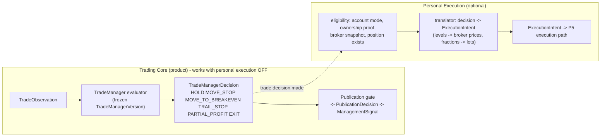

# 03 - Product Trade Manager vs Personal Execution adapter

Question: does the current Trade Manager mix product-level and execution-level concerns, and where exactly? **No policy is redesigned here.** Classes: `PRODUCT_POLICY` (broker-independent management logic), `BROKER_SEMANTICS` (price/instrument conventions that come from how brokers quote), `PERSONAL_EXECUTION` (account, ticket, lot, ownership, executor), `LEGACY_COUPLING` (a product artefact that is wired to an execution or process concept and must be decoupled).

## 1. Target split

The arrow from the decision to Personal Execution is **one-way and event-based**; Personal Execution never writes back into a decision, an observation or a ManagedTrade.

## 2. Classification of what exists

| Item (module / symbol) | Class | Why | Target home |
|---|---|---|---|
| `engine.TradeManager.evaluate` thresholds, `position_r`, `excursion`, `ema*`, `structural_stop`, reasons | PRODUCT_POLICY | pure math on geometry and prices | Trade Management evaluator |
| `engine.ACTIONS` vocabulary | PRODUCT_POLICY (needs canonical rename) | A2 maps to `HOLD / MOVE_STOP / MOVE_TO_BREAKEVEN / TRAIL_STOP / PARTIAL_PROFIT / EXIT` | evaluator + registry |
| `observation.py` (`causal_candles`, EMA, swings, event detection) | PRODUCT_POLICY (observation spec) | as-of math; parameters (EMA 200, swing lookbacks 2/2) are part of TM version identity | evaluator (or shared observation-derivation library) |
| `semantics.PriceSemantics` (close side = bid for LONG, ask for SHORT; mark = mid) | PRODUCT_POLICY with BROKER_SEMANTICS input | reference-trade price convention (A2 `02` section 5); needs a two-sided quote from the MarketDataProvider | evaluator; versioned as `price_semantics_version` |
| `trailing.py` proposals | PRODUCT_POLICY | pure; proposals are stop levels | evaluator |
| `policies.PolicyRegistry` / `ManagementPolicyConfig` | PRODUCT_POLICY | strategy/instrument resolution | TradeManagerVersion content |
| `central.stop_is_safe` (never widen risk) | PRODUCT_POLICY (domain invariant per A2) | protects the reference trade, not only accounts | ManagedTrade invariant |
| `engine.ManagementPolicy.mode = "ADVISORY_SHADOW"`, `authorization_mode`, `advisory_only` in every decision; `phase2` hard-codes `mode="ADVISORY_SHADOW"` | **LEGACY_COUPLING** | execution/authorisation vocabulary inside a product decision | remove from decision contract |
| `engine._record` fields `account_context_id`, `position_size`, `unrealized_pnl` | PERSONAL_EXECUTION | account concepts; influence nothing (`02`) | translator adds them |
| `TradeManager.evaluate` requiring `size` in the position | LEGACY_COUPLING | a lot size is required to *start* evaluating, but is unused | drop from required set |
| `engine.management_intent()` (broker-free "future execution contract": `MOVE_STOP/REDUCE/CLOSE/ADD/REENTER`) | PERSONAL_EXECUTION placed in the product module | a second, older intent vocabulary | translator |
| `stream_consumer` `if mode == "REAL_MANAGEMENT": decision = evaluate(...)` (`M8`) | **LEGACY_COUPLING** | a product decision is computed only when the personal-execution proposal switch is on | decision generation unconditional |
| `stream_consumer` proposals: `BrokerStateStream().load()` snapshot version | PERSONAL_EXECUTION | broker state read inside the product consumer | translator |
| `central.ManagementProposal` (`ticket`, `broker_position_id`, `broker_symbol`, `requested_close_volume`, `snapshot_version`) | PERSONAL_EXECUTION (+ BROKER_SEMANTICS) | ticket/volume/snapshot are broker concepts | translator output = ExecutionIntent |
| `central.ALLOWED_ACTIONS` (`MOVE_TO_BREAKEVEN, TRAIL_STOP, PARTIAL_CLOSE, CLOSE_POSITION`) | PERSONAL_EXECUTION vocabulary | broker-flavoured action names | translator mapping table |
| `central.authorize` (snapshot match, ownership proof, position found, duplicate key, close-volume bound) | PERSONAL_EXECUTION | account/ownership | Personal Execution (P5) |
| `central.OwnershipRegistry`, `BrokerStateStream` | PERSONAL_EXECUTION | account state; written only by the consumer (A5 `P7`, `P8`) | Personal Execution (P5 authority) |
| `stream_consumer._eligible` via `started_at` reset on start (`M7`) | LEGACY_COUPLING | eligibility tied to *process* start | ManagedTrade eligibility set at open |
| `stream_consumer.status/health` `broker_state_stream_ready`, `ownership_registry_ready`, `direct_broker_access` | PERSONAL_EXECUTION / LEGACY_COUPLING | product health mixes account readiness | split health |
| `fanout` file transport, `publisher_state.json` published-ids | LEGACY_COUPLING | transport | replaced (`09`, `10`) |
| `Phase7` research measurements (thresholds, checkpoints, hypotheses) | RESEARCH | not product policy | research consumer |
| `experiments.MultiPolicyExperimentRunner`, `counterfactual` | RESEARCH (counterfactual) | hypothetical outcomes | research; never FORWARD evidence |
| `live_execution_consumer.process_management_intents` (close/trail via bridge; supports 2 of 4 actions) | PERSONAL_EXECUTION | executor | P5 |

## 3. Where the two layers meet today, and what must change (not now)

| Meeting point | Today | Target |
|---|---|---|
| Identity of "the thing managed" | `economic_position_id` (strategy paper position) reused as the *broker position identity* in proposals (`M26`) | `managed_trade_id` in the product; the translator resolves it to broker positions through `signal_id -> execution_intent -> ownership -> ticket` |
| Activation | `REAL_MANAGEMENT` means both "compute decisions" and "send proposals" | activation splits into **product TM activation** (version binding state) and **personal-execution management activation** (account-scoped, P5) |
| Broker snapshot version | attached to the proposal by the product consumer | attached by the translator at intent time |
| Action names | three vocabularies (`M11`) | one product vocabulary (A2 mapping); a translator table to executor primitives |
| Decision persistence | only non-HOLD proposals, in a file the executor reads | decision persisted first, always (including HOLD); effects are separate records (`11`) |

## 4. Rule of thumb for later reviews

A field belongs in the product decision only if a **customer-facing ManagementSignal** could carry it without leaking an account: levels, fractions, reference prices, reason codes, evidence references. Anything requiring a lot size, ticket, account id or broker snapshot belongs to the Personal Execution translator.
