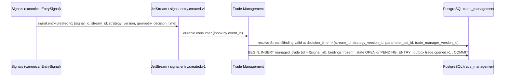
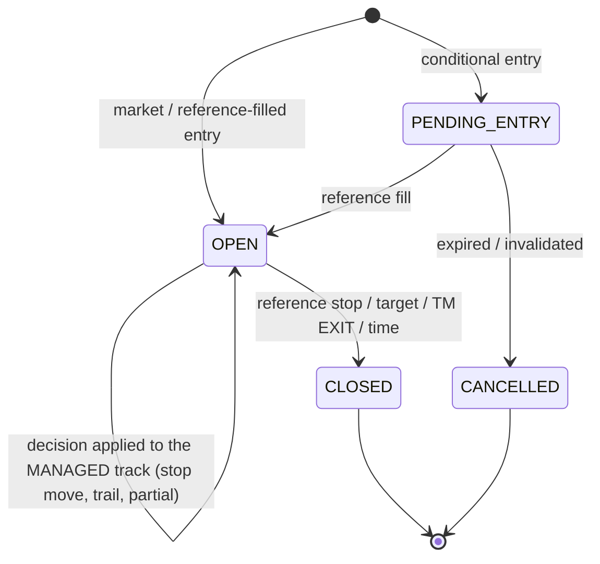

# 06 - ManagedTrade: ownership, creation, identity, state

## 1. Owner - verified against the implementation

A2 (`docs/architecture/02_DOMAIN_MODEL.md` section 3-5, `03` section 4, `ADR-0001` D9-D12) places `ManagedTrade` in **Trading Core / Trade Management**, as a broker-independent *reference trade*. Verification against the code:

| A2 claim | Implementation (`17c09b2`) | Verdict |
|---|---|---|
| ManagedTrade is created for every EntrySignal, published or not | there is **no ManagedTrade**; the equivalent is the strategy's `economic_position` (Context runner state) plus a Phase 7 registration row and an in-memory `ManagementState`; none is tied to publication or to a signal id | consistent in spirit (managed things exist without publication or execution); identity is different |
| broker-independent | `TradeManager.evaluate` is broker-free; proposals/authorisation are not (`03`) | the *evaluator* is; the *package* is not |
| binds StrategyVersion and TradeManagerVersion at open, never rebinds | nothing binds; `PolicyRegistry.resolve(strategy_id, symbol)` is evaluated **per observation**, so a registry change re-binds silently mid-trade; `management_policy_version` is a label (`M10`) | **not implemented** |
| geometry = EntrySignal entry/stop/target | `StrategySignal.entry_price/stop_price/target_price` exist and equal the Context reference fill (`M14`); the TM instead reads geometry from Phase 7 rows copied from the legacy state (`initial_stop`, `v1_target`) | source of geometry differs |
| supports FORWARD evidence without execution | Phase 7 does this for research (its own N and thresholds) | precedent only |

## 2. Creation trigger

* **Trigger**: consumption of `signal.entry.created.v1` (A2 `04`; the subject already exists in V1.2). Not: publication, execution, or the arrival of a broker fill.
* **Not created** when the stream binding is `RETIRED`/absent, or the signal is classified ineligible by the replay guard (`PRE_ORCHESTRATOR_REFERENCE`, gap recovery) - such signals are recorded as `ManagedTradeSkipped(reason)` for audit, not silently dropped.
* **Idempotent**: unique `signal_id` per binding role; a redelivered signal event is absorbed by the inbox and the unique key.

## 3. Identity

`managed_trade_id = stable_id("MT", {signal_id})` for the **PRIMARY** binding (one ManagedTrade per EntrySignal, A2 ER). It never depends on `economic_position_id`, ticket, account or process.

| Reference | Stored as | Why |
|---|---|---|
| `signal_id` (EntrySignal) | FK by value | 1:1 origin |
| `economic_position_id`, `entry_opportunity_id` | `legacy_refs` (Context only; `M14`) | join to strategy ledger/Phase 7 during migration; Liquidity has none (`economic_position_id=None`) |
| `published_signal_id` | nullable, set when a PublishedSignal exists | the public face is optional (A2) |
| personal execution position(s) | **not stored on the ManagedTrade**; a link table owned by Personal Execution: `(managed_trade_id or signal_id, execution_intent_id, broker_position_ref)` | keeps the product free of accounts; the join exists today through `signal_id -> intent -> ownership -> ticket` (`M15`) |
| broker ticket | Personal Execution only | - |

**Shadow / challenger TM versions.** To evaluate a candidate TradeManagerVersion on the same entries without touching the bound version, a `ManagedTradeEvaluationTrack(managed_trade_id, tm_version_id, role = BOUND | CHALLENGER)` carries that version's decisions and hypothetical managed outcome. Only the `BOUND` track is *the* managed series; challengers never publish, never blend, and start their own FORWARD clock (`15`). (Open decision `OD-A6-3`: track vs separate ManagedTrade rows per binding role.)

## 4. State machine

A2 (`03` section 4):

Implementation notes:

* **Both adapters emit an EntrySignal only after the strategy's reference fill** (Context: `entry_type = MARKET_PAPER_OBSERVATION` from a filled economic position; Liquidity: records without `simulated_fill_timestamp` are skipped, `M14`), so today every ManagedTrade would start `OPEN`. `PENDING_ENTRY` is part of the model for future conditional entries (Liquidity runner records do pass through `WAITING_FOR_RETRACE` before the fill, but that is not surfaced as a signal).
* **Two ledgers on one trade**: the `ENTRY_ONLY` outcome follows the *strategy's frozen ledger* (its stop/target/exit events - the Context runner's `STOPPED`/`TARGET_HIT`); the `MANAGED` outcome follows the *TM reference simulation* (decisions actually emitted, applied in order). The TM never recomputes the entry-only outcome. `experiments.HypotheticalPosition` is the precedent for the managed simulator.
* `MOVE_STOP` never widens risk: `stop_is_safe` becomes a ManagedTrade invariant.
* `CLOSED` is recorded from the strategy ledger event (entry-only) **and** the managed simulation; both are required to emit `trade.closed.v1` with both outcomes (A2).

## 5. Answers to the questions asked

| Question | Answer |
|---|---|
| Creation trigger | consumption of `signal.entry.created.v1` (the canonical EntrySignal) |
| Stable ID | `stable_id("MT", {signal_id})` (PRIMARY binding) |
| Relation to EntrySignal | 1:1 |
| Relation to PublishedSignal | optional; ManagedTrade exists without one |
| Relation to personal execution position | none inside the product; link owned by Personal Execution |
| Relation to broker ticket | none inside the product |
| **Can an unpublished EntrySignal have a ManagedTrade?** | **Yes** - SHADOW/CHALLENGER/personal-only trades still get decisions and both outcomes (A2 `03` section 5). It simply never yields a customer `ManagementSignal` (a management update for a trade customers never saw is meaningless) |
| **Can an unexecuted EntrySignal have a ManagedTrade?** | **Yes** - FORWARD evidence is defined on the reference trade with no broker order |
| Silent rebinding | forbidden: bindings written at open, immutable; a registry change affects only trades opened afterwards |

## 6. Consequences for P4

* Creating ManagedTrades in shadow requires **canonical EntrySignal identity from P2** (stable `signal_id`, `decision_time`, `provenance`, stream/strategy version). P2's review checklist (`20`) protects exactly these fields.
* The Phase 7 registration and the legacy `economic_position` are *sources of legacy references*, not the canonical identity.
