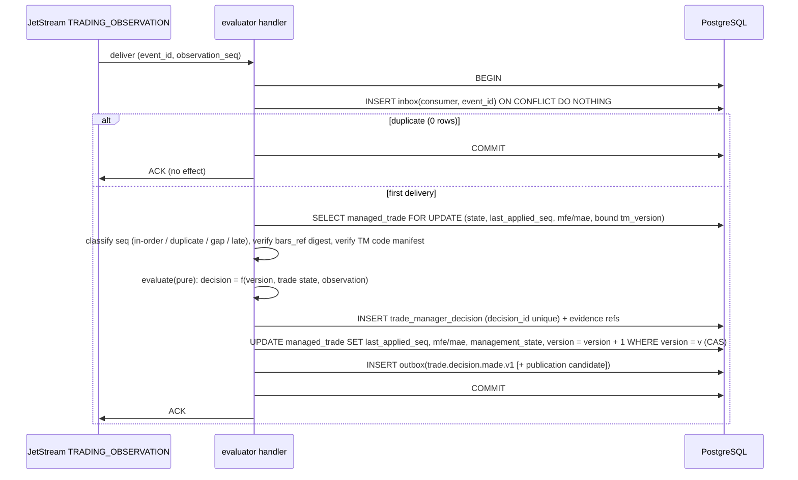

# 10 - Replacing the fan-out checkpoint (at-most-once -> effectively-once)

## 1. The defect being replaced (`M6`, `M7`, `M13`)

| Current behaviour | Effect |
|---|---|
| `FanoutConsumer.read()` writes `checkpoint.trade_manager.json` **before** the rows are processed | crash after `read()` loses those observations permanently (**at-most-once**) |
| positions live in an in-memory dict rebuilt only from lifecycle events already consumed | after restart positions are unknown |
| `start()` resets `started_at` and `_eligible()` filters by it | after restart open trades become ineligible |
| MFE/MAE prior read from a position dict that never carries it | excursion never accumulates |
| `publisher_state.json` keeps all published ids | unbounded, and the only dedupe |

## 2. Target flow

* **No network call inside the transaction.** The handler reads one trade row and, at most, resolves a `bars_ref` from a local bar store before opening the transaction (or from an in-process cache); the evaluator is pure.
* **Trade state lives in PostgreSQL** (`managed_trade`: `last_applied_seq`, `mfe_R`, `mae_R`, current stop of the managed track, management state, bound versions). Nothing is held only in memory.
* **Eligibility is a property of the ManagedTrade**, set at open (`PROSPECTIVE_ELIGIBLE`, `PRE_FREEZE_EXPOSED`, `LEFT_TRUNCATED`, the vocabulary Phase 7 already uses), never a function of when a process started.

## 3. Restart proof (conceptual)

Invariants:

1. **State is durable and transactional**: every effect of handling an event (decision, trade state, outbox, inbox marker) commits in one transaction or not at all.
2. **The handler is a deterministic function** of `(event, managed_trade row, bound TradeManagerVersion)`; it has no hidden state (positions, `started_at`, published ids).
3. **Delivery is at-least-once**: the message is acknowledged only after commit.
4. **Duplicates are absorbed** by the inbox (same event) and by `decision_id` uniqueness (same observation, trade, version).

Cases:

| Crash point | State at restart | What happens |
|---|---|---|
| before `BEGIN` | nothing changed | JetStream redelivers; processed normally |
| inside the transaction, before `COMMIT` | rolled back (PostgreSQL) | redelivery; recompute yields the same `decision_id`; commits once |
| after `COMMIT`, before `ACK` | decision, state, outbox, inbox all present | redelivery; inbox hit => `COMMIT`/`ACK` with no effect |
| after `ACK` | complete | nothing to redo |
| outbox committed, not yet published | outbox row exists | relay publishes on restart; `Nats-Msg-Id` + downstream inbox absorb duplicates (A4 failure modes 2, 3) |
| process restart | no in-memory state to restore; the durable consumer resumes from its ack floor; the trade rows give `last_applied_seq` | in-order processing continues; nothing about the process start time matters |
| stream truncated/recreated | `trade_observation` rows are intact | republish from rows (`08` section 5); consumers tolerate replays (inbox) |
| two evaluator instances | both may receive messages | `SELECT ... FOR UPDATE` on the trade row + CAS on `version` serialise; the duplicate work is discarded by uniqueness; a lease (A5 `04` resource naming) may additionally restrict to one active evaluator |

Therefore **no checkpoint file is required for correctness** (`CHECKPOINT_FILE_REQUIRED_TARGET = false`): the JetStream consumer position is an efficiency, the database is the truth, and the convergence test of A4 (`11` section 6) - delete all local files, restart, converge to identical PostgreSQL state - applies unchanged.

## 4. Old artefacts and their fate

| Artefact | Fate |
|---|---|
| `checkpoint.trade_manager.json` | retired (replaced by the durable consumer + `last_applied_seq`) |
| `publisher_state.json` (all published ids) | retired (`Nats-Msg-Id` + inbox) |
| `collector_state.json` (`started_at`) | retired; eligibility on ManagedTrade |
| `events.jsonl` + rotation | retired after the shadow gates (`16`) |
| in-memory `positions` | replaced by `managed_trade` rows |

## 5. Ordering versus redelivery

With `max_deliver > 1` a redelivered older message can arrive after a newer one. The sequence guard (`08` section 4) makes that harmless: an older `seq` is a duplicate (already applied) and is acknowledged; a newer `seq` with a gap waits for its predecessor. This replaces "the file is read in order" as the ordering guarantee.

## 6. Mixed-mode note (P4.3-P4.4)

During shadow the legacy consumer keeps its file checkpoint untouched; the shadow consumer's durable position lives in JetStream. Neither reads the other's state. No cutover happens in P4.3-P4.4 (`16`).
