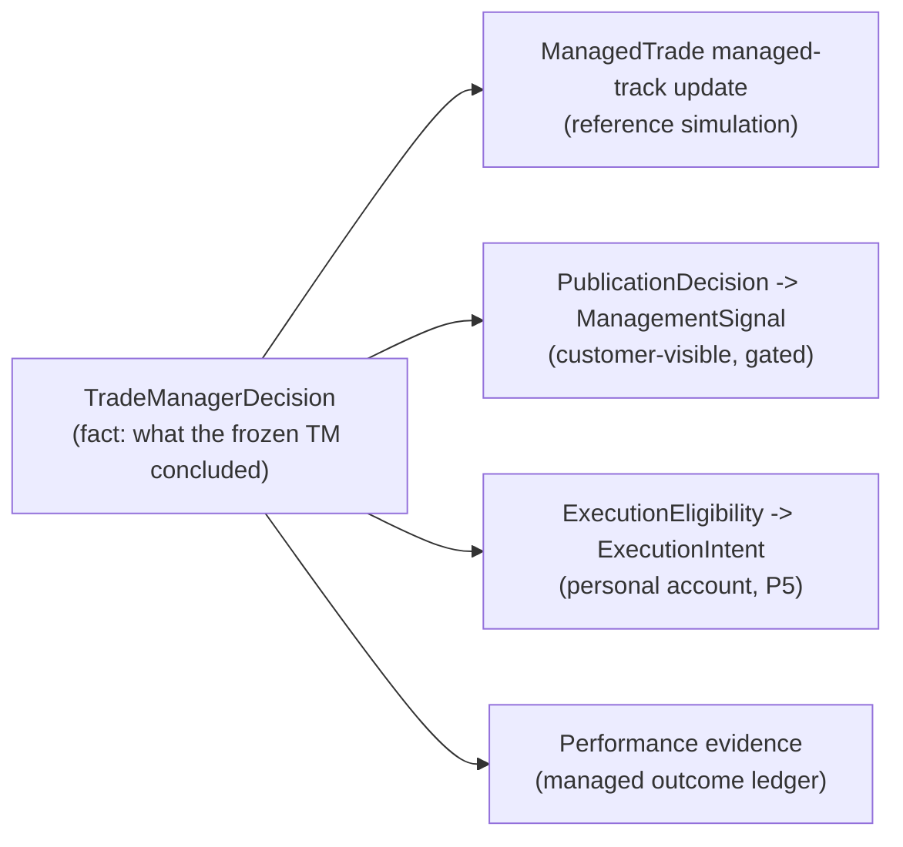

# 11 - TradeManagerDecision (durable model) and its separation from effects

## 1. Model

```
TradeManagerDecision   (immutable; persisted BEFORE anything reacts to it)
  decision_id            stable_id("TMD", {managed_trade_id, observation_id, tm_version_id})
  managed_trade_id, signal_id, stream_id
  observation_id         the single observation used (causality: observation.observed_at <= decision_time)
  observation_seq
  trade_manager_version_id, evaluation_track  (BOUND | CHALLENGER)
  action                 HOLD | MOVE_STOP | MOVE_TO_BREAKEVEN | TRAIL_STOP | PARTIAL_PROFIT | EXIT     (A2 canonical; see mapping in 03/A2)
  parameters             levels and FRACTIONS only: {to_price} | {reference_price, offset_r} | {distance, basis} | {fraction, reference_price} | {reference_price}
  reason_codes           from a versioned registry (existing engine.REASONS is the seed)
  decision_trace_ref     reference (hash + row id) to the evaluator trace: derived state (current_R, MFE/MAE, EMA, structure), rules evaluated, thresholds vs observed
  decision_time          the observation's effective time; never later than persisted_at
  persisted_at           DB time
  data_status            FORWARD | REPLAY | BACKTEST      (inherited from the observation; LIVE evidence belongs to Personal Execution)
  provenance             producer versions, code-manifest digest verified, provider/feed
  idempotency_key        = decision_id (the current sha256(strategy, setup, position, action, timestamp) is replaced: it ignored the version and the observation)
```

Not present: lots, tickets, account ids, `account_context_id`, `unrealized_pnl`, `position_size`, `authorization_mode`, `advisory_only` (`03`).

## 2. Persistence rules

* **Every evaluated observation yields a persisted decision, including `HOLD`** (audit and replay; A2 `03` section 5). Today `HOLD` decisions are not persisted anywhere in the stream path (`M8`).
* `decision_id` is unique; a redelivered observation recomputes the same id and is absorbed (`10`).
* A decision is **immutable**. Corrections are new decisions on later observations; a bug found later produces a *new TradeManagerVersion*, never a rewrite.
* The decision references, does not embed, the full trace (A3 pattern: `evaluation_hash`/`trace_hash` + row id) - decisions stay small; the trace is evidence.

## 3. Decision vs effects



| Statement | True? |
|---|---|
| `Decision(EXIT)` means the broker position was closed | **No** - that is `ExecutionResult`, downstream, personal, optional |
| `Decision(EXIT)` means customers were told | **No** - that is a published `ManagementSignal`, and only if the entry was published and the gate allows |
| `Decision(EXIT)` closes the ManagedTrade's **managed track** | **Yes** - reference simulation applies decisions in order |
| `Decision` depends on entitlements, subscribers, or account state | **Never** |

Each effect has its own record, status and failure handling:

| Effect | Record | Status values | Failure isolation |
|---|---|---|---|
| managed-track update | `managed_trade` transaction (same tx as the decision) | applied | atomic with the decision |
| publication | `publication_decision` (`12`) | `PUBLISHED` / `WITHHELD(reason)` | a failure never rolls back or suppresses the decision |
| execution | `execution_eligibility` (`13`) | `ELIGIBLE` / `NOT_ELIGIBLE(reason)` / `NOT_EXECUTABLE(reason)` / `INTENT_CREATED` | the current bridge limitation becomes `NOT_EXECUTABLE(EXECUTION_PRIMITIVE_UNAVAILABLE)` on the *effect*, not a missing decision (`13`) |
| evidence | performance ledger | - | reads decisions only |

## 4. Action vocabulary

Canonical (A2) vs existing (`M11`):

| Existing engine `ACTIONS` | Canonical | Notes |
|---|---|---|
| `HOLD` | `HOLD` | persisted, not published |
| `PROTECT_STOP` | `MOVE_STOP` | levels only |
| `MOVE_BREAKEVEN` | `MOVE_TO_BREAKEVEN` | `{reference_price, offset_r}` |
| `TRAIL_STOP` | `TRAIL_STOP` | `{distance, basis}`; proposals from `trailing.py` |
| `REDUCE_POSITION` | `PARTIAL_PROFIT` | `{fraction, reference_price}`; the existing `proposed_size` (lots) leaves the product contract |
| `CLOSE_POSITION` | `EXIT` | `{reference_price}` |
| `ADD_POSITION` | *not in V1* | ADR-011 "no scale-in" |
| `REENTRY_ELIGIBLE` | *not a decision* | re-entry is a new StrategyOpportunity (ADR-010) |

The three current vocabularies (engine 8, `central` 4 broker-flavoured, executor 2 supported) collapse to **one product vocabulary** plus a **translator table** owned by Personal Execution.

## 5. Determinism requirements

Inputs to the pure evaluator: `(observation, managed_trade state row, TradeManagerVersion manifest, bars window resolved via digest)`. No wall clock, no random, no provider call, no file. `decision_time` = observation `effective_at`; `persisted_at` is metadata. Two evaluations of the same inputs must be byte-identical (the golden-replay gate, `16`).

## 6. What P4 may persist before P5

Everything in this document: `managed_trade`, `trade_observation`, `trade_manager_decision`, decision traces, `publication_decision`. **Not** `execution_eligibility` rows that create intents or any write consumed by the legacy executor (`13`).
