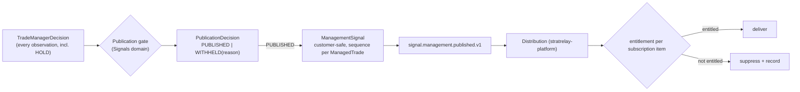

# 12 - TradeManagerDecision -> PublicationDecision -> ManagementSignal

The customer/product branch must exist with **personal execution OFF and MT5 execution OFF**. Entitlement affects **distribution** only, never the generation of a decision (A2 `03` section 6).

## 1. The chain



Ownership: decision - Trade Management; gate and `ManagementSignal` - **Signals (publication)**; entitlement and delivery - Commerce/Distribution (`stratrelay-platform`). The Trading Core publishes **one** customer-safe copy; it never sees entitlements or subscribers (A2: "Commerce -> Trading Core: none in V1").

## 2. Publication gate rules (inputs are trading facts only)

| Rule | Source |
|---|---|
| the ManagedTrade's **entry was published** (a `PublishedSignal` exists); a management update for a trade customers never saw is meaningless | A2 `03` section 5 |
| the action is **actionable** (not `HOLD`); `HOLD` is audited, never published | A2 |
| the stream/TM-version publication policy allows it (`TradeManagerVersion.status` = `FROZEN`/`ACTIVE`; a `SHADOW`/challenger version never publishes) | A2 bindings |
| stream state and kill switch allow publication | A2 |
| the decision is the **bound track's** decision, in `observation_seq` order | `06`, `08` |

Everything above is a trading/product fact. **No rule consults personal execution state, an account, a broker position, or an entitlement.**

## 3. ManagementSignal (A2 fields)

`managed_trade_id`, `sequence` (per trade, gapless), action, human-readable parameters (new stop level, fraction, reference price), customer-safe reason text derived from reason codes, `published_at`, original `signal_id`, `tm_version_id`, `decision_id`. It carries **levels and fractions**, never lots, tickets or accounts. Corrections are new signals (`SignalCorrected`), never mutations (A2 `03` section 3).

## 4. Event boundary Commerce consumes

`signal.management.published.v1` on `TRADING_CORE` (`09`):

```
event_id, aggregate = managed_trade / managed_trade_id, aggregate_version = ManagementSignal.sequence
payload: managed_trade_id, signal_id, published_signal_id, sequence, action, parameters, reason_customer, published_at, tm_version_id
```

* Ordered per `managed_trade_id`; distribution guarantees in-order delivery per recipient/channel or marks a gap (A2).
* Commerce subscribes to exactly `signal.published`, `signal.retracted`, `signal.management.published`, `signal.outcome.published` (A2 stream layout); it never sees `trade.observation.*`, `trade.decision.made.v1`, `execution.*` or `broker.*`.
* Name reconciliation with the task's suggested `management.signal.published.v1` is in `09` section 2 (recommendation: keep A2's `signal.management.published`, add `.v1`).

## 5. What P4 can do before Distribution exists

* Generate and persist decisions (always).
* Evaluate the gate and persist `PublicationDecision` and the `ManagementSignal` **record** for every actionable decision on a published ManagedTrade, and publish the event to the internal stream - **with no consumer required**. Distribution/Commerce attaches later.
* Until a PublishedSignal exists in the codebase (A2 `02`: *absent* today; "today every signal auto-enters `distribution_queue`", which has no consumer, A4 `ORC-08`), `WITHHELD(ENTRY_NOT_PUBLISHED)` is the correct outcome for every trade; the gate and its persistence are still exercised in shadow.
* **Independence test** (must pass before P4.6): with the Personal Execution translator disabled and no broker/bridge credentials present, decisions, publication decisions and management signal records are produced and reconciled identically.

## 6. Non-goals

No pricing, entitlement model, channel rendering, or commerce schema. The only Commerce-facing artefact defined here is the event above and its ordering guarantee.
