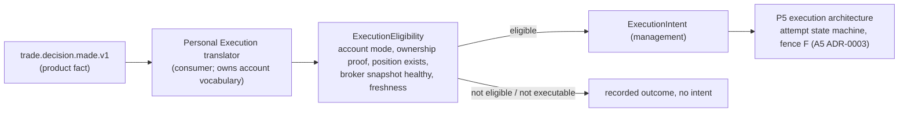

# 13 - Personal Execution boundary (and the REAL close/trailing limitation)

## 1. The separate path

* One-way, event-based: the translator **consumes** decisions and never writes into `trade_manager_decision`, `managed_trade` or observations.
* Owner: Personal Execution. It holds the translation table (product action -> executor primitive), account/ownership/broker-state knowledge, lot arithmetic for `PARTIAL_PROFIT`, and the mapping *reference level -> broker price* (with feed-basis policy, `05` section 4).
* Identity: the translator resolves `managed_trade_id -> signal_id -> execution_intent -> ownership -> broker position` (the join exists today through `signal_id`, `M15`). It never uses `economic_position_id` as a broker position identity (the defect of `M26`).

## 2. Which P4 artefacts may exist before P5

| Artefact | Allowed in P4? | Condition |
|---|---|---|
| `managed_trade`, `trade_observation`, `trade_manager_decision`, decision traces | **yes** | product domain |
| `publication_decision`, `management_signal` records, `signal.management.published.v1` | **yes** | no Distribution consumer required (`12`) |
| `execution_eligibility` **in shadow** (`role = SHADOW`) | **yes, optional** | translator reads legacy `broker_state.json` and `ownership_registry.jsonl` through the P0/P1 **read-only tailer**, writes only shadow rows, creates **no intent** |
| shadow "would-be" management intents | yes (shadow tables only) | never written to `management_intents.jsonl` or any file/subject the legacy executor reads |
| `management_proposals.jsonl`, `management_intents.jsonl`, `management_decisions.jsonl` (legacy chain) | **unchanged, untouched** | continues to exist as today; not fed by the canonical path |
| any DB-authoritative `management_intent` consumed by an executor | **NO - P5** | requires OD-06 design approval and implementation |
| ownership ledger / broker-state authority in PostgreSQL | **NO - P5** | A5 `11` section 3: their only writer is the execution consumer |
| `activation.json` REAL_MANAGEMENT authority switch as DB authority | **NO - P5** | it gates proposals to an executor (A4 `TMG-05`) |
| bridge changes (REAL close/trail admission, fence) | **NO - P5** | A5 ADR-0003 M7 |

**Hard rule for P4:** no component introduced in P4 may create, enqueue, or publish anything that the legacy executor, or any broker-facing client, reads. Verification: grep of the P4 codebase for imports of `contracts.mt5_bridge.Mt5ExecutionClient`, `execution/demo_broker`, writers of `INTENTS_PATH`; absence of bridge write-tool names; the evaluator/TOS packages import no broker client.

## 3. The REAL close/trailing limitation - impact

Verified facts:

* The bridge's execution listener refuses `mt5_close_position` and `mt5_trailing_stop` under `REAL_EXECUTION` (`M24`, A5 `B4`).
* The executor implements only `CLOSE_POSITION` and `TRAIL_STOP`; `MOVE_TO_BREAKEVEN` and `PARTIAL_CLOSE` are answered `MANAGEMENT_ACTION_NOT_SUPPORTED_BY_EXECUTION_ADAPTER` (`M11`).
* The legacy chain cannot reach the executor anyway (`01` section 3).

| Concern | Impact |
|---|---|
| **TradeManagerDecision generation** | **None.** The evaluator is pure and broker-independent (`03`): `EXIT`, `MOVE_STOP`, `MOVE_TO_BREAKEVEN`, `TRAIL_STOP`, `PARTIAL_PROFIT` are all decidable with no execution primitive. Do **not** suppress or downgrade a decision because the bridge lacks a primitive |
| **ManagementSignal generation** | **None.** Publication depends on the entry being published, not on executability (`12`) |
| **ManagedTrade managed track / evidence** | **None.** The reference simulation applies decisions by itself (`15`) |
| **Personal execution** | Blocked: recorded as `execution_eligibility = NOT_EXECUTABLE(EXECUTION_PRIMITIVE_UNAVAILABLE)` with the specific missing primitive; re-evaluated when the primitive exists. Capability is a property of the *effect side*, evaluated at translation time |
| Legacy coupling to remove | product decision generation gated by `REAL_MANAGEMENT` (`M8`); an unsupported broker action must not be a reason to skip a product decision |

This means the customer/product branch and FORWARD evidence for `ENTRY_PLUS_TM` can operate fully while personal REAL management remains unavailable, and personal management becomes available later purely as a P5 capability (A5 ADR-0003 M7 plus attempt machine).

## 4. Personal-execution state that the translator needs (and only it)

`PersonalPositionObservation` (position exists, ticket, volume, current SL/TP, spread), account execution mode, broker connectivity, snapshot version and age, ownership proof. In P4 these come from the **legacy** files via the tailer (`14`); they never enter `TradeObservation`.

## 5. Failure isolation

The translator failing, stalling or being switched off has no effect on decisions, publication decisions, management signals or evidence (`18`). Conversely a product-side problem (quarantined observation) simply produces no decision for the translator to act on.
