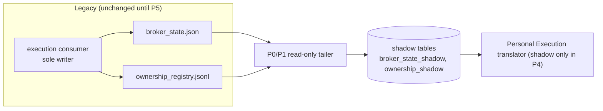

# 14 - Broker-state relationship (temporary boundary until P5)

A5 (`docs/runtime_boundaries/11` section 3) corrected A4: **the execution consumer is the only writer of `broker_state.json` and of the ownership ledger** (`P7`, `P8`). Their **authority therefore moves with P5**. A6 does not move it.

## 1. What each consumer needs from broker state

| Consumer | Needs broker state? | For what |
|---|---|---|
| Trade Observation Service | **no** | market data comes from a `MarketDataProvider` |
| Trade Manager evaluator | **no** | decisions are on the reference trade; the current evaluator uses no broker field for any comparison (`02`) |
| Publication gate / ManagementSignal | **no** | |
| **Personal Execution translator** | **yes** | position exists, ticket, volume, current SL/TP, snapshot version/age, ownership proof, account mode |
| Performance (LIVE evidence) | yes (Personal Execution's `live.trade.closed`, broker-reconciled) | separate series |

Conclusion: **broker state is a Personal Execution concern**. Removing it from the product path is what makes the product runnable with execution off.

## 2. What P4 may consume, and how

| Source | Status in P4 | Notes |
|---|---|---|
| legacy `broker_state.json` projection (via the P0/P1 read-only tailer, into shadow tables) | **allowed, read-only, shadow** | no new writer; the consumer remains the sole writer; freshness rule (120 s) recorded but not re-implemented |
| legacy `ownership_registry.jsonl` (tailer, shadow) | allowed, read-only | needed to resolve `signal_id -> broker position` in the translator shadow |
| a new read-only `BrokerClient` publisher | **not in P4** | a second broker-state writer would violate the single-writer rule; and extra bridge reads compete with the execution queue (A5 `11` section 4) |
| `MarketDataProvider` | **allowed for market facts only** | never as a source of broker positions |
| synthetic / replay observations | allowed | golden corpus; product path needs no broker fixture |

Nothing in P4 writes `broker_state.json`, the ownership ledger, or their DB counterparts as authority.

## 3. The temporary boundary

* The translator shadow may only *read* the shadow tables; its output (eligibility rows) is shadow.
* `authorize()` in the legacy chain keeps reading the **files** (A5 `11` section 3 rule): it is not repointed to shadow tables until each artifact's reconciliation gate passes, and never mixed within one authorisation.

## 4. P3 in this light

`17` redefines P3 as exactly this shadow: broker-state and ownership **projection and read-model preparation with shadow reconciliation**, no authority.

## 5. Where authority moves

With P5's fenced cutover `T_cut(execution:real:<account>)` (A4 `08`): the new execution service becomes the single writer of broker state and ownership in PostgreSQL, the file writers stop, and the projector (if any legacy reader remains) becomes the only file writer. Until then: **`BROKER_STATE_AUTHORITY_MOVES_IN = P5`**.
