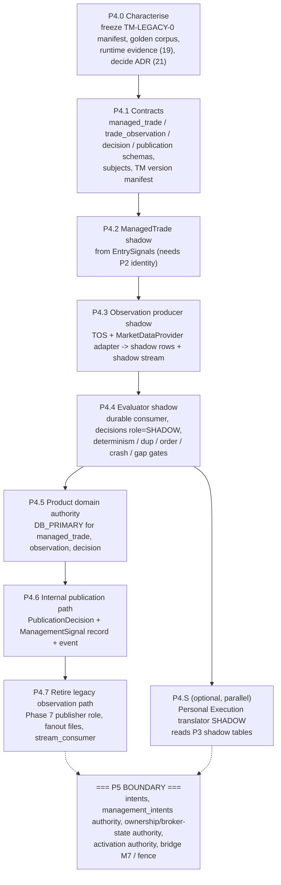

# 16 - P4 migration plan (Trade Manager + observation), derived from source

The stages below are **derived from what `01` found**, not copied from the task's sample shape. Key consequence of `01`: the legacy observation -> decision -> proposal chain **produces nothing** (no quote, all actions disabled, identity mismatch, REAL close refused). There is no legacy TM *output* to reconcile against and no legacy consumer to cut over. P4 is therefore mostly **build-and-prove a canonical path in shadow**, then make it authoritative for the *product* domain, then retire the inert transport. Runtime modes are the P0/P1 axes (`migration.modes`: state authority x event transport x legacy projection).

## 1. Stages

| Stage | Content | Modes (domain `TRADE_MANAGEMENT` / transport `OBSERVATION`) | Depends on | Exit gate (A4 `12` names) |
|---|---|---|---|---|
| **P4.0** | characterise: record `TM-LEGACY-0` (six-module hash manifest + default bundle); assemble the **golden corpus**: the tracked expected-output reports `trade_manager/reports/xauusd_ae53cb8a_{replay,discrepancy}.txt` document one Context XAUUSD case, but its *input* (`context_structure_retrace_phase7_state.json`, read by `replay.py`) is **not tracked** - an owner-supplied read-only copy is a runtime-evidence item (`19`) - plus synthetic edge cases (stale, gap, duplicate, out-of-order, closed trade); run the read-only runtime evidence checklist (`19`); approve ADR (`21`) and decide `OD-A6-*` | no code | - | decisions recorded; evidence answered |
| **P4.1** | canonical contracts: `trade_management` schema deltas (`managed_trade`, `trade_observation`, `market_snapshot`, `trade_manager_version`, `trade_manager_decision`, `publication_decision`, `management_signal`, inbox/quarantine use of existing `platform.inbox_events`), subjects, envelope, action/reason registries, TM version manifest tool | `LEGACY_FILE` (nothing running) | V1.2/V1.2.1, P0/P1 substrate | schema/contract review (`20`-style checklist for P4) |
| **P4.2** | create `ManagedTrade` in **shadow** from EntrySignals; bind `TM-NONE-1` (`SHADOW`); record legacy refs (Context `economic_position_id`) | `DB_SHADOW` / `LEGACY_FILE` | **P2**: canonical signal identity and events (or the P0/P1 tailer over `signals.jsonl` as an interim source) | `SHADOW_WRITE_READY`; reconciliation of ManagedTrade set vs signals by identity + hash: 0 blocking findings |
| **P4.3** | Trade Observation Service in shadow: `MarketDataProvider` adapter over the **research listener**, snapshot per instrument, trade-scoped observations with gapless `observation_seq`, outbox, shadow publish to `TRADING_OBSERVATION` | `DB_SHADOW` / `JETSTREAM_SHADOW` | P4.2 (open trades to observe); a working provider adapter | producer health (quote age, gap rate, outbox lag), provider-load budget within the bridge read budget (A5 `11`), `JETSTREAM_SHADOW_READY` |
| **P4.4** | evaluator shadow consumer (`trade-manager-shadow`): decisions `role = SHADOW`, `TM-NONE-1` -> audited `HOLD`; plus a **test-only synthetic version** (breakeven/trail enabled, never bound to a real trade) to exercise non-HOLD, publication and eligibility shadow paths | `DB_SHADOW` / `JETSTREAM_SHADOW` | P4.3 | gates: golden-replay determinism (byte-identical decisions), duplicate delivery -> no duplicate decision, out-of-order -> in-order application, crash injection at every step (`10`), gap handling, code-manifest verification fail-closed; `DUAL_WRITE_RECONCILED` in its *golden* sense |
| **P4.5** | product domain authority: `DB_PRIMARY` for `managed_trade`, `trade_observation`, `trade_manager_decision`; evaluator role `BOUND`. **No legacy projection needed** - no legacy reader exists for these; an optional research export may remain a file | `DB_PRIMARY` / `JETSTREAM_PRIMARY` (observation transport) | P4.4 gates sustained over the soak window | `DB_AUTHORITY_READY`, `JETSTREAM_PRIMARY_READY` for the trade-management domain; **legacy output recorded as `EMPTY` (nothing to compare), not as a match** |
| **P4.6** | internal publication path: gate, `PublicationDecision`, `ManagementSignal` records, `signal.management.published.v1` to `TRADING_CORE`; **independence test with execution off** (`12` section 5) | product domain | P4.5; `PublishedSignal` concept (Signals) - until it exists everything is `WITHHELD(ENTRY_NOT_PUBLISHED)` and still audited | independence test passes; ordering per trade verified |
| **P4.7** | retire the legacy observation path: stop running the Phase 7 observer as a *publisher* (do **not** edit it: it carries its own whole-file hash), remove the `trade_manager` stream-consumer service from the stack registry (note: the registry lives in the **bridge** repository, `scripts/mt5_stack_services.json`; A1 finding L9), delete `observation_stream/*`, `collector_state.json`, `checkpoint.*.json`, `publisher_state.json` | `LEGACY_READ_DISABLED` / `LEGACY_WRITE_DISABLED` for the observation transport | P4.5 stable; owner decision on Phase 7's research role (`OD-A5-13` resolved) | `LEGACY_READ_RETIRE_READY`, `LEGACY_WRITE_RETIRE_READY` (access audit shows no reader/writer) |
| **P4.S** | Personal Execution translator in **shadow**: consumes `trade.decision.made.v1`, reads P3 shadow tables, writes shadow `execution_eligibility`; **no intent** | shadow only | P4.4 (decisions), P3 shadow tables | shadow eligibility reconciled against expectations; proves `NOT_EXECUTABLE(EXECUTION_PRIMITIVE_UNAVAILABLE)` handling |

## 2. Why this differs from "move the JSONL to NATS"

| Naive plan | Why it fails here |
|---|---|
| ingest `events.jsonl` into JetStream | the file's producer emits no quote and a Context-only, frozen-input feed; migrating it migrates a broken input (`01`) |
| reconcile old TM output vs canonical | old output is empty (`M1`, `M25`); reconciliation must be against the **golden corpus and determinism**, and the report must state `LEGACY_OUTPUT_EMPTY` explicitly |
| keep Phase 7 as the producer and just change transport | wrong owner, wrong identity, wrong lifecycle (`04`) |
| cut over management to the DB with the executor | the executor's writer role and the bridge limitation put that in P5 (`13`) |

## 3. Where the P5 dependency begins

The first step that **cannot** be done in P4 is any component that would **cause a broker write or move execution-plane authority**:

1. creating a DB-authoritative management `ExecutionIntent` that an executor consumes;
2. moving `management_intents`, ownership ledger or broker-state authority (the consumer is their only writer);
3. making `activation.json` (`REAL_MANAGEMENT`) a database authority;
4. enabling REAL close/trail admission on the bridge, or using the fence (A5 ADR-0003);
5. repointing the legacy `authorize()` / `process_management_intents` to database sources.

These are P5 and remain **blocked by OD-06** (`P5_STILL_BLOCKED_BY_OD06 = true`). P4.S is the only P4 stage that touches the *shape* of that path and it is shadow-only.

## 4. Leases and fencing inside P4

No broker is involved, so A5's fence F is not needed. Two single-writer rules still need enforcement:

* **Observation sequencing**: `observation_seq` per trade must be assigned by one writer. In P4 use row-level locking on the `managed_trade` row (transaction-scoped), plus - once the substrate provides it - a lease `observation:producer:<provider>` recorded as a **shadow row** (A4 `08`; V1.2.1's `acquire_ownership` lacks write-path validation, A5 `P13`, so the lease is advisory in P4).
* **Evaluator**: the CAS on `managed_trade.version` serialises even if two evaluators run.

## 5. Rollback

| Stage | Class | Rollback |
|---|---|---|
| P4.1-P4.4 | REVERSIBLE | discard shadow rows/stream; nothing legacy changed |
| P4.5 | CONDITIONALLY_REVERSIBLE | disable the canonical domain; no legacy state to restore (the legacy chain never produced any); ManagedTrade/decision rows are retained as evidence |
| P4.6 | REVERSIBLE until a Distribution consumer attaches, then ONE_WAY for events already delivered (customer-visible) | disable publication; corrections are `SignalCorrected`, never deletions |
| P4.7 | CONDITIONALLY_REVERSIBLE | restarting the legacy observer/consumer is possible but pointless; recorded for completeness |

## 6. Mode-safety rules (inherit A4 `14`)

`DB_PRIMARY` fails closed and never falls back to files; the observation domain refuses `JETSTREAM_PRIMARY` with `LEGACY_FILE` authority; no P4 service constructs a JSONL store; no P4 service loads a broker or bridge write client.
