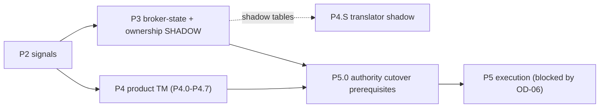

# 17 - P3 redefined

## 1. What changed

A4 defined **P3** as "broker-state: single publisher, snapshot rows + projector for `broker_state.json`, authority `DB_PRIMARY` + projection". A5 (`docs/runtime_boundaries/11` section 3) showed the **execution consumer is the only writer** of `broker_state.json` and the ownership ledger (`P7`, `P8`), so a separate publisher cannot become authoritative without either two writers or a change to the execution process. A6 additionally shows that the **product path does not need broker state at all** (`14`).

## 2. New definition

> **P3 = broker-state and ownership projection and read-model preparation, with shadow reconciliation only. No authority moves.**

| In P3 | Not in P3 |
|---|---|
| P0/P1 read-only tailer over `broker_state.json` and `ownership_registry.jsonl` into **shadow** tables (`snapshot_version` continuity, `captured_at`, positions/orders, ownership rows with provenance) | a DB-authoritative broker-state or ownership writer |
| reconciliation by identity + canonical hash + version continuity (A4 `11`); explicit classes for the known writer anomalies | a second broker-state publisher, extra bridge reads (A5: read budget on the single EA queue) |
| definition of the **`PersonalPositionObservation`** read model consumed by the Personal Execution translator (`13`, `14`) | any change to the execution consumer |
| the `signal_id -> execution_intent -> ownership -> broker position` join materialised as a read model (the join `M15` says exists only through `signal_id`) | repointing `authorize()` to shadow tables |
| freshness and staleness metrics (age of last snapshot vs the existing 120 s rule) | enforcement of any new freshness rule |

## 3. Separate phase or absorbed?

**Recommendation: keep P3 as a small, separate, shadow-only phase - do not absorb it into P4 or P5.**

| Option | Assessment |
|---|---|
| Absorb into **P4** | P4 (product Trade Manager) must not depend on broker state; folding it in would re-couple the product roadmap to personal execution and delay P4 behind the execution soak. Rejected |
| Absorb into **P5** | hides a long soak and a reconciliation gate that P5's cutover *requires* (`DUAL_WRITE_RECONCILED` for broker state and ownership); P5 would start with unproven read models. Rejected |
| **Keep separate (shadow-only)** | can run **in parallel** with P4.1-P4.4 (no dependency in either direction), gives the P5 cutover a pre-reconciled shadow, and keeps Codex's substrate work (tailer/reconcile/projector) exercised on the highest-risk artefacts early |

Sequencing:

## 4. Exit criteria (proposals; numeric thresholds remain A4 `12` / owner sign-off)

1. Tailer handles partial lines, replacement (`os.replace` of `broker_state.json`), and malformed rows (`central.rows` skips bad lines; `OrchestrationStore.rows` does not - both behaviours recorded).
2. Reconciliation shows `snapshot_version` continuity and hash equality over the soak window, with every anomaly classified (`KNOWN_LEGACY_DEFECT` for scan-then-append races, the consumer swallowing refresh exceptions).
3. Read models are **not consumed** by any authority decision.
4. The gate `DUAL_WRITE_RECONCILED` for `broker_state` and `ownership` is evidenced - **consumed by P5**, not by P4.

## 5. Renaming (optional)

To avoid future confusion the phase table can read: P2 Signals, **P3 Personal-position shadow (broker state + ownership)**, P4 Product Trade Management, P5 Personal execution authority.
