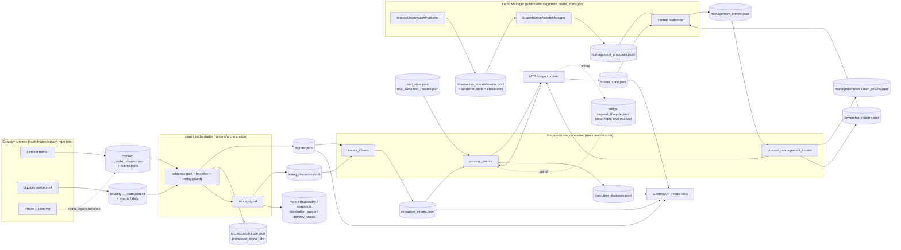
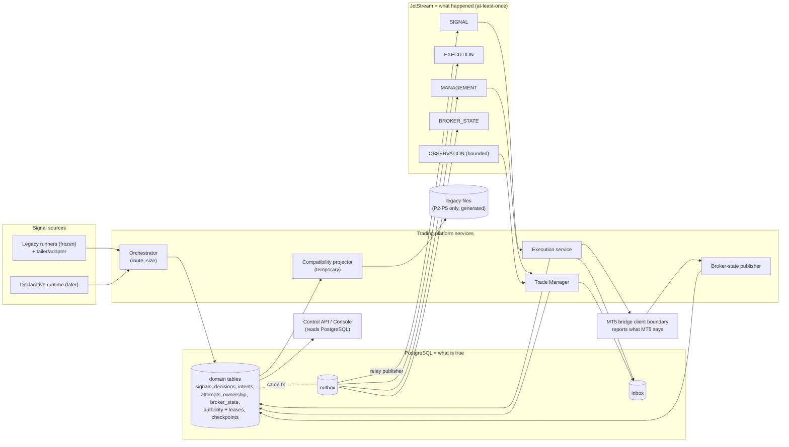

# 02 - Runtime data-flow graphs: current and target

Governing rule: **PostgreSQL tells us what is true. JetStream tells services what happened. The trading platform decides what
should happen. The MT5 bridge tells MetaTrader what to do and reports what MT5 says.**

## A. Current runtime graph (baseline `64cb033`)

Every arrow is a file. `producer → write → reader → ack → downstream` is traced per hop in the table below the diagram.

### Hop-by-hop trace (producer → write → reader → ack → downstream)

| # | Producer | Write | Reader | Ack / completion test | Downstream | Crash window |
|---|---|---|---|---|---|---|
| 1 | Context / Liquidity runner | tmp+replace state file (Liquidity: + fsync) | orchestrator adapter (poll) | none; adapter dedupes by stable `signal_id` + baseline/replay watermark | `signals.jsonl` | Context writes event **before** state |
| 2 | Orchestrator `poll_once` | `signals.jsonl` append (scan for `unique_key`) + `state.json` | Consumer `source_records()` (every ~1 s, whole file) | none; "new" = no intent exists | `execution_intents.jsonl` | signal appended, `processed_signal_ids` not yet saved → reprocess (safe by unique key) |
| 3 | Orchestrator `route_signal` | route / sizing / snapshots / distribution_queue appends | Consumer reads `sizing_decisions`; **nobody** reads `distribution_queue` / `delivery_status` | none | sizing feeds intents | `tradeability_decisions` stream undeclared (defect, OD-01) |
| 4 | Consumer `create_intents` | `execution_intents.jsonl` append | same process `process_intents` | intent done ⇔ decision row exists | broker send | none if single process |
| 5 | Consumer `process_intents` | **broker send first, then** `execution_decisions.jsonl` append | Consumer completion test; Control API | decision presence | position at broker | **crash after send, before decision append ⇒ intent replayed**; idempotency key + bridge are the only guard |
| 6 | Trade manager publisher | observation `events.jsonl` (sequence), `publisher_state.json` (all ids) | `FanoutConsumer.read` | checkpoint **before** processing (at-most-once) | proposals | crash after checkpoint ⇒ observation lost |
| 7 | `SharedStreamTradeManager` | `management_proposals.jsonl` (`append_unique`) | `central.authorize_pending_proposals` | decision row | `management_intents.jsonl` | scan-then-append is not atomic |
| 8 | `central.authorize` | `management_intents.jsonl` | Consumer `process_management_intents` | only `COMPLETED` result counts; failed are retried | broker modify/close + `ownership_registry` | retry loop by design |
| 9 | Broker refresh | `broker_state.json` (tmp+replace, `snapshot_version`) | `authorize` (version match, 120 s freshness), TM, API | version match | authorization decision | consumer swallows refresh exceptions |

### Findings that shape the migration

1. **Nine artifacts play two roles** (record and queue): `signals`, `sizing_decisions`, `execution_intents`, `management_proposals`, `management_intents`, Context compact state, Liquidity state, `broker_state.json`, orchestrator `state.json`. Each is flagged in `04`.
2. **The only pre-send durable write in the codebase is the smoke path** (`SUBMISSION_ATTEMPTED`). The production path writes the decision after the send.
3. **"Generation" is an operator epoch, not a per-write fencing token** (`real_execution_resume.json`), and process singletons are PID files (check-then-write; no lease). See `08`.
4. **Portability holes**: cwd-relative defaults (`fanout`, `stream_consumer`, consumer's lifecycle read) and a cross-repository read of the bridge's lifecycle journal.
5. **Frozen code**: the strategy runners cannot change their own persistence casually (Context hash covers five decision functions; Liquidity hash covers `liquidity_displacement.py`). Persistence lies *outside* the fingerprints, so it *may* be ported, but the safest first move is a read-only tailer (OD-05).

## B. Target graph

### Target semantics (short form; details in 03)

* **State**: every authoritative fact is a PostgreSQL row committed in a domain transaction. Consumers make decisions from rows (by key), never from event payloads alone and never by scanning tables for work.
* **Transport**: every state change that another service must react to is an **outbox row in the same transaction**; a relay publishes it to JetStream with `Nats-Msg-Id = event_id`. Consumers are durable, acknowledge **after** their own transaction commits, and record `(consumer, event_id)` in an inbox.
* **Effective-once** is achieved by `event_id` + inbox + unique constraints + aggregate version + fencing. JetStream is at-least-once and is never claimed to be exactly-once.
* **Compatibility projector** (temporary): reads committed rows/outbox and writes legacy files for readers not yet migrated. It is the *only* writer of those files once a domain is `DB_PRIMARY`. It is deleted at `LEGACY_WRITE_RETIRE_READY`.
* **Observation** traffic (high volume) uses its own bounded stream; nothing high-volume, and no tick history, enters PostgreSQL or operational subjects.
* **The MT5 bridge boundary is a client interface**, not a shared file: the lifecycle journal read (`request_lifecycle.jsonl`) is replaced by bridge-reported results through that boundary.

## C. Which rule is mechanical, which is not

| Question | Answer |
|---|---|
| Does every artifact walk the nine-step ladder? | **No.** `04` assigns one of eight strategies per artifact. Execution and ownership use a single fenced cutover; frozen strategy state uses tailing; checkpoints disappear rather than migrate. |
| Is dual-write ever allowed? | Only as *transaction + outbox + projector* (one writer). Independent application-level dual writes are rejected because the two writes cannot be made atomic and a crash between them silently diverges. Where a legacy **frozen** writer must keep writing its own file (strategy runners), the tailer ingests **after** the fact - this is an ingest, not a dual-write. |
| Where can outbox + projector not be used? | (a) Frozen strategy runners (cannot be edited → tailer). (b) The broker-facing send, which is an external side effect outside any DB transaction → addressed by pre-send durable attempt + idempotency key + reconciliation (`06`). (c) Fencing itself, which must be a single DB decision, not mirrored (`08`). |
