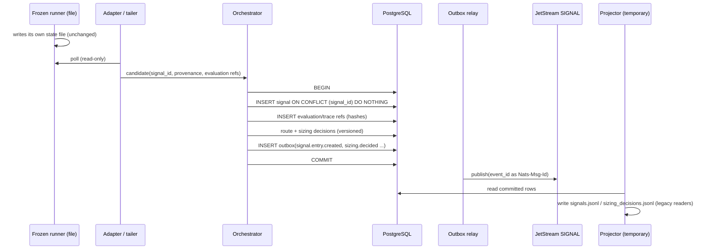

# 05 - Signal migration

Scope: strategy output → orchestrator → routing/sizing → the point where execution takes over. Artifacts: `ORC-01..13`, `CTX-01..04`, `LIQ-01..03`, `P7-01` (see `04`).

## 1. Current path and its weak points

Frozen runners write a state file; an adapter polls it and stamps `signal_emitted_at` with **orchestrator discovery time** (not detection time). `signals.jsonl` is both the record and the consumer's queue; `processed_signal_ids` in `state.json` is unbounded and doubles as a correctness dedupe; the replay guard (`startup_epoch.json`) and per-instance baselines decide which historic signals are ignored. `tradeability_decisions` is appended to an undeclared stream (defect, OD-01).

## 2. Target

* `signal_id` remains `stable_id("SIG", identity)`; the database key is the same value, so file and DB reconcile by identity (`11`).
* Two timestamps are stored: `detected_at` (from strategy provenance) and `discovered_at` (orchestrator). Freshness rules keep using the value they use today (`discovered_at`) - **no policy change** - but the event carries both so a later, separately approved change is possible.
* **Evaluation (V1.1) stays a reference.** The event and the signal row carry `evaluation_hash`, `trace_hash`, `schema` (`strategy-evaluation.v1`), `fidelity` (L0-L3) and a `payload_ref`. The `DecisionTrace` is stored once (evidence table/object) and is never repeated in operational events. Legacy adapters produce L1/L2 evaluations; the hash must **round-trip**: load → canonicalise → hash equals the stored `evaluation_hash` (checklist item).
* The strategy owns its evidence; the orchestrator registers lifecycle and outcome snapshots; consumers/frontends never reconstruct signal evidence from files (existing architectural decision, kept).

## 3. Strategy per artifact

| Artifact | Strategy | Notes |
|---|---|---|
| `CTX-01/02`, `LIQ-01/02` (runner files) | `TAILER_INGEST` | runner untouched; adapter is the only reader; ingest idempotent by `signal_id`; runner file stays authoritative for runner evidence |
| `ORC-01 signals.jsonl` | `TAILER_INGEST` first (shadow), then `OUTBOX_PROJECTOR` | DB row + outbox is committed by the orchestrator; `signals.jsonl` becomes a projection until execution moves |
| `ORC-03 sizing_decisions` | `OUTBOX_PROJECTOR` | still consumed as a file by execution until P5; then by event + row |
| `ORC-02/06` | `OUTBOX_PROJECTOR` / `TAILER_INGEST` | audit records |
| `ORC-04 tradeability_decisions` | `DB_ONLY` after OD-01 | do not migrate a broken stream; first prove liveness |
| `ORC-05/07/09` | `REBUILD` / retire | derived |
| `ORC-08 distribution_queue` | `RETIRE` | no consumer; replaced later by subscription delivery events (A2) |
| `ORC-10 state.json` | `DB_ONLY` | `processed_signal_ids` → `UNIQUE(signal_id)`; the file is imported once to seed the "already processed" set |
| `ORC-11 startup_epoch`, `ORC-12 baselines` | `DIRECT_CUTOVER` / `DB_ONLY` | replay watermark is a safety boundary → row with generation; imported, never regenerated blindly |

## 4. Steps (per stream instance, so the four liquidity instances and Context can move separately)

1. **Shadow ingest.** Adapter still drives the file path. A second reader ingests the same candidate into `shadow_signal` (or the real table flagged `shadow=true`), emitting **no** operational events. Reconcile hourly (`11`).
2. **Outbox on.** Orchestrator commits signal + decisions + outbox in one tx; relay publishes; **no consumer yet**. Projector regenerates `signals.jsonl`/`sizing_decisions.jsonl`; reconciliation compares the projected file byte-canonically with the file the legacy path *would* have written (run both in shadow).
3. **JetStream shadow consumer** in the execution service parses events and records what it *would* create; compared with the file-driven intents.
4. Signal domain reaches `DB_PRIMARY` (authority: rows). File is now generated. Execution still reads the file (until its own cutover) - that is a read of a *projection*, not authority.

## 5. Ordering, duplicates, replay

* Key `signal:<signal_id>`; no cross-signal order.
* Duplicate discovery (adapter restarts, Liquidity `detect()` re-evaluates ~18 anchors each poll) → `ON CONFLICT DO NOTHING` + inbox.
* **Replay after downtime.** The replay watermark row plays the role of `startup_epoch.json`; DB authority must not let an outage release signals older than the cutoff. Historic signals discovered after an outage enter as `signal` rows with `status=STALE_ON_DISCOVERY` (recorded, not routed), never silently dropped and never executed.

## 6. Risks

| Risk | Mitigation |
|---|---|
| runner writes event before state (Context) → tailer sees event without state | tailer keys on the compact **state** (as the adapter does today) and treats events as evidence only |
| clock/`created` semantics differ between file and DB | both stored; reconciliation compares `signal_id`+canonical hash of the *content* fields, excluding `discovered_at` |
| outbox not yet consuming → false confidence | gate `SHADOW_WRITE_READY` requires lag and reconciliation SLOs, not merely "rows exist" |
| tradeability defect masks lost decisions | OD-01 resolved in P0 before any migration of that stream |

Rollback: **REVERSIBLE** through `DB_SHADOW` (files remain authority); **CONDITIONALLY_REVERSIBLE** in `DB_PRIMARY` while the projector is on and reconciliation is clean (reverting = re-point readers to the projected file; the file is complete because it is generated from the same rows).
