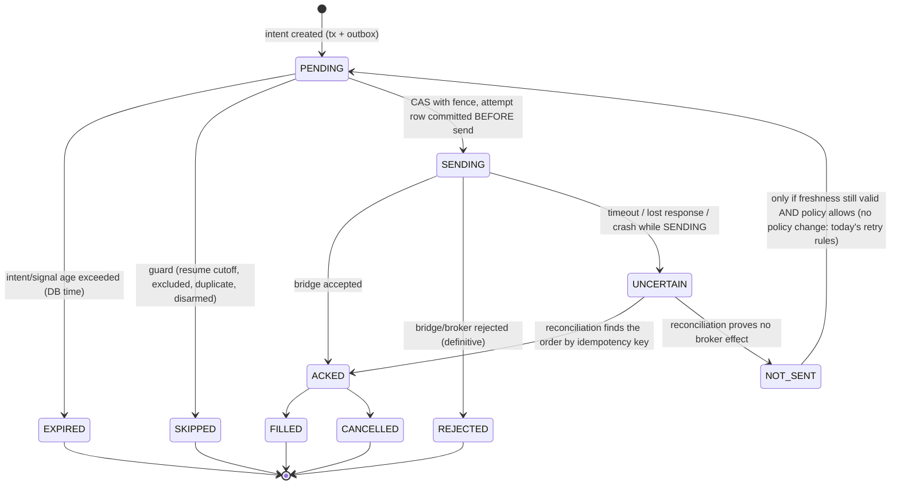

# 06 - Execution-intent migration

Artifacts: `EXE-01..15`, `MGT-04`. This is the most conservative domain; it moves **last** (`16`), under an explicit fence (`08`).

## 1. Current behaviour (what must be preserved)

* `create_intents` derives intents from `signals` + `sizing_decisions` + `classification_corrections`, honouring the resume cutoff and `excluded_signal_ids`.
* `process_intents` picks intents lacking a decision row (decision id `stable_id("DEC",{"intent": id})`), enforces freshness (`intent_max_age` 5 s, `signal_max_age` 120 s), **sends to the bridge, then appends the decision**.
* Idempotency key: `stable_id("REALORDER", {execution_intent_id, account_context_id})`.
* Management path: only `COMPLETED` results count, so failed management intents are retried.
* Smoke path already records `SUBMISSION_ATTEMPTED` **before** send - the in-repo precedent for the target design.
* The canonical-order-send timeout anomaly is **frozen**: it is recorded as an uncertain outcome; its cause is not redesigned here.

## 2. Target state machine (execution intent + attempt)

* **Durable intent, stable ID**: PK `execution_intent_id` (unchanged derivation), unique `idempotency_key`.
* **One logical broker operation**: an intent has one idempotency key; `attempt_no` counts *transport* tries of that one operation. A second attempt is created only from `NOT_SENT` (reconciliation proved no effect). Resend from `UNCERTAIN` without reconciliation is impossible by state machine.
* **Freshness** is evaluated at the moment of the `PENDING → SENDING` CAS, using database time and the same 5 s / 120 s limits. A stalled consumer therefore cannot send an old intent: the CAS fails and the intent becomes `EXPIRED`.
* **Duplicate JetStream delivery** cannot create a duplicate broker write because the first delivery already moved the intent to `SENDING` (CAS on `state='PENDING'`); the inbox row is written in the same transaction; the redelivery finds inbox hit (or state ≠ `PENDING`) and acks without effect.
* **Uncertain acknowledgement** is a first-class state, not a log line. A crash while `SENDING` is found at restart by state (not by absence of a decision row) and enters reconciliation (`11` §5): query the bridge/broker by idempotency key, then transition.
* **Fence**: the CAS includes the lease generation; a stale holder's CAS fails (`08`).

## 3. Event flow

`exec.intent.created.<account>` (from the same tx that creates the intent) → execution consumer for that account (single in-flight, `max_ack_pending=1`) → CAS to `SENDING` (tx1: inbox + attempt + outbox `exec.attempt.updated`) → **bridge call outside any DB transaction** → tx2: result state + outbox `exec.result.recorded` → ack.

The bridge call must never happen inside an open transaction (a slow send would hold locks and expire `ack_wait`); the attempt row committed in tx1 is what makes the gap safe.

## 4. Migration strategy: `DIRECT_CUTOVER` with prior shadow, never dual authority

1. **P3-P4 (before cutover)** signal and sizing are already `DB_PRIMARY`; the file consumer still reads the projected files and remains the **only** sender.
2. **Shadow intents.** A DB-side consumer (`JETSTREAM_SHADOW`) derives intents from events into `shadow_execution_intent`, applying the same guards, with the **send disabled at the type level** (no bridge client constructed). Reconcile each intent against the file consumer's real intents: identity, idempotency key, guard outcome, freshness decision, terminal state (`11`).
3. **Attempt journaling in the legacy sender is not attempted**: the legacy consumer is not modified to dual-write (that would create dual authority). The shadow comparison is sufficient evidence.
4. **Cutover window** (`08` §3): disarm real execution; drain (every intent terminal or explicitly imported as `EXPIRED`/`SKIPPED`); import file state; DB authority instant; arm the DB-driven consumer with a new lease generation.
5. **After cutover** the file consumer cannot start (guard reads `authority` and refuses). Files `execution_intents.jsonl`, `execution_decisions.jsonl` are generated by the projector for the Control API only until `LEGACY_READ_RETIRE_READY`.

Why not a gradual per-signal split: any period in which both the file consumer and the DB consumer may send makes duplicate broker orders a matter of luck; the idempotency key is a defence in depth, not an excuse for dual authority.

## 5. Artifact mapping

| Artifact | Target | Notes |
|---|---|---|
| `EXE-01 execution_intents.jsonl` | `execution_intent` | unique `idempotency_key`; state machine; fence column |
| `EXE-02 execution_decisions.jsonl` | `execution_attempt` (+ terminal state on intent) | written **before** send |
| `EXE-05 execution_skips` | terminal `SKIPPED(reason_code)` on intent | preserves audit reasons |
| `EXE-07 real_state.json` | `execution_authority.armed` | arming is an audited transaction |
| `EXE-08 real_execution_resume.json` | `execution_authority_generation` | generation, cutoff, `excluded_signal_ids` imported verbatim; monotonic |
| `EXE-10 real_trades.jsonl` | `broker_order` / `fill` | reconciled against broker state |
| `EXE-12 management/execution_results` | `management_execution_result` | `COMPLETED` semantics preserved: non-`COMPLETED` intents remain retryable under the existing policy |
| `EXE-15 bridge lifecycle` | bridge client boundary result | no cross-repo file read |
| `EXE-06/03/04/11/13/14` | retire / rebuild / keep per `04` | |

## 6. Failure analysis (execution-specific)

| Scenario | Today | Target |
|---|---|---|
| crash after send, before record | replay possible; guard = idempotency key | attempt is `SENDING` in DB → `UNCERTAIN` → reconcile before any resend |
| duplicate event delivery | n/a | inbox + CAS → no second send |
| consumer paused past lease | PID file still "alive" | CAS fails on stale generation |
| paused **after** CAS, before send | n/a | send may occur after lease loss - residual risk; mitigations: short lease, re-check lease immediately before send, bridge honours idempotency key; full closure needs bridge-side fence (OD-06) |
| JetStream down | n/a | intents wait; freshness limits expire them (fail-safe: lost trade, not stale trade) |
| DB down | file path continues | `DB_PRIMARY` fails closed: no arming, no sends |
| bridge timeout (frozen anomaly) | decision may record failure | `UNCERTAIN` with cause `BRIDGE_TIMEOUT`; reconcile |

Rollback class: **ONE_WAY_WITH_MIGRATION** after the first DB-authoritative send. Before that instant it is REVERSIBLE (see `13`).
