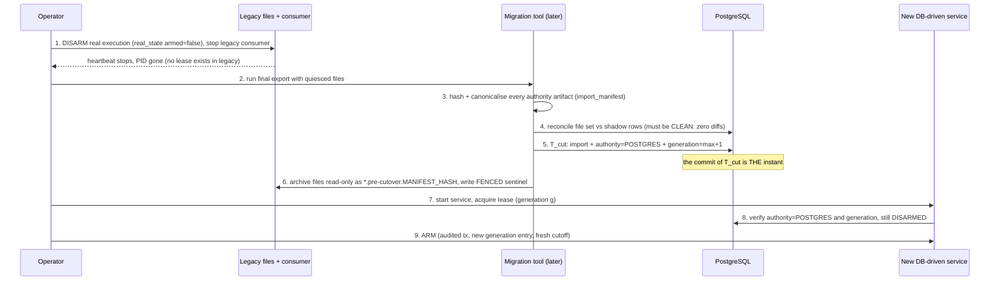
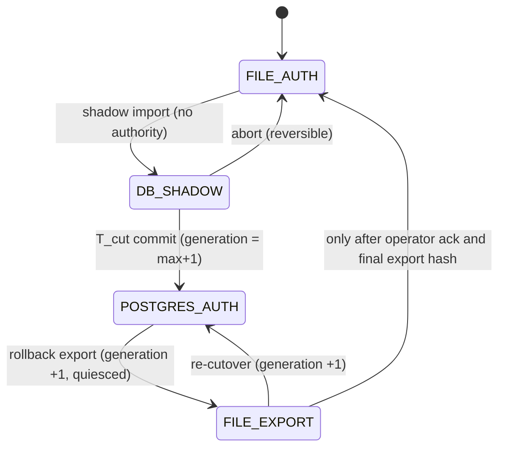

# 08 - Ownership and fencing cutover

## 1. Three different things called "ownership"

| Notion | Today | Target | Moves in |
|---|---|---|---|
| **A. Position ownership** (provenance: which position belongs to which signal/manager) | `ownership_registry.jsonl` | `position_ownership` (domain data) | P4 |
| **B. Execution authority / resume generation** (may REAL execution run, and which signals are eligible) | `real_state.json` (armed) + `real_execution_resume.json` (operator epoch `generation`, `cutoff`, `excluded_signal_ids`) | `execution_authority` + `execution_authority_generation` | P5 |
| **C. Process singleton** (only one instance of a service acts) | PID file + heartbeat; `acquire_lock()` is check-then-write (TOCTOU); no lease, no fencing token; stop files in `/tmp` | `runtime_instance` + `runtime_lease(resource, holder, generation, expires_at)` | P1 (substrate), enforced P5 |

Findings that force the design: **the current "generation" is an operator-incremented epoch, not a per-write fencing token** - nothing rejects a write from a holder with an old generation. And no runtime artifact except the Liquidity `atomic_write` is fsync'd.

## 2. Target fencing model

`runtime_lease(resource text PK, holder runtime_instance_id, generation bigint, expires_at timestamptz)`.

* **Acquire**: one transaction, using DB time, `generation = previous + 1` (or `1`); succeeds only when the lease is free, expired, or held by the same instance. `generation` never decreases, including across rollbacks (§5).
* **Renew**: `UPDATE … WHERE resource=$1 AND holder=$2 AND generation=$3`; zero rows ⇒ the holder has lost the lease and **must stop acting immediately**.
* **Fence token** = `(resource, generation)`. Every authority-bearing write includes it and is validated **inside the same transaction** (`SELECT … FOR SHARE` on the lease row, or a conditional insert). A stale token cannot commit.
* **Resources** (proposed): `signal:orchestrator:<env>`, `execution:real:<account_context_id>`, `management:trade_manager:<env>`, `broker_state:publisher:<account_context_id>`, `relay:outbox:<partition>`.
* **Runtime instance identity**: `runtime_instance_id` = UUID generated at process start, recorded with host, pid, image/build hash and code fingerprints (the frozen-strategy hashes stay recorded as today); carried in every event envelope (`03` §4).
* **Residual gap, stated plainly**: a process paused *between* the fence-checked CAS and the external broker call can still send after losing the lease. Controls: short lease, re-validate the lease immediately before the call, idempotency key honoured by the bridge, mandatory reconciliation of `UNCERTAIN`/`SENDING` before any other holder proceeds. A complete closure needs the bridge to reject a lower fence token than it has seen (OD-06, requires bridge work and is outside this task).

## 3. The instant PostgreSQL becomes authority (execution/ownership authority)

**Definition.** PostgreSQL becomes the authority for resource *R* at the **commit of transaction `T_cut(R)`**, and at no other moment. `T_cut(R)` atomically:

1. inserts the imported state (generation history, cutoff, excluded ids, armed=false, ownership rows, broker snapshot version),
2. sets `authority(R) = 'POSTGRES'` and `generation(R) = max(file_generation, previous_db_generation) + 1`,
3. records the hash of every imported artifact (`import_manifest`).

Before that commit the files are authoritative and the database rows are shadow; after it, the database is authoritative and files are **generated exports** (or absent).

* Steps 1-4 are pre-conditions; if any fails, nothing has changed: **abort = no-op**.
* Between step 5 and 9 the system is authoritative but disarmed: nothing executes, so an error is recoverable.
* Legacy guard: the execution consumer (not a hash-frozen file) gains a start-up assertion - *if `authority(R) = POSTGRES` (or a FENCED sentinel exists) refuse to start in `LEGACY_FILE` mode.* The sentinel makes the refusal work even without DB access.

## 4. Resume generation and cutoff on cutover

* Historic `real_execution_resume` generation and `excluded_signal_ids` are imported verbatim; the DB generation is `max(...)+1`.
* Cutoff at arm time is **freshly established** (as today's `establish_execution_resume_cutoff` does after an outage): signals discovered before the cutoff never execute. The cutover therefore cannot release a backlog of old signals.
* `real_execution_resume_generations/` (referenced by no source file at baseline, OD-02) is imported as history only if it exists in the live runtime dir.

## 5. Rollback that cannot resurrect an older generation

Rules:

1. **Generations are monotonic across authority changes.** Rolling back to files does **not** restore the pre-cutover file; it *exports from the database* a new file whose `generation = db_generation + 1`, and records `authority(R) = 'FILE_EXPORT'` in PostgreSQL. A pre-cutover file (older generation) is archived and refused by the guard: any file whose `generation ≤ db_generation` and whose manifest hash is not the latest export is rejected at startup.
2. Rollback is **only allowed while quiesced** (disarmed, lease released) and after a final reconciliation of DB-side state (so anything the DB-driven consumer sent is present in the exported file: `execution_intents`, decisions/attempts, `real_trades`).
3. After rollback the DB is not deleted; it continues as shadow so a second attempt starts from a known state.
4. If any broker send happened under DB authority, rollback classification for that resource is **ONE_WAY_WITH_MIGRATION**: the "export back" path (rule 1-2) is the migration; a plain restore of the old files is forbidden.

## 6. Ownership by resource: what moves when

| Resource | Authority instant | Fence | Notes |
|---|---|---|---|
| position ownership rows (A) | with management plane, P4 | none (data) | reconciled by identity + hash; no arming involved |
| `broker_state` publisher | P3 | `broker_state:publisher:<acct>` lease | single writer; version continuity checked |
| `management:trade_manager` | P4 (real management only after shadow gate) | lease | activation row versioned |
| `execution:real:<acct>` | P5 (`T_cut`) | lease + generation on every intent/attempt | most conservative; last |
| `signal:orchestrator` | P2 | lease | before execution; low blast radius |
| outbox relay | P2 | lease per partition | duplicates harmless (`Nats-Msg-Id`), lease prevents reordering |

## 7. Dev/test evidence required before P5

* Kill -9 during each step of §3 and §2 (holder, migration tool, DB failover): system converges to either "unchanged" or "cut over", never both.
* Two holders started simultaneously: exactly one acquires; the other cannot commit an authority write.
* Stale generation write is rejected by the database (constraint/CAS), demonstrated by test.
* Rollback drill: cut over in a test environment, send simulated intents, export back, confirm generation strictly greater and the old file is refused.
