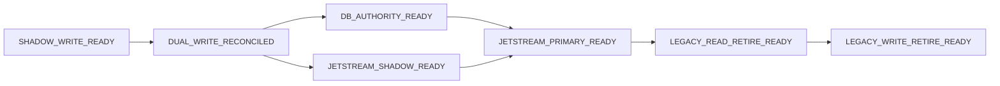

# 12 - Cutover gates

Every gate is a set of **measurements with thresholds and evidence sources**; a gate is passed by a recorded reconciliation/metrics snapshot, not by assertion. Thresholds are *proposed* and must be confirmed by the owner (OD-07); they are deliberately expressed in observable terms. Gates are **per domain** (signal, broker-state, management, execution, observation); a domain never passes a gate on another domain's evidence.

Common "quiet period" rule: measurements are taken over at least the stated window **including one weekend market close/open and one service restart of each participant**.

## SHADOW_WRITE_READY (start DB shadow writes → allow `DB_SHADOW` to become default for the domain)

| Measure | Threshold | Evidence |
|---|---|---|
| Schema/migrations applied, roles least-privileged, dedicated-infra assumption confirmed | yes | Codex V1.2 handoff + checklist |
| Shadow write failures | 0 unhandled; shadow failure never affects the legacy path (isolated, alerted) | logs/metrics |
| Shadow lag (file write → DB row) p99 | < 5 s | metric |
| Backup + restore rehearsed for PostgreSQL | restore RPO/RTO measured | runbook evidence |
| Legacy behaviour unchanged (frozen fingerprints, unit suites) | identical | CI |

## DUAL_WRITE_RECONCILED (outbox + projector in place; file regenerated from DB matches the legacy file)

| Measure | Threshold |
|---|---|
| Blocking reconciliation findings (`MISSING_*`, `CONTENT_MISMATCH`, `STATE_DIVERGENCE`, `NEW_UNCLASSIFIED`) for the domain | **0** over ≥ 5 trading days |
| Projection fidelity (`11` §2.7) | 100 % byte-canonical |
| Outbox: unpublished older than 10 s | 0 sustained; oldest-age p99 < 2 s |
| State without event / event without state | 0 |
| Crash tests (kill -9 at each write step) | converge, no dup, no loss |

## DB_AUTHORITY_READY (allowed to run `T_cut` for a resource)

| Measure | Threshold |
|---|---|
| Final **quiesced** reconciliation | 0 findings of any blocking class |
| Checkpoint independence (`11` §6) on a test runtime dir | pass |
| Fence tests (`08` §7): two holders, stale generation, kill during cutover | pass |
| Fail-closed tests: DB stopped ⇒ `DB_PRIMARY` refuses authority actions; no file fallback | pass |
| Rollback drill for this resource completed with a **strictly greater generation** and old file refused | pass |
| Operators trained; runbook reviewed; change window scheduled | yes |
| Execution only: 10 trading days of shadow intents with 100 % identity/idempotency-key/guard/terminal-state match, and 0 uncertain attempts unexplained | required |

## JETSTREAM_SHADOW_READY (a shadow consumer may run beside the file consumer)

| Measure | Threshold |
|---|---|
| Streams/consumers created from reviewed config; limits, retention, ack policy, `max_deliver`, DLQ present | yes |
| Publish success ratio over 5 d | ≥ 99.99 %, failures alerted and retried |
| Shadow consumer lag p99 | < 2 s (< 1 s for execution) |
| Shadow-derived results equal file-derived by identity+hash | 100 % (allow-list for documented legacy defects) |
| Poison/parked messages | 0 unexplained |

## JETSTREAM_PRIMARY_READY (consumer becomes the acting consumer)

| Measure | Threshold |
|---|---|
| Everything in `JETSTREAM_SHADOW_READY`, sustained ≥ 10 trading days | yes |
| Duplicate-delivery test: force redelivery of 1000 events (incl. execution) | 0 duplicate effects, 0 duplicate broker writes (in test broker) |
| Broker outage / JetStream outage / DB failover drills | behaves per `10`, `14` |
| DB_PRIMARY already true for the same domain | required (`JETSTREAM_PRIMARY` without `DB_PRIMARY` is illegal, `14`) |

## LEGACY_READ_RETIRE_READY (nothing reads the legacy files)

| Measure | Threshold |
|---|---|
| Access audit of files (inotify/`fs_usage`/open-file trace) over ≥ 10 trading days | 0 reads by services; only human/debug tools |
| Control API and console served from PostgreSQL | yes |
| `audit_file_ipc.py audit` for read-side candidates | 0 |
| Reads of retired artifacts by any process (e.g. Phase 7 observer's legacy state) | 0 |

## LEGACY_WRITE_RETIRE_READY (nothing writes the legacy files; projector removed)

| Measure | Threshold |
|---|---|
| Runtime dir mounted **read-only or absent** in a full-stack test run | services healthy, e2e passes |
| Projector disabled ≥ 5 trading days; no consumer complaints/alerts | yes |
| Static audit: 0 IPC candidates outside allow-list (`17`) | yes |
| Rollback artifacts (final export, archived files with manifest hash) retained per policy | yes |

## Ordering of gates per domain

Not every artifact needs every gate: `KEEP` artifacts need none; `RETIRE` artifacts need only the two retire gates; frozen-runner tailers need `SHADOW_WRITE_READY`, `DUAL_WRITE_RECONCILED` and the retire gates for **consumers of the file**, not for the runner's own writes (which are permitted as strategy evidence; see `17` allow-list rule for frozen runner state).
