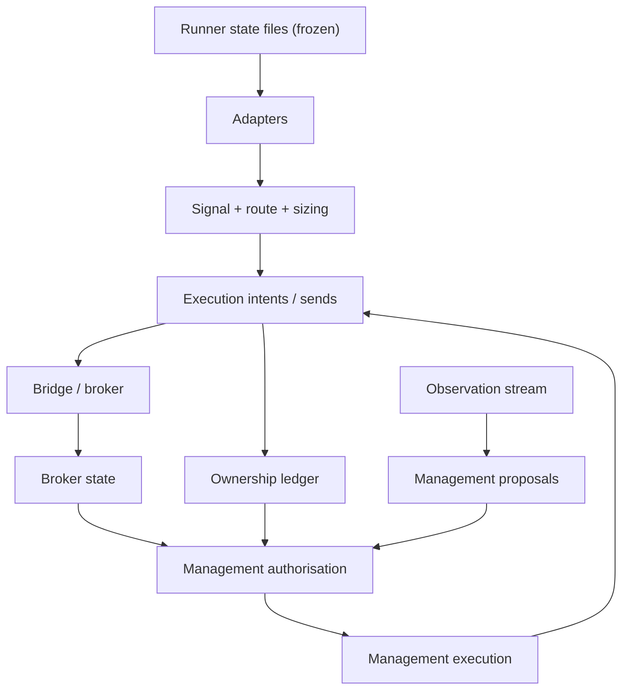

# 16 - Deployment sequence

The order is derived from **real read/write dependencies** in `02` and `04`, not from convenience: a consumer cannot move to the database before its inputs are authoritative there, and anything that can move money moves last.

## 1. Dependency facts

Consequences: signal/sizing before execution; broker state before authorisation; ownership before management execution; the bridge feedback loop (`BRIDGE → BS`, `EX → OWN`) means execution cutover needs broker state and ownership already authoritative; observation is independent of execution.

## 2. Phases

| Phase | Content | Domains at end | Gate(s) passed | Risk |
|---|---|---|---|---|
| **P0 Verify & baseline** | resolve OD-01/02/03/04 read-only; freeze this matrix; record baseline `audit_file_ipc` (174 candidates / 15 modules at `64cb033`); confirm dedicated infrastructure; DR gap plan (`backup_runtime.sh` covers only Context files) | none | - | none |
| **P1 Substrate** | schemas, roles, migrations; `runtime_instance` + leases + heartbeats as **shadow rows** (processes register, nothing consults them); JetStream streams/consumers created (no producers acting); pg backup/restore rehearsal; metrics/alerts (`15`) | substrate | `SHADOW_WRITE_READY` | low |
| **P2 Signal plane** | tailer/adapter ingest (`TAILER_INGEST`) → outbox → projector; route/sizing rows; replay watermark and baselines imported; retire placeholders (`distribution_queue`, `delivery_status`) after no-reader proof | signal: `DB_SHADOW` → `DB_PRIMARY` (+projection) | `DUAL_WRITE_RECONCILED`, `DB_AUTHORITY_READY` (signal) | medium |
| **P3 Broker-state** | single publisher; snapshot rows + projector for `broker_state.json`; version continuity | broker-state `DB_PRIMARY` (+projection) | same, for the domain | medium |
| **P4 Management plane** | ownership ledger, proposals/decisions, activation, observation stream moved to JetStream (shadow → primary); TM authorisation as DB tx; **real** management stays shadow until its gate | management `DB_PRIMARY`; observation `JETSTREAM_PRIMARY` | domain gates | high |
| **P5 Execution plane** | shadow intents (`JETSTREAM_SHADOW`) ≥ 10 trading days; then fenced `T_cut` (`08`), arm with new generation; management execution and bridge lifecycle boundary in the same window | execution `DB_PRIMARY`+`JETSTREAM_PRIMARY` | `DB_AUTHORITY_READY`, `JETSTREAM_PRIMARY_READY` | critical |
| **P6 Retire** | legacy readers off (Control API from PostgreSQL) → `LEGACY_READ_RETIRE_READY`; projector off → `LEGACY_WRITE_RETIRE_READY`; delete files; run `17` audit | all `LEGACY_PROJECTION=off` | retire gates | medium |

```mermaid
gantt
  dateFormat  X
  axisFormat  %s
  section Prep
  P0 Verify and baseline        :p0, 0, 2
  P1 Substrate (shadow rows)    :p1, after p0, 3
  section Plane by plane
  P2 Signal plane               :p2, after p1, 5
  P3 Broker state               :p3, after p2, 4
  P4 Management plane + observation :p4, after p3, 6
  section Money
  P5a Execution shadow (>=10 trading days) :p5a, after p4, 5
  P5b Fenced cutover + arm       :crit, p5b, after p5a, 1
  section Exit
  P6 Retire legacy               :p6, after p5b, 4
```

(Durations are relative weights only; real time is bounded by the trading-day soak requirements in `12`.)

## 3. Why this order

* **P1 has no authority change**: leases and heartbeats are recorded but not enforced, which lets us watch real behaviour (heartbeat gaps, split brain) before a lease can stop a process.
* **Signal before broker state** because the signal plane is the least dangerous (no broker interaction) and yields the outbox/relay/reconciler machinery every later phase relies on.
* **Broker state before management** because `authorize` depends on it (snapshot version + freshness).
* **Management before execution** because management execution changes positions and needs the ownership ledger; observation moves here because its consumer is the Trade Manager and it is *independent* of execution (a safe place to prove JetStream at real volume).
* **Execution last, in its own window**, because every remaining hazard (duplicate broker write, uncertain send, stale generation) is highest here, and only here is there an irreversible external side effect. Ownership/fence cutover and execution cutover are the **same** `T_cut` for `execution:real:<acct>` (`08`); position-ownership *data* moves earlier.
* **P6 last** so rollback (`13`) stays available while evidence accumulates.

## 4. Per-phase release mechanics

* Each phase is one or more independent releases with its own change record, gate evidence and rollback drill.
* Services are deployed as unchanged-by-default: new code paths are inactive until the mode setting (`14`) says so.
* Changes to frozen strategy code: **none**, in any phase.
* Change windows for P5b: market closed / no open positions if possible; otherwise positions are adopted via the ownership ledger and broker-state snapshot import, verified before arming.

## 5. Infrastructure assumptions (must be confirmed, not changed here)

Dedicated PostgreSQL database + roles and dedicated JetStream account; backups (PITR) enabled before P2; time sync on all hosts; a staging environment able to run the entire stack against a **test broker/bridge stub** for the duplicate-delivery and rollback drills (no real orders during drills).
