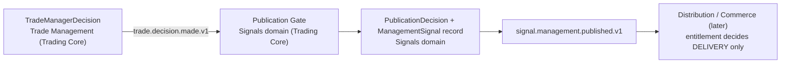

# 07 - Publication boundary (OD-A6-7)

## 1. Ownership (resolved)

| Concept | Owner | Notes |
|---|---|---|
| `TradeManagerDecision`, `ManagedTrade`, observations | **Trade Management** | never reads publication state, entitlements or subscribers |
| **Publication Gate**, `PublicationDecision`, `PublishedSignal` (entry), `ManagementSignal` record | **Signals domain (Trading Core)** - A2 `02` section 3 places `PublicationDecision`, `PublishedSignal`, `ManagementSignal` in *Signals (publication)* | resolves A2's internal tension: `05_DATA_OWNERSHIP` lists `management_publication` under `trade_management`; **A7: it belongs to Signals**. Trade Management keeps no publication table; the event `trade.decision.made.v1` *is* the publication request |
| Entitlement, channels, delivery, pricing | **Commerce / Distribution** | out of scope; consumes only `signal.management.published.v1` (+ existing published-signal events) |

Rules that keep entitlement out of the Trading Core: entitlement affects **distribution only**; it must not influence strategy evaluation, ManagedTrade creation, observations, TradeManagerDecision, or performance truth. Concretely, no Trading Core table has an entitlement/subscription/customer column, and no Trading Core consumer subscribes to any Commerce subject (A2: "Commerce -> Trading Core: none in V1").

## 2. Gate inputs (trading facts only)

The entry was published (a `PublishedSignal` exists for the trade's `signal_id`); the action is actionable (not `HOLD`); the decision is the **bound track's**, in `observation_seq` order; the bound `TradeManagerVersion` has publication eligibility `PUBLISHABLE`; stream state/kill switch allows it. Never: an account, a broker position, execution status, an entitlement.

## 3. What is missing today, and what it blocks

Today no `PublishedSignal`, Publication Gate, or `ManagementSignal` exists in code (A2 `02`: *absent*; the legacy `distribution_queue` has no consumer and is not a publication mechanism). The only version that exists is `TM-NONE-1`, which produces no actionable decision - so the gate has **nothing publishable to gate** in P4 regardless.

| Stage | Blocked by OD-A6-7? | Reason |
|---|---|---|
| **P4.1** contracts/schema | **No** | the Signals-owned tables (`publication_decision`, `management_signal`) may be *specified* as an interface, but P4.1 delivers no Signals code; A2's ownership is enough |
| **P4.2** ManagedTrade shadow | **No** | creation is independent of publication (`03`) |
| **P4.3** observation producer shadow | **No** | |
| **P4.4** evaluator shadow | **No** | decisions are persisted regardless; `TM-NONE-1` only HOLDs |
| **P4.5** product-domain authority | **No** | authority covers `managed_trade`, `trade_observation`, `trade_manager_decision` only |
| **P4.6** internal publication path | **Partially** | split it: **P4.6a** gate + records + event with every outcome `WITHHELD(ENTRY_NOT_PUBLISHED)` or `WITHHELD(NOT_ACTIONABLE)` - *not blocked*; **P4.6b** a `PUBLISHED` outcome - *blocked* until the Signals domain provides `PublishedSignal` and a publishable TM version exists (both outside P4) |

**Conclusion:** customer distribution not being implemented blocks **nothing** in P4.1-P4.5 and only the `PUBLISHED` branch of P4.6. OD-A6-7 is **resolved as to ownership** (Signals domain), and open only as to *timing* of the `PublishedSignal` deliverable (a Signals-domain decision that gates P4.6b).

## 4. Event and record contract Commerce will eventually consume

`signal.management.published.v1` (A6 `12` section 4 stands): ordered per `managed_trade_id` by `ManagementSignal.sequence`; payload = levels and fractions, customer-safe reason text, `published_at`, `signal_id`, `tm_version_id`, `decision_id`; no lots, tickets, accounts. Commerce subscribes only to `signal.published`, `signal.retracted`, `signal.management.published`, `signal.outcome.published` (A2); it never sees `trade.observation.*`, `trade.decision.made.v1`, `execution.*` or `broker.*`.
