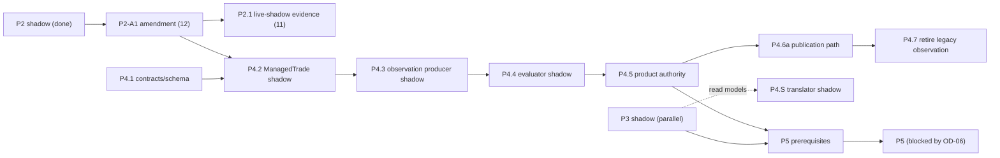

# 09 - Final P3 / P4 / P5 boundaries

Supersedes A6 `16` and `17` where they differ (A7 > A6). Confirms the architect's expectation and lists the near-crossings found.

## 1. Boundaries

| Phase | Final scope | Personal Execution | Authority moved |
|---|---|---|---|
| **P3** | **broker-state + ownership SHADOW projection and read models only**: read-only tailers into shadow tables, reconciliation, `PersonalPositionObservation` read model, the `signal_id -> intent -> ownership -> position` join | not touched | **none** |
| **P4** | **product Trade Management path, broker-independent**: ManagedTrade, Trade Observation Service, TradeManagerVersion registry, evaluator, `TradeManagerDecision`, internal publication path (P4.6a), evidence records, retirement of the legacy observation transport | **may remain OFF**; optional shadow translator (P4.S) writes shadow rows only | trade-management domain (`managed_trade`, `trade_observation`, `trade_manager_decision`) -> `DB_PRIMARY` in P4.5 |
| **P5** | **execution authority, ownership authority, broker-state authority, management execution effects, OD-06 fencing** (A5 ADR-0003), attempt state machine, REAL close/trail bridge capability, `activation` authority, DB-authoritative management `ExecutionIntent` | the whole personal path | execution plane (`T_cut(execution:real:<account>)`) |

`P5_BLOCKED_BY_OD06 = true`. Nothing in P2, P3 or P4 lifts it.

## 2. What is in P4 and must stay out of P5

| P4 element | Why it is not P5 |
|---|---|
| ManagedTrade creation, observation, decisions, `TM-NONE-1` | no broker interaction of any kind; reads only the EntrySignal record and a market provider |
| Trade Observation Service using `MarketDataProvider` on the **research** listener | read-only tools on a listener that exposes no write tools (A5 `B4`); not the execution EA queue |
| Publication Gate (P4.6a) | Signals-domain records; no Commerce, no execution |
| P4.S translator shadow | reads P3 shadow tables, writes shadow eligibility only, **creates no intent**, writes no file/subject the legacy executor reads |
| Retiring the Phase 7 publisher/legacy fan-out | the legacy chain is inert (A6 `01`); it is *removing* an input, not moving authority |

## 3. Near-crossings identified (and how each is contained)

| # | Near-crossing | Containment |
|---|---|---|
| X1 | A6 P4.7 edits the **stack registry**, which lives in the *bridge* repository (`scripts/mt5_stack_services.json`) | separate approval in that repository; not part of P4.1-P4.5; the gate (`06` G4) requires it only at retirement |
| X2 | **OD-01 repair in P2** makes the orchestrator's tradeability gate effective in REAL mode (`R16`) | analytical sizing rows only; REAL consumer ignores `sizing_decisions` (A5 `P11`); recorded as a deliberate P2 change, **not** an execution change; no P5 crossing |
| X3 | the personal link `managed_trade <-> execution_intent <-> broker position` | table owned by Personal Execution (P5); the product `managed_trade` has no such column (`03`) |
| X4 | A2's `personal-exec-entry` consumer of `signal.entry.created` and `trade.decision.made` | subscribing is P5; P4 may only run a **shadow** consumer under a distinct durable name |
| X5 | `activation.json` (`REAL_MANAGEMENT`) | remains a legacy file switch; its DB authority is P5 (A4 `TMG-05`) |
| X6 | outbox relay and `Nats-Msg-Id` support | shared substrate needed by P2.1/P4.3; it is infrastructure, not execution; may be delivered under P2-amendment/P4.1 |
| X7 | the shadow tailers of `broker_state.json` / ownership in P3 | read-only; **no** repointing of `authorize()`; no second writer |
| X8 | any P4 component importing `contracts.mt5_bridge.Mt5ExecutionClient`, `execution/demo_broker`, or writing `INTENTS_PATH` | forbidden; enforced by an import/grep test in every P4 stage (`10`) |

No P4 element **accidentally** crosses into P5 as designed; X1-X8 are the places where an implementation could, and each has a containment rule.

## 4. Sequencing

`P4.1` can start immediately (it needs the *interface* of the EntrySignal record, defined in `03`, not its implementation). `P4.2` and `P2.1` wait for P2-A1. P3 is independent of both.
