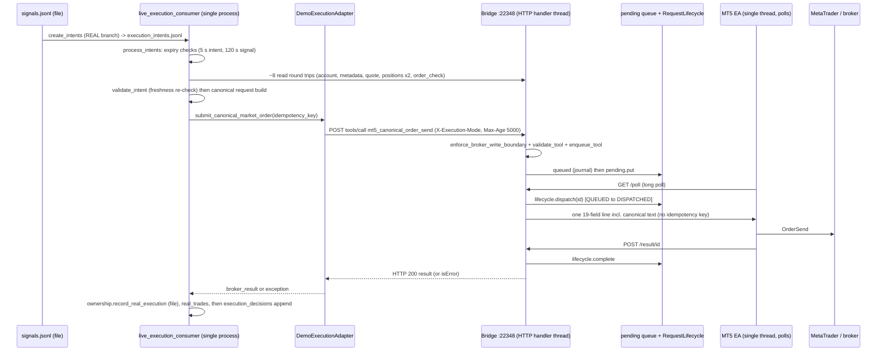
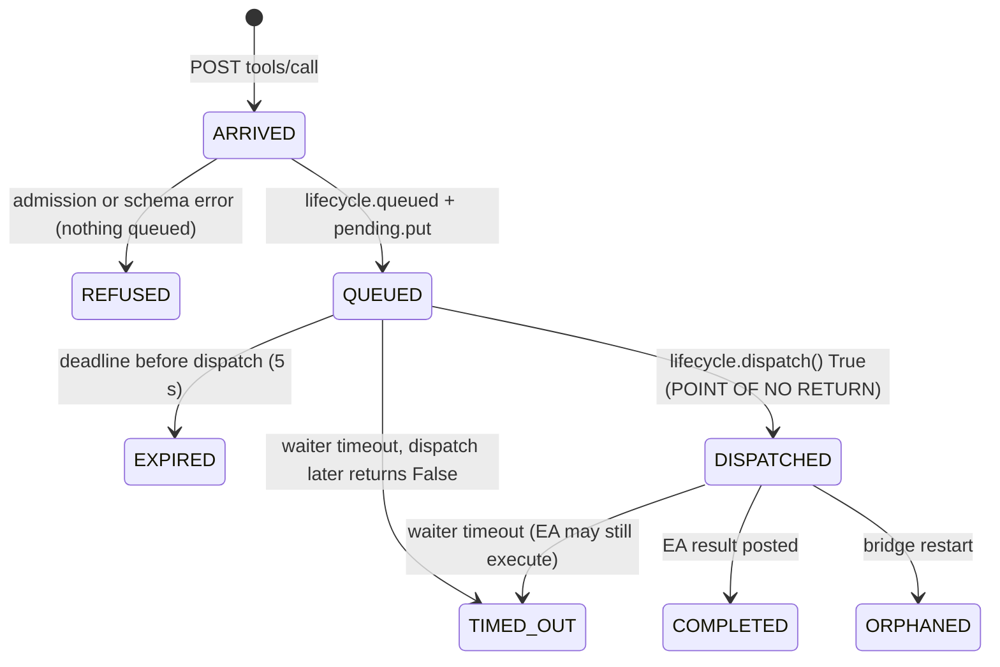

# 01 - The actual execution call path (OD-06 trace)

Sources: platform `88528e6` (this checkout) and bridge `5d4b018` (repository `mt5-native-bridge`, read from git objects, not the working tree). Every statement below is either a citation or is marked as inference. `tools/verify_evidence.py` re-checks the load-bearing ones (IDs `B*`, `P*`).

> **A correction to the premise.** `contracts/mt5_bridge/Mt5ExecutionClient` (the "narrow write client") is **not** on the production path. The consumer sends through `execution/demo_broker.py::DemoExecutionAdapter` (raw `urllib`) and, for management, through a second raw `urlopen` in the consumer itself (check `P1`, `P6`). The extracted client boundary is therefore a target, not the current call path; any fence must be added to the path that exists, and the client should be brought onto it.

## 1. The path, hop by hop

## 2. Boundary inventory

Columns follow the question set in the task: where ownership is checked, where a generation exists, request identity, idempotency, mode, staleness, queueing and timeout.

| # | Boundary | Location | What is checked / exists | What is **not** there |
|---|---|---|---|---|
| 1 | Intent creation | `live_execution_consumer.py:425-526` (`create_intents`, REAL branch) | `execution_state_consistency()` across manifest / orchestration state / `real_state.json` / resume file (**startup-style agreement of four files**); armed + account context; startup baseline; resume cutoff, `excluded_signal_ids`; source health; symbol mapping `NATIVE`; account authorised; risk policy. Identity: `ExecutionIntent.from_records` gives a stable `execution_intent_id`; `intent_max_age_seconds` = 5 s | **No generation is stamped on the intent.** The resume generation is only tested for non-zero (`:228`). REAL sizing is owned here; the orchestrator's `sizing_decisions` are **not read** in the REAL branch (check `P11`) |
| 2 | Intent selection | `:679-716` (`process_intents`) | decision key `stable_id("DEC",{intent})`; expiry: `expires_at`, intent age > 5 s, signal age > 120 s, missing timestamps all fail closed | "Done" is defined by the *presence of a decision row* (`:683`), not by state |
| 3 | Armed / account context | `:741-762` and again `:786-800` | `real_state.json` armed and `account_context_id`; account snapshot must match; mismatch disarms | Armed state is read from a file **before** the multi-second pre-send reads, not immediately before send. Single-process assumption; **no lease** |
| 4 | Pre-send reads | `:763-835` | account, metadata, quote, positions; `market_execution_sizing`; `validate_intent` (freshness re-checked with `datetime.now`) executed twice ("final pre-write recheck") | Each read is an EA round trip through the same serialised queue (default EA poll floor 5 s, check `B9`) |
| 5 | Preflight | `:839` `adapter.order_check(...)` | canonical request round-trips through the EA and text/fingerprint must match | **Runs after the last freshness check.** Its latency is uncovered by consumer-side freshness |
| 6 | Adapter guards | `execution/demo_broker.py:22-50` | mode enum, endpoint is not `:22347`, armed context equals verified account, real server prefix, account type real, `transport_verified` | Caller-side only; nothing the bridge can verify |
| 7 | **Idempotency key** | `live_execution_consumer.py:864` | `stable_id("REALORDER",{execution_intent_id, account_context_id})` - **per intent**, passed as `idempotency_key` | The bridge does not use it (`B1`); the EA never receives it (`B2`) |
| 8 | Submit | `demo_broker.py:89-131` | headers `X-Execution-Mode`, `X-Bridge-Origin: REAL_EXECUTION`, `X-Bridge-Priority-Class: EXECUTION_CRITICAL`, `X-Bridge-Max-Age-Ms: 5000`; client timeout 10 s; only `TimeoutError` becomes `SUBMISSION_ACK_UNCERTAIN_RECONCILE_REQUIRED`; success = retcode in {10008, 10009, 10010} | Any other exception (incl. URLError, bridge-side timeout text) is a plain `RuntimeError` |
| 9 | Bridge admission | `mt5_bridge/server.py:332` `enforce_broker_write_boundary`; `:203` `validate_tool` | execution listener only (`MT5_EXECUTION_ONLY`); `X-Execution-Mode` **self-declared header**; schema | **No authentication** (`B3`). `REAL_EXECUTION` is accepted only for `mt5_canonical_order_send`; REAL `mt5_close_position` / `mt5_trailing_stop` are refused (`B4`, table in section 4) |
| 10 | Bridge dedupe | `server.py:360-380` | in-flight *coalescing* by `[tool, args]` key, cleared when the request completes or times out (`lifecycle.py:265`) | No idempotency ledger; a retry after completion or timeout is a **new** request; args include the fresh quote price, so retries rarely even coalesce |
| 11 | Request id | `server.py:401` | `secrets.token_hex(16)` minted per enqueue by the bridge | The caller never learns it before the response; no lookup by id or key (`B7`) |
| 12 | Queue | `server.py:400-439`, `lifecycle.py` | backpressure at depth 32; `deadline_at = created + max_age`; journal to `runtime/execution_bridge/request_lifecycle.jsonl` | Queue is in memory; a restart orphans non-terminal requests (`B10`) |
| 13 | Waiter timeout | `server.py:441-451` | `wait_timeout = min(30, max_age)` = **5 s** for canonical sends. On timeout: `lifecycle.timeout()` (terminal `TIMED_OUT`) for `mt5_canonical_order_send`; only five legacy write tools use `caller_timeout()` (`B5`) | The HTTP reply is `isError` with text "EA did not respond..." - **not** a client-side timeout, so the client's `TimeoutError` branch is not taken (5 s < 10 s) |
| 14 | **Dispatch** | `server.py:539`, `lifecycle.py:165` | `dispatch()` under `lifecycle.lock`: only `QUEUED` requests, expiry checked, then `DISPATCHED` and the line is written to the EA socket | **The only cancellation point.** No fence, generation or owner check (`B6`) |
| 15 | EA | `ea/MT5TradingBridge.mq5:469-530, 346` | 19-field parse; canonical text rebuilt and compared (`CANONICAL_REQUEST_MISMATCH`); `OrderSend`; result JSON with `retcode`, `order`, `deal` | EA has no dedupe, no cancel message, no idempotency key. Polls at most every `MinimumPollMilliseconds` (5000 default); `WebRequest` timeout 35 s |
| 16 | Result | `server.py:593-620`, `lifecycle.py:193` | `complete()`; a response after `TIMED_OUT`/`ORPHANED` is journaled as `LATE_RESPONSE_RECEIVED` and the HTTP reply is still 204 | Late results are recorded only in the journal file; nobody is notified |
| 17 | Record | `live_execution_consumer.py:872-910` | ownership file written, `real_trades.jsonl` appended, then the terminal decision row | **The decision row is written after the send** (`P2`). Any exception inside the inner `try` - including one raised *after* the broker accepted (ownership write failure) - is stored as `DRY_RUN_REJECTED` with `broker_write_blocked=true` (`P5`, `:877`, `:898`) |

The stack registry starts the consumer with `--interval 15` (`scripts/mt5_stack_services.json`, bridge `5d4b018`), so one loop iteration is: refresh broker state, `create_intents`, `process_intents` (sequential, several EA round trips per intent), `process_management_intents`, then sleep `max(1, 15)` s. Intents later in a batch routinely age past the 5 s limit and are recorded as expired - a fail-safe, but also the reason the pre-send window is long.

## 3. The management path is a different, weaker path

`process_management_intents` (`live_execution_consumer.py:126-188`) reads `management_intents.jsonl`, checks position existence, `position_snapshot_version` equality against the local `broker_state.json`, and ownership `prove()`, then sends `mt5_close_position` / `mt5_trailing_stop` with a raw `urlopen(..., timeout=30)` (`:169`):

* no idempotency key, no max-age header, no priority class, no `DemoExecutionAdapter` guards;
* **the bridge refuses it**: `REAL_EXECUTION` + close/trailing => `EXPLICIT_DEMO_OR_SMOKE_MODE_REQUIRED` (`B4`), so REAL management writes are structurally unreachable at this baseline. They record `REJECTED / BROKER_MANAGEMENT_REJECTED` (or `MANAGEMENT_TRANSPORT_FAILED`) and, because `completed` counts only `COMPLETED`, the intent is re-attempted on every loop iteration;
* a transport timeout is stored as `REJECTED` (`MANAGEMENT_TRANSPORT_FAILED`) and retried - the *uncertain* case is treated as a *retryable failure*;
* the results file stores one row per `MEXEC` key (`:181-185`); if a first attempt is `REJECTED` and a later attempt succeeds, the later `COMPLETED` row is **not** appended (unique key already present), so the intent never enters `completed` and is re-sent every second. (Latent; unreachable while the bridge refuses REAL close/trailing.)

Consequence for P5: the management-execution path cannot simply be "migrated"; it needs a defined bridge capability (REAL close/trail with fence) before it can be enabled. See `12`.

## 4. Bridge admission matrix (behavioural check `B4`, execution listener, extracted function evaluated in isolation)

| Tool \ `X-Execution-Mode` | `REAL_EXECUTION` | `DEMO_EXECUTION` | `REAL_SMOKE_TEST` (+id) | none |
|---|---|---|---|---|
| `mt5_canonical_order_send` | **ALLOWED** | `DEMO_EXECUTION_TOOL_NOT_ENABLED` | **ALLOWED** | `EXPLICIT_DEMO_OR_SMOKE_MODE_REQUIRED` |
| `mt5_close_position` | `EXPLICIT_DEMO_OR_SMOKE_MODE_REQUIRED` | `DEMO_EXECUTION_TOOL_NOT_ENABLED` | **ALLOWED** | `EXPLICIT_DEMO_OR_SMOKE_MODE_REQUIRED` |
| `mt5_trailing_stop` | `EXPLICIT_DEMO_OR_SMOKE_MODE_REQUIRED` | `DEMO_EXECUTION_TOOL_NOT_ENABLED` | `SMOKE_TEST_TOOL_NOT_ENABLED` | `EXPLICIT_DEMO_OR_SMOKE_MODE_REQUIRED` |
| `mt5_market_order` (legacy) | `EXPLICIT_DEMO_OR_SMOKE_MODE_REQUIRED` | **ALLOWED** | `SMOKE_TEST_TOOL_NOT_ENABLED` | `EXPLICIT_DEMO_OR_SMOKE_MODE_REQUIRED` |

Anyone able to open a TCP connection to the execution listener and send `X-Execution-Mode: REAL_EXECUTION` with a well-formed 19-field body can place a real order: there is no authentication and no account binding on the bridge side. This is pre-existing and is a security finding independent of fencing (see `13`).

## 5. Where uncertainty can arise (exact points)

| Point | Mechanism | How the consumer sees it today |
|---|---|---|
| U1 | consumer crashes after `submit_canonical_market_order` returned, before the decision row | intent has no decision: **re-processed on restart**. Guards are only freshness (5 s), `position_conflict_policy` if configured, and the bridge (which does not dedupe) |
| U2 | bridge waiter timeout (5 s) after the request was `DISPATCHED` | `isError` text; recorded `DRY_RUN_REJECTED`. The order may still execute (`LATE_RESPONSE_RECEIVED`) |
| U3 | client 10 s `TimeoutError` (rare: 5 s bridge timeout usually fires first) | `SUBMISSION_ACK_UNCERTAIN_RECONCILE_REQUIRED` string, still recorded `DRY_RUN_REJECTED` |
| U4 | `URLError` / connection reset after the request body was sent | generic exception, recorded `DRY_RUN_REJECTED` |
| U5 | EA executed, result POST lost (bridge down / partition) | bridge never learns the result; consumer already timed out |
| U6 | bridge restart while `DISPATCHED` | journal replay marks it `ORPHANED`; outcome unknown |
| U7 | ownership/record write fails **after** broker acceptance | recorded as rejection with `broker_write_blocked=true` although a position exists |

Nothing consumes `unresolved_attempts` / `unknown_active_outcomes` (they are only read by `control_api/app.py:359-368`; no source writes them): the existing system has the *vocabulary* for uncertainty but no writer.

## 6. Where cancellation is possible (bridge view, exact)

**Cancellation is possible until `RequestLifecycle.dispatch()` flips `QUEUED` to `DISPATCHED` under `lifecycle.lock`. From that instant the EA holds (or may hold) an executable line and the EA protocol has no cancel message.** Before that instant a request can be cancelled by any component that can take the same lock; today nothing except expiry and the waiter timeout does.
