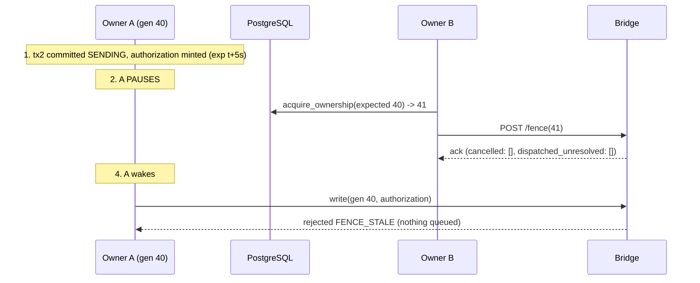

# 03 - Fence race analysis

Notation: A = old owner at generation 40; B = new owner at generation 41; "advance" = `POST /fence` acknowledged by the bridge (`04` 3.1). Outcomes: **CLOSED** (cannot happen), **BOUNDED** (can happen, within a stated bound, and is accounted for), **UNCERTAIN** (can happen, outcome must be reconciled), **OPEN** (not addressed). Designs: **A**=bridge reads PostgreSQL, **B**=signed capability only, **C**=gateway, **D**=pushed generation only, **F**=recommended (D + B-lite).

## 1. The four-step race, both interleavings

| Interleaving | What happens under **F** | Verdict |
|---|---|---|
| **I. advance acked before A's request arrives** (diagram) | request rejected at enqueue with `FENCE_STALE`; ledger has no entry; A's `SENDING` row is resolved by B via `write-status` = `UNKNOWN` **and** fence generation > 40 => `NOT_SENT` (proof) => attempt `FENCED` | **CLOSED** |
| **II. A's request arrives, is queued, then advance runs** | advance (same `lifecycle.lock` critical section) marks the queued request `CANCELLED_FENCED`; `dispatch()` later returns False; ack lists it under `cancelled` | **CLOSED** |
| **III. A's request is dispatched, then advance runs** | request is beyond recall; ack lists it under `dispatched_unresolved`; B marks A's attempt `UNCERTAIN`, blocks the account, reconciles (`06`) | **UNCERTAIN, accounted for** |
| **IV. A's request arrives after B acquired in PostgreSQL but before the advance ack** (the G3 interval) | bridge still at 40 => accepted and possibly dispatched; A's authorization expires <= 5 s after minting; A cannot mint another (tx2 `assert_generation` fails); the send is recorded (`SENDING` committed before the call) so B finds it in the advance ack or in `write-status` | **BOUNDED (<= authorization TTL), accounted for** |
| **V. B crashes after PG acquire, before advance** | bridge stays at 40 until its grant expires (<= 20 s), then rejects everything (fail closed); A's tokens expire in <= 5 s; a third owner C acquires 42 and advances | **BOUNDED, then closed** |

The difference between designs is entirely in rows II-IV: only a fence that is (a) held at the bridge, (b) advanced before use and (c) checked inside `dispatch()` cancels queued work and enumerates dispatched work.

## 2. Scenario matrix

Each cell is the outcome for that design. `n/a` = the scenario is not about that design's mechanism.

| # | Scenario | A (bridge reads DB) | B alone | C gateway | D alone | **F** |
|---|---|---|---|---|---|---|
| 1 | owner checks fence, pauses, generation advances, stale owner resumes | CLOSED to a DB round-trip residual | **OPEN** until TTL | **OPEN** | CLOSED after advance ack; IV-style window before | **CLOSED after advance ack; BOUNDED (5 s) before** |
| 2 | request queued before lease loss | CLOSED if re-checked at dispatch | **OPEN** | **OPEN** | CLOSED (advance cancels queued) | **CLOSED** |
| 3 | request dequeued after lease loss | CLOSED (dispatch check) | **OPEN** | **OPEN** | CLOSED (dispatch check) | **CLOSED** |
| 4 | EA already polled the request | UNCERTAIN | UNCERTAIN | UNCERTAIN | UNCERTAIN (enumerated) | **UNCERTAIN (enumerated in advance ack and ledger)** |
| 5 | HTTP response lost (bridge to platform) | UNCERTAIN, resolved by status | UNCERTAIN, no status | UNCERTAIN | UNCERTAIN, no status | **UNCERTAIN, resolved by `write-status`** |
| 6 | bridge waiter timeout (frozen 5 s behaviour) | UNCERTAIN | UNCERTAIN | UNCERTAIN | UNCERTAIN | **UNCERTAIN, resolved by `write-status`** (timeout behaviour unchanged) |
| 7 | bridge restart | fence not held locally: fine; queue lost (orphaned) | n/a | n/a | fence persisted; else UNSET => fail closed | **persisted fence, else UNSET => fail closed; orphans classified queued/dispatched** |
| 8 | PostgreSQL unavailable | bridge cannot validate => **all writes stop, incl. reduce-only** | no new tokens | no leases | grant expiry stops writes; bridge needs no DB | **writes stop by grant expiry; reduce-only break-glass separate** |
| 9 | NATS unavailable | n/a | n/a | n/a | n/a | not a fencing input; intents expire by freshness (5 s), nothing is sent late |
| 10 | network partition platform-bridge | writes fail | tokens expire | writes fail | grant expires at bridge; new owner cannot advance => cannot send | **same; new owner blocked until ack** |
| 11 | partition bridge-PostgreSQL | **writes stop** | n/a | n/a | n/a (no such link) | n/a (no such link) |
| 12 | duplicate intent delivery | inbox/CAS + ledger | inbox/CAS | inbox/CAS | inbox/CAS | **inbox/CAS; second delivery finds state != PENDING; a duplicate request with the same `attempt_id` gets the ledger entry, not a new enqueue** |
| 13 | same intent under a different generation | DB decides | not detected | not detected | request rejected if stale generation | **B must not claim while any earlier attempt of the intent is non-terminal (I5); ledger key differs per attempt** |
| 14 | emergency close | blocked when DB down | token needed | gateway needed | fence needed | **separate `REDUCE_ONLY` break-glass scope, operator credential, audited (`07`)** |
| 15 | Trade Manager management command | DB | token | gateway | fence | **same fence, same attempt machine; REAL close/trail must first be enabled on the bridge (`01` 3)** |
| 16 | manual operator action in the MT5 terminal | not fenceable | not fenceable | not fenceable | not fenceable | **not fenceable; detected by broker-state reconciliation as unowned/changed position** |
| 17 | REAL vs smoke / demo | mode is a header today | same | same | same | **fence required for `REAL_EXECUTION` and `REAL_SMOKE_TEST` (smoke must take the same lease so it cannot run concurrently with the automated executor); `DEMO_EXECUTION` optional** |

## 3. The exact point after which cancellation is impossible

Three different clocks, from earliest to latest:

1. **Platform view**: after tx2 commits `SENDING`, the platform cannot *un-send* by itself; it can only ask the bridge to cancel (`write-cancel`) or advance the fence.
2. **Bridge view**: **`RequestLifecycle.dispatch()` returning True** (status `QUEUED` -> `DISPATCHED`, journaled, under `lifecycle.lock`, `mt5_bridge/lifecycle.py:165`, called at `server.py:539`). Before that line: cancellable by expiry, `write-cancel`, or fence advance. After it: not cancellable.
3. **EA view**: the EA executes every polled line synchronously (`ea/MT5TradingBridge.mq5:346` `OrderSend`). It has no cancel message and no state to consult. (If the poll response never reaches the EA - `WebRequest` failure - the request is `DISPATCHED` at the bridge and never executed; the two are indistinguishable to the bridge, which is why `DISPATCHED` maps to `SENT` and an unanswered one to `UNCERTAIN`, not to `NOT_SENT`.)

## 4. Windows that remain, quantified

| Window | Length | Bound | Accounted for by |
|---|---|---|---|
| PG acquire commit -> bridge advance ack (G3) | ms in a healthy system; <= 5 s (authorization TTL) if the new owner is stuck | authorization `exp` (<= 5 s) and A's inability to mint | `SENDING` row (I4) + advance ack / `write-status` |
| `dispatch()` True -> EA `OrderSend` | EA-side processing, typically sub-second; bounded above by `WebRequestTimeoutMs` (35 s) plus EA poll cadence effects | none (EA has no cancel) | ledger `DISPATCHED`; `UNCERTAIN` until result/status/broker evidence |
| EA `OrderSend` -> result POST -> platform tx3 | sub-second normally; unbounded on failure | none | ledger `COMPLETED` (even if late), `write-status`, broker state |
| Bridge thread pause between `dispatch()` and socket write | rare | none | ledger `DISPATCHED`; resolved as above |

## 5. Why "the owner re-checks the lease immediately before calling" is not a fix

The re-check (tx2 in the design) is kept because it shrinks the window and prevents a *known-stale* owner from starting. But between the re-check's commit and the bridge's `dispatch()` there are at minimum a socket write, an HTTP parse, admission checks and a queue wait of up to 5 s (`01` rows 8-14): a check on the sender's side can never be the fence. The fence must live where the request stops being cancellable. That is the entire argument for F.
