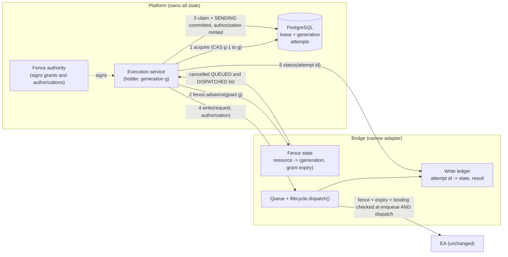

# 04 - Recommended fencing design (F = bridge-held fence + signed request authorization)

Status: **RECOMMENDED, not approved.** Caleb / the architect must approve before any implementation (`15`). Parameters are proposals.

## 1. One-paragraph description

The platform (PostgreSQL) remains the only source of truth for who owns `execution:real:<account>` and at which generation. Ownership is *mirrored* to the bridge as an opaque, authenticated, **expiring** grant `(resource, generation)`. A new owner must **advance** the bridge's fence to its generation - and receive an acknowledgement - before its first write; the advance atomically cancels every still-queued request of lower generation and returns the list of lower-generation requests that already reached the EA. Every write request carries a short-lived signed **authorization** bound to the exact request (attempt id, fingerprint), the tool and the generation. The bridge checks the fence when the request arrives **and again inside `dispatch()`**, under the same lock that serialises the queue. The EA is unchanged.



## 2. Objects

### 2.1 Fence grant (platform to bridge; opaque to the bridge)

```
FenceGrant {
  resource:    string <= 128     # e.g. "execution:real:<account_context_id>"; bridge treats it as an opaque key
  generation:  integer >= 1      # from platform.ownership_leases.generation
  holder:      string <= 64      # runtime_instance_id, logged only
  ttl_ms:      integer           # grant lifetime measured on the bridge's monotonic clock from receipt
  not_after:   RFC3339           # absolute cap (skew-checked)
  key_id, sig                    # signature over the canonical form
}
```

Bridge state per resource: `(generation, grant_expires_at_monotonic, holder, advanced_at)`. **Persisted** (write + fsync before acknowledging) in the bridge's *own* runtime directory - this is the bridge's private state, not service-to-service IPC (`13`).

### 2.2 Write authorization (per request)

```
WriteAuthorization {
  resource, generation,
  attempt_id:  string            # == the bridge idempotency key (see 05)
  tool:        "mt5_canonical_order_send" | "mt5_close_position" | ...   # operation scope
  request_fingerprint: sha256    # from canonical_request_fingerprint(); binds token to the exact request
  scope_class: "EXPOSURE_INCREASING" | "REDUCE_ONLY"
  exp:         RFC3339           # <= now + 5 s (matches X-Bridge-Max-Age-Ms)
  key_id, sig
}
```

Presented in a new request header (`X-Write-Authorization`). Nothing platform-specific is inside: the bridge sees strings, integers, a tool name and a fingerprint.

### 2.3 Bridge write ledger (idempotency and status)

Keyed by `attempt_id` (= `idempotency_key`). Fields: `request_id`, `resource`, `generation`, `tool`, `request_fingerprint`, `state` in {`QUEUED`, `CANCELLED`, `CANCELLED_FENCED`, `EXPIRED_BEFORE_DISPATCH`, `DISPATCHED`, `COMPLETED`, `ORPHANED_QUEUED`, `ORPHANED_DISPATCHED`}, timestamps (`enqueued_at`, `dispatched_at`, `completed_at`), and the EA response payload when present. It is the existing `request_lifecycle.jsonl` journal *extended with these fields and indexed at start-up* (the journal already carries `request_id`, status transitions and response payloads; it lacks key/resource/generation/fingerprint).

## 3. Protocol

### 3.1 Acquire and advance (new owner B)

```
1. B: SELECT lease (resource) -> generation 40
2. B: platform.acquire_ownership(resource, B, expected_generation=40)   # PG CAS -> 41; STALE_FENCING_GENERATION if lost
3. B: obtains FenceGrant(41) from the fence authority (which re-checks PG: holder=B, generation=41)
4. B: POST /fence {grant}  ->  bridge (under lifecycle.lock, one critical section):
        verify signature, grant unexpired, generation >= current
        if generation > current:
             for each QUEUED write request of this resource with generation < 41: state = CANCELLED_FENCED
             collect DISPATCHED (no EA response yet) requests with generation < 41
             set current = 41, expires_at = now + ttl; persist; 
        if generation == current: refresh expiry (renewal)
        reply { accepted, bridge_epoch, generation, cancelled:[attempt_id], dispatched_unresolved:[{attempt_id, request_id, dispatched_at}] }
5. B: only after the reply, marks its lease "bridge-fenced" and may claim intents.
   B records every attempt_id in dispatched_unresolved as UNCERTAIN (see 05) before doing anything else.
```

Renewal: B repeats step 3-4 at `ttl/3` (proposal: grant TTL 20 s, renew every ~6 s). A holder that cannot renew stops sending before the bridge stops accepting it.

### 3.2 A write (holder A at generation g)

```
1. tx1: inbox claim; assert_generation(resource, g); intent PENDING -> attempt CLAIMED          (PostgreSQL)
2. pre-send validation (quote, order_check, freshness) - as today
3. tx2: assert_generation(resource, g); freshness in DB time; attempt CLAIMED -> SENDING;
        mint WriteAuthorization(exp = now + 5 s); COMMIT                                        (PostgreSQL)
4. POST tools/call ... + X-Write-Authorization                                                 (bridge)
5. bridge enqueue: verify signature, exp, tool, fingerprint==request, resource fence generation == g and grant unexpired,
        ledger: attempt_id unseen (else return the ledger entry, no new enqueue)
        -> lifecycle.queued(+ledger fields)
6. bridge dispatch(): under lifecycle.lock: status QUEUED, not expired, fence generation still == g, grant still unexpired,
        authorization still unexpired  -> DISPATCHED   else -> CANCELLED_FENCED / EXPIRED_BEFORE_DISPATCH (returns False; nothing reaches the EA)
7. EA executes; POST /result; ledger COMPLETED with payload
8. tx3: SENDING -> CONFIRMED / REJECTED (+ ownership row, fill, outbox) in ONE transaction                (PostgreSQL)
```

### 3.3 Status and cancel (new, small)

* `GET /write-status?attempt_id=...` returns the ledger entry (or `UNKNOWN`), plus `bridge_epoch` and the current fence generation of the resource.
* `POST /write-cancel {attempt_id}` under the lock: `QUEUED` -> `CANCELLED` (provable not sent); `DISPATCHED`/`COMPLETED` -> returns state unchanged (cannot cancel).

## 4. Invariants (each must have a test in the eventual implementation)

| Id | Invariant |
|---|---|
| **I1** | A claim or send transition commits in PostgreSQL only if `assert_generation(resource, g)` holds inside the same transaction. (V1.2.1 does **not** provide this: `acquire_ownership` is CAS-on-acquire only; no function validates a generation on a write path - check `P13`.) |
| **I2** | The bridge's fence generation for a resource never decreases across advances, restarts and grant refreshes. |
| **I3** | A write is dispatched to the EA only if, **inside `dispatch()`**: fence generation == request generation, grant unexpired, authorization unexpired, ledger state `QUEUED`. |
| **I4** | Every request that may have reached the EA has (a) a committed `SENDING` attempt row (written **before** the call) and (b) a bridge ledger entry; `fence.advance` returns all lower-generation `DISPATCHED` entries. There is no unaccounted broker write. |
| **I5** | A new attempt for an intent requires proof that every earlier attempt is `NOT_SENT`/`FENCED`/`CANCELLED` (`05`). Ambiguity blocks; it is never resolved by resending. |
| **I6** | Unknown, expired, unparsable or unauthenticated input => no dispatch (bridge) and no claim/send (platform). No path falls back to an unfenced write when fencing is required. |

## 5. What is guaranteed - stated precisely

* **G1.** After `fence.advance(R, g+1)` is acknowledged, no request authorised under generation <= g can be dispatched to the EA for R. (Enforced at enqueue *and* dispatch, atomically with cancellation.)
* **G2.** Requests of generation <= g that had already been dispatched when the advance ran are **returned in the acknowledgement** and become `UNCERTAIN` attempts for the new owner. They are accounted for, not cancelled - cancelling them is impossible (`01` section 6).
* **G3.** Between the PostgreSQL acquire commit (step 2) and the bridge acknowledgement (step 4) the old owner's already-minted authorization is the only stale authority in existence. It expires within **<= 5 s**, and the old owner can no longer mint new ones (its `assert_generation` fails in tx2). Any send in that interval is one the old owner legitimately committed as `SENDING` under its then-valid generation, so it is recorded (I4) and reconciled by the new owner (G2 via ledger/status).
* **G4.** If the bridge is unreachable when a new owner takes over, the new owner cannot send (no advance ack), and the old owner's grant expires at the bridge (fail closed). If the *platform* is unreachable from the bridge, grants expire and the bridge stops dispatching by itself.

What is **not** claimed: that no order can ever be executed after the old owner "lost" ownership in PostgreSQL's view. An order already `DISPATCHED`, or committed within the G3 interval, can execute. The claim is that it cannot execute **unaccounted for**, and that nothing can be dispatched after the acknowledged advance.

## 6. Failure and restart behaviour

| Event | Behaviour |
|---|---|
| Bridge restart | queue lost; non-terminal requests become `ORPHANED_QUEUED` (never dispatched: provably not sent) or `ORPHANED_DISPATCHED` (may have executed: uncertain) - the journal already records `REQUEST_DISPATCHED`. Fence state is reloaded from its persisted record; if absent or unreadable => **UNSET => all fenced writes rejected** until the holder re-advances with an unexpired grant. `bridge_epoch` increments and is echoed in every reply so the platform detects the restart and re-advances |
| Persisted fence lost with old grants still circulating | grants carry `ttl_ms` / `not_after`; an old grant is expired and is rejected; only the current holder can obtain a fresh one (fence authority checks PostgreSQL) |
| Holder cannot renew (partition/pause) | grant expires at the bridge; writes stop without any DB access from the bridge |
| Fence authority unavailable | no new grants or authorizations: writes stop (fail closed). Reduce-only break-glass path is separate (`07`, `13`) |
| Clock skew | authorization/grant expiry is enforced on the bridge's own monotonic clock from receipt; the absolute `exp`/`not_after` is checked with a small tolerance; clock-skew alarms belong to the observability requirements (A4 `docs/migration/15`) |

## 7. Parameters (proposals, to be confirmed with measured latencies)

| Parameter | Proposal | Reasoning |
|---|---|---|
| Authorization TTL | <= 5 s | equals the existing `X-Bridge-Max-Age-Ms` (5000) and the platform's `intent_max_age` (5 s) |
| Grant TTL / renewal | 20 s / every ~6 s | must be > 2x renewal and > authorization TTL |
| Lease TTL (PostgreSQL) | 15-30 s | takeover latency vs false takeover; the foundation's `expires_at` is currently unused |
| Advance ack timeout | 2 s, then retry with backoff | new owner sends nothing until acknowledged |
| Bridge fence persistence | fsync before ack | so I2 survives restart |

## 8. Compatibility and rollout (no behaviour change until enabled)

* New bridge behaviour is **off by default** and enabled per listener by configuration; when off, current behaviour is unchanged.
* `GET /health` on the bridge reports `write_fence: {required: bool, resources: {...}, bridge_epoch}`. The platform **refuses to arm REAL execution** unless the bridge reports `required: true` (fail closed against a mis-deployed bridge).
* The frozen order-send timeout behaviour (`lifecycle.timeout()` for canonical sends, `isError` text) is **not** changed. The new `write-status` endpoint is what lets the platform resolve the resulting ambiguity without altering it.

## 9. Residual risks (owned, not hidden)

1. **Bridge process pause after `dispatch()` returned True and before the EA received the line** - the request is `DISPATCHED` in the ledger but the EA may not act; resolved as `UNCERTAIN`.
2. **EA operator changes** (min poll interval) change the dispatch-to-execution latency but not correctness.
3. **Account switch in the terminal** between the platform's account check and the send is not a fencing concern; it is mitigated by the existing double account-context check and remains a residual (`13`).
4. **Shared-secret model** for grants/authorizations in V1 (HMAC) means bridge compromise can mint authorizations; asymmetric signatures are the hardening path (`13`).
5. **Manual operator trades in the MT5 terminal** are outside any fence; broker-state reconciliation detects the resulting unowned positions.
