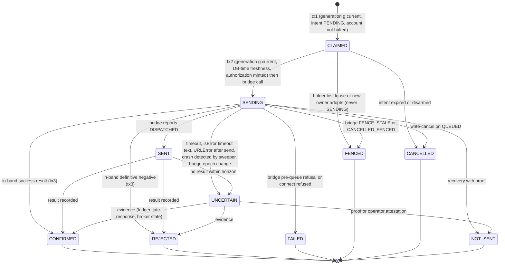

# 05 - Execution attempt state machine (required durable model before P5)

Names are taken from what the bridge and EA actually report (`01`, `lifecycle.py`, EA result JSON) rather than invented. The machine is per **attempt**; the intent is a derived aggregate.

## 1. Why attempts, and what maps to what

Today one intent has one *decision row* written after the send (`P2`). The target has a durable **attempt row before the send**, so "did it go out?" is answered by state, not by the absence of a later row. The in-repo precedent is the smoke path's `SUBMISSION_ATTEMPTED` event written before the send (`live_execution_consumer.py:1678`, smoke state file written before `adapter.submit_canonical_market_order` at `:1724`).

Identity chain (see `06` for the reasoning):

```
execution_intent_id   ->  one logical broker operation per intent (existing stable id)
  attempt_id          ->  stable_id("ATTEMPT", {intent, attempt_no})  == the BRIDGE idempotency key of that transport attempt
    request_fingerprint -> sha256(canonical request text)  (per attempt: the price comes from a fresh quote)
      bridge request_id -> secrets.token_hex(16) minted by the bridge per enqueue
        broker order / deal / position ticket -> from the EA result
```

The existing `idempotency_key = stable_id("REALORDER", {execution_intent_id, account_context_id})` stays as the **logical-operation key** stored on the intent (unique, per V1.2.1 `execution.intents.idempotency_key`); the value sent to the bridge becomes the per-attempt `attempt_id`, so that a proven-not-sent attempt can be followed by a new attempt without the bridge ledger treating it as a duplicate.

## 2. Attempt states

| State | Meaning | Justified by | Terminal |
|---|---|---|---|
| `CLAIMED` | attempt row exists under generation `g`; nothing external has been started | new (claim precedes the pre-send reads) | no |
| `SENDING` | committed **before** the bridge call; from here a broker effect is possible | smoke path `SUBMISSION_ATTEMPTED`; needed because the bridge call is synchronous and can outlive the process | no |
| `SENT` | the bridge reports the request reached the EA (`DISPATCHED`) or returned a result not yet recorded; no broker outcome recorded | bridge lifecycle `DISPATCHED`; distinguishes "still cancellable" (`SENDING`) from "beyond recall" (`SENT`) | no |
| `CONFIRMED` | EA/broker success: retcode in {10008, 10009, 10010} with order/deal ids (the platform's existing success set, `demo_broker.py:132`) | existing behaviour | yes |
| `REJECTED` | definitive negative outcome: the EA/broker answered and no position/order resulted (retcode classified *definitive*, table in `06` 5) | `BrokerSubmissionRejected` | yes |
| `FAILED` | definitive failure **before any possibility of dispatch**, with proof: bridge refusal before queueing (schema, admission, `IDEMPOTENCY_CONFLICT`, backpressure) or connection refused before any byte was sent | bridge `validate_tool` / `enforce_broker_write_boundary` errors | yes |
| `FENCED` | proven not sent because ownership moved: platform saw lease loss before `SENDING`, or bridge replied `FENCE_STALE` / `CANCELLED_FENCED` | new | yes |
| `CANCELLED` | proven not sent because it was cancelled: intent expired or disarmed before `SENDING`, or `write-cancel` on a `QUEUED` request | new | yes |
| `UNCERTAIN` | it may have reached the broker and no proof exists either way | `SUBMISSION_ACK_UNCERTAIN_RECONCILE_REQUIRED`, `LATE_RESPONSE_RECEIVED` | **no - blocks** |
| `NOT_SENT` | resolution of `SENDING`/`UNCERTAIN` **with proof** the request never reached the EA (bridge ledger: never dispatched, and fence advanced beyond the attempt's generation; or operator attestation with an evidence pack) | new | yes |

`CONFIRMED`/`REJECTED` reached from `UNCERTAIN` record `resolved_via` in {`BRIDGE_LEDGER`, `LATE_RESPONSE`, `BROKER_STATE`, `OPERATOR`} and the evidence reference.

## 3. Transitions



### 3.1 Legal transitions, generation and boundary rules

| Transition | Actor and generation | Transaction | Bridge call | Preconditions (all inside the same transaction) |
|---|---|---|---|---|
| none -> `CLAIMED` | holder, `g == current` | **tx1** | none | inbox claim; `assert_generation`; intent `PENDING`; no non-terminal attempt on the intent (partial unique index); account not halted; DB-time freshness (intent <= 5 s, signal <= 120 s) |
| `CLAIMED` -> `SENDING` | holder, `g == current == attempt.generation` | **tx2** | *immediately after commit* | `assert_generation`; DB-time freshness re-check; armed; authorization minted and stored (`authorized_until`) |
| `CLAIMED` -> `FENCED` / `CANCELLED` | holder (`g` still current) or any **later** owner (`g' > attempt.generation`) | own tx | none | proof by construction: state was never `SENDING` |
| `SENDING` -> `SENT` / `CONFIRMED` / `REJECTED` / `FAILED` / `FENCED` / `CANCELLED` | holder with `g == attempt.generation`, or a **later** owner via recovery | **tx3** (incl. ownership row, fill, outbox) | after the call returned | evidence attached; `CONFIRMED` writes `position_ownership` in the *same* transaction (fixes today's "ownership write failed => rejected" mislabel, `P5`) |
| `SENDING` / `SENT` -> `UNCERTAIN` | holder or later owner or sweeper | own tx | - | reason code (`BRIDGE_TIMEOUT`, `EA_NO_RESULT`, `PROCESS_LOST`, `BRIDGE_EPOCH_CHANGED`, ...) |
| `UNCERTAIN` -> `CONFIRMED`/`REJECTED`/`NOT_SENT` | **only** the reconciler with the current generation | own tx | `write-status` and broker reads | evidence reference stored; `NOT_SENT` only with a proof class from `06` |
| any terminal -> anything | forbidden | - | - | terminal states are immutable |

A **later generation may never advance a `CLAIMED` attempt of an older generation to `SENDING`**: it must create a new attempt. The database function implementing transitions rejects a transition whose actor generation is lower than the attempt's, except along the recovery edges above where the actor generation is **higher**.

### 3.2 Broker-call boundary

* **Committed `SENDING` (tx2) always precedes the HTTP call.** A crash before tx2 leaves `CLAIMED` (provably not sent); a crash after tx2 and before the call, or during it, leaves `SENDING`.
* **No database transaction is held open across the bridge call.**
* The call carries the authorization minted in tx2 (`04` 2.2); its `exp` is the send deadline.
* After the call returns (or fails), tx3 records the outcome; if tx3 cannot commit (database unavailable) the holder retries with backoff and, if it dies, recovery resolves from the bridge ledger.

## 4. Intent aggregate

| Intent state | Derived from |
|---|---|
| `PENDING` | created, no attempt |
| `IN_FLIGHT` | a non-terminal attempt exists |
| `DONE_CONFIRMED` / `DONE_REJECTED` | terminal attempt `CONFIRMED` / `REJECTED` |
| `EXPIRED` | freshness lost before any attempt reached `SENDING` (maps today's `EXECUTION_INTENT_EXPIRED`) |
| `SKIPPED(reason)` | guard refusal (`record_skip` reasons) |
| `NEEDS_ATTENTION` | latest attempt `UNCERTAIN` for longer than the alert horizon |

**Account halt.** Any `UNCERTAIN` attempt halts new `CLAIMED` transitions for that account until resolved (`execution.account_halts`). This is a *new* fail-closed rule. Today an uncertain outcome is recorded as a rejection and the next intent proceeds; adopting the halt is an execution-policy decision that needs owner sign-off (open decision `OD-A5-4`), not something to be slipped in during migration.

## 5. Retry rules

| Case | Rule |
|---|---|
| Attempts per intent | default `max_attempts = 1` (matches today: one decision per intent). |
| New attempt | only after every earlier attempt is in {`FENCED`, `CANCELLED`, `NOT_SENT`, `FAILED`}, the intent is still fresh, and the actor holds the current generation. `REJECTED`, `CONFIRMED`, `UNCERTAIN`, `SENDING`, `SENT` never allow another attempt. |
| Same-attempt transport resend | permitted **only** against a bridge that has the write ledger (same `attempt_id` returns the ledger entry, never a second enqueue). Against today's bridge: forbidden. |
| Management (close / trail) | attempt machine is identical; the existing "retry until COMPLETED" behaviour is preserved as *retry after definitive REJECTED/NOT_SENT under the existing loop*, but an uncertain outcome (today `MANAGEMENT_TRANSPORT_FAILED` => retried) becomes `UNCERTAIN` and is resolved by broker state (position gone = goal achieved) before any retry. |
| Freshness | evaluated in DB time at tx1 and tx2; a stale intent becomes `EXPIRED`, never sent late. |

## 6. Sweepers (recovery, no new authority)

* `CLAIMED` older than the claim TTL (proposal 30 s) => `FENCED` (owner changed) or `CANCELLED`.
* `SENDING` older than the send horizon (authorization `exp` + bridge wait + margin, proposal 15 s) with no result => query `write-status` => transition per `06`; if the bridge is unreachable => `UNCERTAIN`.
* `SENT` without result beyond horizon => `UNCERTAIN`.
* `UNCERTAIN` older than alert horizon => page an operator (`NEEDS_ATTENTION`).

## 7. Schema deltas needed before P5 (V1.2.1 lacks them; **not** implemented here)

| Need | V1.2.1 state (check) | Delta |
|---|---|---|
| attempt table with fence, state CHECK, request identity | `003` defines `execution.broker_attempts(attempt_id, intent_id, idempotency_key UNIQUE, status text)` referencing `execution.execution_intents`; `008` defines `execution.intents`/`execution.results` (`P15`); neither has generation, fingerprint, timestamps or a state CHECK | reconcile the two intent tables; add `fence_resource`, `fence_generation`, `state CHECK`, `request_fingerprint`, `authorized_until`, `send_started_at`, `bridge_request_id`, `bridge_dispatched_at`, `resolved_via`, `evidence` |
| one non-terminal attempt per intent | none | partial unique index on `(intent_id)` where state not terminal |
| legal transitions | none (`status` free text, `P14`) | `execution.transition_attempt(...)` function enforcing the table in 3.1 |
| generation validation on writes | none (`P13`) | `platform.assert_generation(lease_key, generation)` used by every claim/send transition |
| lease liveness | `expires_at` column exists but is never written or tested | renewal function + expiry policy |
| account halts | none | table + check in tx1 |
