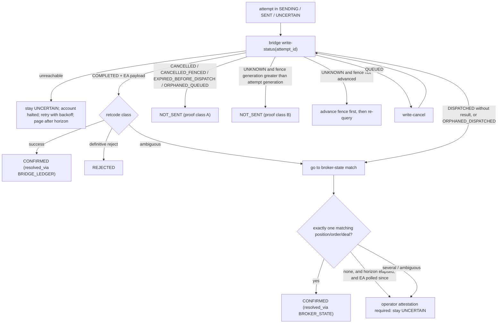

# 06 - Broker idempotency model and UNCERTAIN reconciliation

Rule from A4, kept: **a timeout is not `NOT_SENT`.** `UNCERTAIN` is a first-class, blocking state, resolved only by evidence, never by resending.

## 1. How the identifiers relate (and where each is minted)

| Identifier | Minted by | Stable across | Scope | Dedupes | Exists today? |
|---|---|---|---|---|---|
| `execution_intent_id` | platform (`ExecutionIntent.from_records`) | retries, restarts | one logical broker operation | intent creation (PK) | yes |
| logical idempotency key | platform: `stable_id("REALORDER", {intent, account_context_id})` | retries | one logical operation | `execution.intents.idempotency_key UNIQUE` (V1.2.1) | yes (`:864`); **not used by the bridge** (`B1`) |
| `attempt_id` = **bridge idempotency key** | platform: `stable_id("ATTEMPT", {intent, attempt_no})` | transport resends of the *same* attempt | one attempt | bridge write ledger (`04` 2.3) | **new** |
| canonical request fingerprint | platform: `sha256(canonical_request_text)` | one attempt (price comes from a fresh quote) | the exact request bytes | detects `IDEMPOTENCY_CONFLICT` (same key, different request) | yes (computed, validated present, ignored by the bridge) |
| bridge `request_id` | bridge: `secrets.token_hex(16)` | one enqueue | one queue entry | none | yes |
| broker `order` / `deal` / position ticket | broker via EA result | forever | the executed operation | broker uniqueness | in the EA response only |
| broker-visible tag | platform: `comment = "CTXV1:" + intent_id[:24]`, `magic = 0` | one request | the request | none | sent, but **not readable back** through the EA's read tools (`B8`) |

Design consequences:

* One intent = one logical operation, but the bridge key is **per attempt**: a proven-not-sent attempt can be followed by a new attempt whose different request bytes (fresh price) would otherwise collide with the earlier ledger entry.
* The platform, not the bridge, enforces "at most one possibly-sent attempt per intent" (partial unique index + invariant I5). The bridge only guarantees "one enqueue per `attempt_id`".
* Bridge dedupe never *unblocks* anything: a repeated `attempt_id` returns the existing ledger entry; it is a safety net for transport retries, not a retry mechanism.

## 2. Evidence sources, strongest first

| # | Evidence | Available today | Needs | Decides |
|---|---|---|---|---|
| E1 | In-band EA result (`ok`, `retcode`, `order`, `deal`) | yes | - | `CONFIRMED` / `REJECTED` |
| E2 | **Bridge write ledger** by `attempt_id` (states, timestamps, EA payload including late responses) | **no** (journal file exists but is unindexed by key, `B7`) | bridge change (`12`) | everything below |
| E3 | Late response captured in the ledger | journaled as `LATE_RESPONSE_RECEIVED` only | E2 | `CONFIRMED` / `REJECTED` |
| E4 | Broker state match (positions / orders / history) | yes, but **without** `comment` or `magic` (`B8`) | heuristic match rules (section 4) | `CONFIRMED` only when unambiguous |
| E5 | Enriched broker reads (`comment`, `magic`, `position id`, `order` in EA JSON) | no | EA recompile + operator re-attach | makes E4 exact |
| E6 | Operator attestation with an evidence pack | procedure | runbook | any terminal, audited |

Without E2 the platform cannot prove `NOT_SENT` and can only confirm by heuristic E4; **the write ledger is therefore a P5 prerequisite, not a nicety.**

## 3. Resolution procedure

### 3.1 Proof classes for `NOT_SENT` (a timeout is never one)

| Class | Proof | Why it is sufficient |
|---|---|---|
| **A** | ledger state in {`CANCELLED`, `CANCELLED_FENCED`, `EXPIRED_BEFORE_DISPATCH`, `ORPHANED_QUEUED`}: the request never became `DISPATCHED` (`dispatch()` is the only path to the EA) | nothing was ever written to the EA socket |
| **B** | ledger `UNKNOWN` **and** the bridge fence generation for the resource is greater than the attempt's generation **and** the ledger is durable across the bridge restart (`bridge_epoch` unchanged or the journal proves no entry) | a late arrival with the old generation is rejected at enqueue, so it can never appear |
| **C** | operator attestation with evidence pack (ledger dump, broker history window, EA log excerpt) | last resort; audited |

Not proofs: client timeout; bridge timeout text; absence of a position; process crash.

## 4. Broker-state matching against today's EA read tools

`mt5_positions` returns `ticket, symbol, type, volume, price_open, sl, tp, profit, time`; `mt5_orders` returns `ticket, symbol, type, volume, price, sl, tp, time`; `mt5_history` returns deals `ticket, symbol, type, entry, volume, price, profit, time` limited to the last 500 (`B8`, EA lines 249-262). **No comment, magic, order id or position id.** A match is therefore heuristic:

1. Candidate = position (or deal with `entry=in`) with the same `symbol`, `type`, `volume`, `sl`, `tp`, and `time` in `[send_started_at - skew, now]`, and `price_open` within the request's `deviation` of the request price.
2. **Exactly one** candidate **and** no other candidate before `send_started_at` that could equally match => `CONFIRMED (BROKER_STATE)`.
3. Otherwise ambiguous => stays `UNCERTAIN`.

Two practical mitigations that need no EA change: (a) the existing `position_conflict_policy = REJECT_SAME_SYMBOL_DIRECTION` (when configured) makes an unambiguous match likely; (b) the account is **halted** while any attempt is `UNCERTAIN`, so the candidate set does not grow. An EA change (E5) making reads return `comment`/`magic`/ids would make matching exact and is the recommended hardening once the ledger exists; it is not a prerequisite.

## 5. Retcode classification (proposal; verify against the MetaQuotes documentation before adoption)

Today the platform treats every retcode outside {10008, 10009, 10010} as a definitive rejection (`demo_broker.py:132`). Some MT5 return codes describe a *timeout or connection state*, where the order may still exist.

| Class | Codes (as understood by the author of this analysis; **unverified here**, no external documentation was consulted) | Attempt outcome |
|---|---|---|
| success | 10008, 10009, 10010 | `CONFIRMED` |
| definitive not-executed (examples) | 10006 (rejected), 10013-10019, 10030, 10035 and similar "invalid request / no money / market closed" codes | `REJECTED` |
| **ambiguous by nature** | 10011 (error), 10012 (request timeout), 10031 (no connection), and any code not in the verified table | `UNCERTAIN` |

Policy: **default-deny classification** - a code is `REJECTED` only if it appears in a verified list; anything else is `UNCERTAIN`. Verification of the list is an explicit prerequisite item (checklist `16`).

## 6. Management operations (close / trailing stop)

The same attempt machine applies, with **goal-state reasoning**: for `CLOSE_POSITION`, an `UNCERTAIN` attempt resolves to `CONFIRMED (BROKER_STATE)` if the position is absent from a fresh `mt5_positions` (whoever closed it), and is never resent while ambiguity remains; for `TRAIL_STOP` the goal is "stop at or tighter than requested" read from `mt5_positions.sl`. Today's behaviour (`MANAGEMENT_TRANSPORT_FAILED` => retried every loop) is replaced by `UNCERTAIN` => reconcile => retry only after proof. REAL close/trailing additionally require bridge admission to be enabled (`01` 3, `12`).

## 7. What must never happen (each is a test)

* A second `CLAIMED`/`SENDING` attempt for an intent while an earlier one is `SENDING`, `SENT` or `UNCERTAIN`.
* `NOT_SENT` recorded from a timeout, a missing position, or a crashed process alone.
* A resend of the same `attempt_id` treated as a new order.
* `REJECTED` recorded for an ambiguous retcode.
* Account activity resuming while an `UNCERTAIN` attempt exists (unless the owner explicitly sets the halt policy otherwise, `OD-A5-4`).

## 8. Cadence and operations

Reconciler runs continuously for `SENDING`/`SENT`/`UNCERTAIN` (every 2 s for the first minute, then 15 s); alerts per `15` of the A4 observability set (uncertain older than 5 min pages). The **evidence pack** for operator attestation contains: attempt row, ledger entry, advance history, broker positions/orders/history window, EA/bridge log excerpt hashes. Operator attestation is recorded in `audit_event` with actor and reason.
