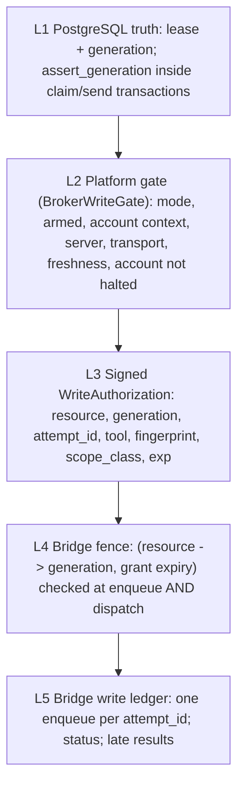

# 07 - Write authorization model

## 1. A1's `BrokerWriteGate` / `WriteAuthorization`, revisited

A1 (`docs/extraction/03_MT5_BRIDGE_CLIENT.md`, commit `eda827c`) proposed a platform-side `BrokerWriteGate.authorize(mode, armed_context, verified_snapshot, transport_verified, smoke_test_id) -> WriteAuthorization`, an *injected* object that the `Mt5ExecutionClient` "only carries to the wire" as `X-Execution-Mode` / `X-Smoke-Test-ID`. That design moved the four checks out of `DemoExecutionAdapter.__init__` and was right about **where the checks live** (platform side, one place, table-driven test). It is not sufficient as a fence:

| A1 property | Consequence for OD-06 |
|---|---|
| `WriteAuthorization` is an in-process object, unsigned, no expiry, no generation | a paused process still holds a valid one; nothing the bridge can verify |
| carried as self-declared headers | any local caller can present the same headers (`B3`) |
| checks happen at `authorize()` time | the check-then-act window of `03` |
| A1 finding **L2**: the bridge itself encodes platform execution modes | keeping mode headers as the authorization keeps the bridge coupled to platform vocabulary |

Decision: **keep `BrokerWriteGate` as the platform-side place where all pre-conditions are evaluated, but make the `WriteAuthorization` it returns a signed, expiring, generation-bound, request-bound artifact that the bridge verifies.** The client carries it verbatim. A1's acceptance test (T-C4 arming matrix) remains valid and gains fence/expiry cases. A1's finding **L6** (the canonical send omitted from the `caller_timeout` set) is the frozen order-send timeout anomaly and is deliberately not touched.

## 2. Options for what authorises a write

| Option | Freshness at the last cancellable instant | Bridge needs | Fail-closed | Verdict |
|---|---|---|---|---|
| DB lookup by the bridge | best (live) | DB client + credentials | yes, but ties writes to a bridge-DB link | fallback only (`02` A) |
| Signed capability only | TTL-bounded, not live | verification key | expires | necessary, not sufficient |
| Local lease token held in the platform process | none the bridge can see | nothing | n/a | insufficient |
| Bridge-known generation (pushed) | live for the bridge's own state | one integer per resource + auth on the push | expires | **the enforcement** |
| Execution-gateway serialisation | none against a stale gateway | nothing | n/a | already true structurally (single consumer); not a fence |
| **Combination (F)** | live at `dispatch()` for the fence; bounded <= 5 s only in the G3 interval | key + fence state + ledger | yes | **RECOMMENDED** |

## 3. Layers in the recommended model

| Layer | Owner | Failure of the layer => |
|---|---|---|
| L1 | platform | no claim, no send |
| L2 | platform | no authorization minted |
| L3 | platform signs, bridge verifies | rejected at enqueue |
| L4 | bridge | cancelled at dispatch |
| L5 | bridge | duplicate `attempt_id` returns the ledger entry |

## 4. Scope classes and operation scope

| `scope_class` | Tools | Requirement |
|---|---|---|
| `EXPOSURE_INCREASING` | `mt5_canonical_order_send` (and, if ever enabled, pending orders) | fence generation must equal the bridge's current generation for the `execution:real:<account>` resource; authorization <= 5 s; account not halted |
| `REDUCE_ONLY` | `mt5_close_position`, `mt5_cancel_pending_order`, `mt5_trailing_stop` (stop tightening) | same fence for the *automated* executor and Trade-Manager-authorised management; **plus** a separate break-glass grant class (section 5) |

The bridge sees only `tool` and `scope_class`; it does not know why. Admission of tools per listener stays configuration (`PROFILES`, A1 finding **L7**), not policy.

## 5. Break-glass and emergency close

Risk-reducing operations must remain possible when the normal chain is unavailable (database down, no holder). Design:

* A separate **break-glass** signing key held by operators, not present on the automated execution host's normal path. It can only authorise `scope_class = REDUCE_ONLY` and `tool` in {close, cancel pending}; it is **not** subject to the resource generation (there may be no holder), but it is bound to a specific `ticket`, has `exp <= 60 s`, and is single-use by `attempt_id`.
* Every break-glass use is written to an append-only local operator journal *and* replayed into `audit_event` when PostgreSQL returns. The journal is an operator audit trail, not service-to-service IPC (A4 `docs/migration/17` permits operator/debug artifacts).
* Idempotent by nature (close by ticket); an ambiguous result reconciles by goal state (`06` 6).
* **Never** for `EXPOSURE_INCREASING`. There is no break-glass for opening positions.
* Today REAL close/trailing are refused by the bridge (`B4`), so at this baseline an operator must close manually in the terminal. Enabling REAL reduce-only writes on the execution listener is therefore a **bridge capability to be added deliberately** with F, not an existing one to be fenced.

## 6. Modes: REAL, smoke, demo

| Mode | Fence | Notes |
|---|---|---|
| `REAL_EXECUTION` | **required** | production |
| `REAL_SMOKE_TEST` | **required, same resource `execution:real:<account>`** | today the smoke CLI can run concurrently with the consumer (both hit :22348); under F it must take the lease, so it cannot race the automated executor. Smoke is an operator procedure: it acquires the lease with the executor stopped or handed over |
| `DEMO_EXECUTION` | optional (`MT5_REQUIRE_WRITE_FENCE` per listener) | uses the legacy `mt5_market_order` path (idempotency key ignored, `B1`; admission per the `B4` table); demo is code-supported, deployment unknown (`10`) |
| Research listener (:22347) | not applicable - exposes no write tools | unchanged |

Mode names remain platform vocabulary. The bridge stops deriving *policy* from them (A1 **L2**): with F it derives admission from the verified `scope_class` and tool, keeping `X-Execution-Mode` only as a compatibility input during a defined window.

## 7. Fail-closed table

| Condition | Result |
|---|---|
| no `X-Write-Authorization` while the fence is required | `WRITE_AUTH_REQUIRED` |
| bad signature / unknown `key_id` / expired / malformed | `WRITE_AUTH_INVALID` (nothing queued) |
| authorization not bound to this request (fingerprint/attempt/tool mismatch) | `WRITE_AUTH_MISMATCH` |
| resource unknown to the bridge (UNSET after restart) | `FENCE_UNSET` |
| generation lower than the bridge's | `FENCE_STALE` |
| generation higher than the bridge's (bridge missed the advance) | `FENCE_UNKNOWN_GENERATION` - the holder must advance first |
| grant expired | `FENCE_EXPIRED` |
| `attempt_id` seen with a different fingerprint | `IDEMPOTENCY_CONFLICT` |
| `attempt_id` seen with the same fingerprint | ledger entry returned, no new enqueue |
| queue full | `BACKPRESSURE` (existing) |

Every bridge refusal above happens **before queueing** or **inside `dispatch()`** and is therefore a proof-of-not-sent class A/`FAILED`/`FENCED` outcome for the platform.

## 8. Platform behaviour when fencing cannot be established

* PostgreSQL unavailable => no claim, no `SENDING`, no authorization: the executor stops acting (reads may continue).
* Bridge unreachable for the advance => the new owner does not claim.
* Bridge `/health.write_fence.required == false` while `REAL_EXECUTION` is armed => **refuse to arm / halt** (a mis-deployed or downgraded bridge must not silently remove the protection).
* Fence authority (signing component) unavailable => no authorizations; writes stop.
