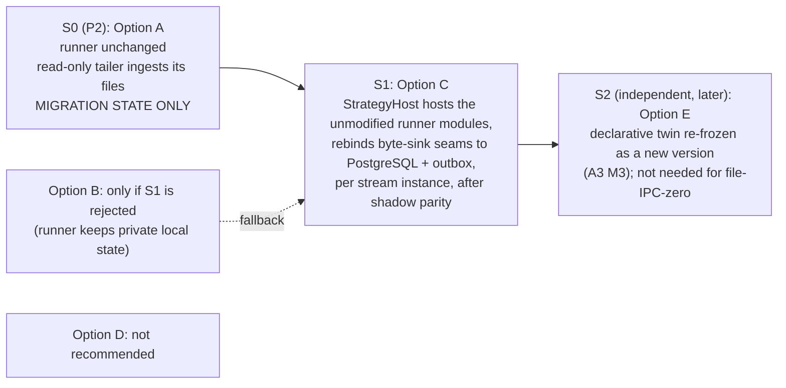
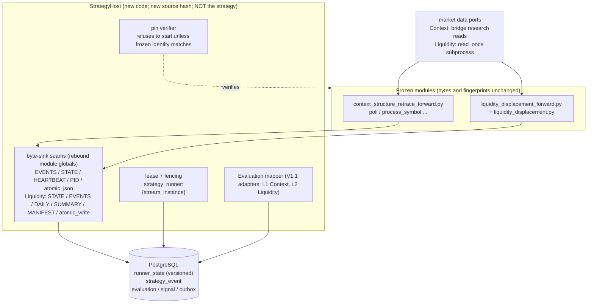

# 09 - OD-05 recommendation: frozen runners and `PRODUCTION_FILE_IPC=0`

Status: **PROPOSED options-and-recommendation document, not an ADR and not approved.** A strategy-runtime migration is Caleb's decision; nothing here silently locks it. Companion evidence: `08`, `tools/verify_evidence.py` (`P16`-`P26`).

## 1. Recommended progression



| Stage | What runs | File IPC | Owner decision needed |
|---|---|---|---|
| **S0** | frozen runner writes its files as today; the platform's tailer/adapter reads them (already the case for the orchestrator adapter, `ORC`/`CTX-01`/`LIQ-01` in A4) | runner -> adapter file hop **remains**: acceptable **only as a migration state**, and it must be listed as a *time-boxed exception* on every audit report until S1 completes for that instance | approve S0 as a documented migration state |
| **S1** | `StrategyHost` (a new process/module) imports the frozen runner module(s) **unchanged**, rebinds the seams, runs the same `poll`/`detect` calls; state + events + Evaluation + signal + outbox commit in one PostgreSQL transaction | **zero** for that instance (no runner file read by anyone; none required to restart) | approve Option C; approve the parity gate; decide the golden corpus owner |
| **S2** | new declarative version runs in shadow against the legacy identity | n/a | later; A3 M3 |

The final `PRODUCTION_FILE_IPC=0` definition therefore has **no permanent frozen-runner exception**: the exception exists during S0 and is removed instance by instance at S1.

Option B is retained only as a fallback: it removes the *cross-process* file read but leaves a runner state file that is required for restart, which conflicts with the A4 requirement "no checkpoint file required for correctness" unless that requirement is relaxed for single-process private state. Option D is rejected (a FIFO/tmpfs is a file transport; the alternative requires editing frozen runners). Variant C' (edit runner sources) is rejected (`08` 4).

## 2. What `StrategyHost` is (design only)



Key properties:

* **The runner modules are imported, never copied or edited.** The decision functions execute exactly as today, on the same inputs.
* **The seam is the byte sink, not the behaviour.** Because `append_event` embeds recovery tagging, identity dedupe and counters (`P25`), the host replaces only what writes bytes: the module constants `EVENTS`/`STATE`/`HEARTBEAT`/`PID`/`MANIFEST`, the module functions `atomic_json` (Context) / `atomic_write` (Liquidity), and the lock/stop helpers. This is the technique the four Liquidity instances already use (`P24`).
* **State and events commit atomically** (one transaction: `runner_state` version CAS + event rows + Evaluation + signal + outbox). Today the Context runner writes the event and then the state; replay identity absorbs the gap. The atomic form is strictly safer and cannot alter decisions, but it is recorded as a host behaviour, not a runner change.
* **PID file and `/tmp` stop file are replaced by a lease and a control row** (`strategy_runner:{stream_instance}` with a fencing generation), closing the check-then-write TOCTOU noted by A4.
* **Data ports unchanged.** Context keeps reading through the bridge research listener; Liquidity keeps its `read_once` subprocess (a pipe, not a file). Moving them behind a `MarketDataProvider` is a separate A2/A3 item.

## 3. Identity: preserving strategy identity without pretending the wrapper is the strategy

### 3.1 Records

```
FrozenStrategyIdentity  (verified by the host at start; recorded, never edited)
  strategy_id, strategy_version, parameter_set_id
  source_pins:  { "context_structure_retrace_forward.py": sha256(bytes), "liquidity_displacement.py": sha256(bytes), ... }
  decision_fingerprint:  Context: decision_code_hash() == FROZEN_DECISION_CODE_HASH  |  Liquidity: source_hash()
  config_hash, phase2_hash (Context)
  status: FROZEN_LEGACY

RuntimeHost  (identity of the wrapper; changes freely)
  host_id, host_version, host_source_hash, seams: [ "EVENTS", "STATE", ... ], runtime_instance_id
```

The host **pins whole-file hashes of the runner modules** in addition to the existing fingerprints: this *strengthens* identity (it closes the Liquidity gap of `08` conclusion 2, where `detect()` is unguarded) without adding any requirement to the runner code.

### 3.2 What enters the `Evaluation` hash

`Evaluation.evaluation_hash = canonical_hash(to_dict())` and `to_dict()` includes `provenance` and `runtime_version` (`P20`). Therefore:

* Put `FrozenStrategyIdentity` (fingerprints, parameter set, source pins digest) in `provenance.frozen_identity` - it identifies the decision code and is *supposed* to be hashed.
* Put `RuntimeHost` details in the **event envelope** (`producer`, `runtime_instance_id`) - **not** in `provenance`, or the evaluation hash would change with every host upgrade.
* The V1.1 adapter's own `runtime_version` (`liquidity-legacy-adapter.v1`, `context-legacy-adapter.v1`) is already hashed; when the mapper is upgraded the hash changes by design. **The "one canonical result" rule (A3) therefore cannot key on the hash.** Uniqueness key: `(strategy_id, strategy_version, parameter_set_id, instrument, decision_time, candidate_id)`; the hash is an integrity attribute of one representation.
* Parity between S0 (tailer-derived) and S1 (host-derived) results is asserted on **decision content** (decision, direction, entry/stop/target, candidate id, lifecycle facts), not on the whole hash.

### 3.3 ParameterSets

The four Liquidity instances stay four existing identities during migration (A3): the host takes the same instance parameters the entry-forward runner applies (fraction, max retrace) - it reuses `liquidity_displacement_entry_forward` unchanged - and records the `parameter_set_id` per instance. No instance is merged or renamed.

## 4. Parity gates (must pass before an instance leaves S0)

| Gate | Test | Evidence |
|---|---|---|
| **G-Fingerprint** | host start refuses on any pin/fingerprint mismatch; the five-function hash equals `FROZEN_DECISION_CODE_HASH` under the host | unit test |
| **G-Golden replay** | replay recorded bar sequences (from the runner's own state/event history, copied into a scratch area) through (a) the legacy file persistence and (b) the host's DB sinks; compare canonical **state after every poll**, **event sequence**, **signals**; must be identical | golden corpus per instance; includes gap-recovery, duplicate-event, mid-poll-crash cases |
| **G-Restart** | kill the host at each write step; restart; state/events converge to the uninterrupted run (no duplicate terminal event, no lost setup) | crash-injection tests |
| **G-Shadow** | host runs in shadow on live data alongside the legacy runner for >= N trading days; signals compare by identity and content hash; zero unexplained differences | reconciliation report (A4 `docs/migration/11`) |
| **G-Round-trip** | `Evaluation` produced by the host round-trips canonical bytes -> hash unchanged (A4 checklist item 15) | test |
| **G-No-file** | with the runtime directory read-only/absent the host runs and restarts | test |

## 5. Cutover per stream instance (no flag day)

1. S0 running; host deployed in **shadow** (writes to shadow tables, publishes nothing, holds no lease that matters).
2. Gates pass; one instance at a time (smallest blast radius first).
3. **Authority switch for that instance** follows the A4 single-authority-instant discipline: stop the legacy runner (its lock/stop mechanism), final reconciliation, host acquires `strategy_runner:{instance}` (generation g), host becomes the signal source of record; the orchestrator consumes the DB signal/event, not the file.
4. **Rollback** = export the DB `runner_state` back to the runner's compact-state file shape (`project_state`) with a monotonic version, verify, restart the legacy runner. An older pre-cutover file is never restored; the host guard refuses a runner state whose version is lower than the DB's (the A4 "no resurrection" rule applied to runner state).
5. After all instances: remove the runner->adapter tailer, delete the dual reads in the Control API (`API-01`), retire the `/tmp` stop files.

## 6. Dependencies and consequences elsewhere

| Item | Effect |
|---|---|
| Control API / observability | currently reads runner state/events/daily files directly (A4 `API-01`); S1 requires PostgreSQL-backed readers first |
| Phase 7 observer | reads the *legacy full-state* file that the Context runner declares immutable (`P19`); see `10` OD-03 - it must be re-pointed or retired before S1 for Context |
| P2 (signals) | unchanged: S0 tailer is the P2 mechanism; S1 is a **separate, later step**, so P2 is not delayed by OD-05 |
| Frozen-hash governance | no re-freeze is required; the host adds pins, it does not alter any |
| Testing | requires the golden corpus - an owner and a location must be decided (open decision) |

## 7. Risks

* **Sink contract drift** (atomicity, in-place mutation, `default=str` JSON): mitigated by the golden replay and by pinning the runner bytes.
* **Import-time side effects** of the runner modules under a new host: to be verified in the parity harness (the runners set module constants from `__file__`; the host must rebind before first use and must not call `main`).
* **A single host for many instances** would couple blast radii: recommendation is one host process per stream instance initially.
* **Clock/time**: the host must not substitute DB time inside runner code paths (event times come from the runner's `now_iso()`).
* **Fidelity ceiling**: Context stays L1 and Liquidity L2 until a declarative twin (S2); that is a property of the frozen code, not of the host.

## 8. Open decisions (OD-05 sub-decisions)

| Id | Decision | Recommendation |
|---|---|---|
| OD-A5-1 | Approve Option C as the end-state for frozen runners; S0 as the time-boxed migration state | approve |
| OD-A5-2 | Owner and location of the golden replay corpus | derive from the runners' own histories; store as versioned test fixtures |
| OD-A5-3 | One host per instance vs shared host | one per instance initially |
| OD-A5-9 | Whether the host may add whole-file pins for runners (strengthens Liquidity identity) | yes |
