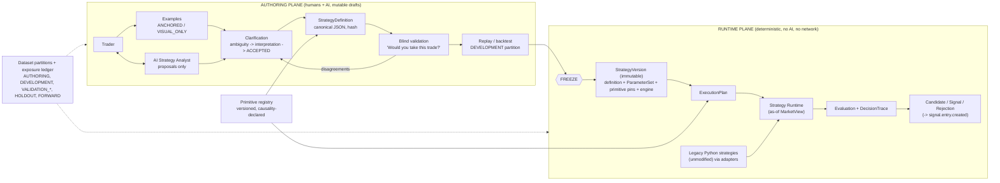

# Strategy Studio: V1 architecture (design only)

Agent CLAUDE-A3-STRATEGY-STUDIO.  Base: architecture commit `9b6c89e` (ADR-0001), in an
isolated worktree (`claude-a3/strategy-studio`).  Codex's worktree and branch, and all
production code, strategies, hashes, runtime, brokers, MT5, Kubernetes, PostgreSQL and NATS
were untouched; this directory contains documentation and read-only analysis tooling.

## What Strategy Studio is

A way to add strategies **as data**: the trader describes a strategy, teaches it with chart
examples, resolves ambiguities, validates blind against the engine, and freezes a
reproducible version — while an AI analyst helps *author* but never *decides*.



## Documents

| # | Document | Deliverable |
|---|---|---|
| 00 | this file | 1 overview |
| 01 | `01_STRATEGY_DEFINITION.md` | 2 definition model; Strategy / Definition / ParameterSet / Version; strategy types + promotion; expression model; canonical form |
| 02 | `02_PRIMITIVE_REGISTRY.md` | 3 primitive registry; divergence evidence; how a new primitive is introduced |
| 03 | `03_EXAMPLES_AND_CLARIFICATION.md` | 4 chart/example intake; 5 clarification model |
| 04 | `04_BLIND_DECISION_VALIDATION.md` | 6 blind validation protocol |
| 05 | `05_DECISION_TRACE.md` | 7 DecisionTrace, reason codes, legacy mapping |
| 06 | `06_COMPILER_AND_RUNTIME.md` | 8 compiler/validator/runtime |
| 07 | `07_VERSIONS_PROMOTION_EVIDENCE.md` | 9 lifecycle/promotion; 10 evidence + dataset partitions |
| 08 | `08_CONSOLE_V1_WORKFLOW.md` | 11 Console V1 screens/workflows |
| 09 | `09_DATA_AND_EVENTS.md` | 12 PostgreSQL ownership; 13 V1 events |
| 10 | `10_CURRENT_STRATEGY_MIGRATION.md` | 14 current-strategy classification + migration path |
| 11 | `11_WORKED_EXAMPLES.md` | 15 worked examples |
| — | `../architecture/ADR-0002-strategy-authoring-runtime-separation.md` | 16 ADR |
| — | `examples/`, `tools/`, `data/` | examples (linted), read-only analysis tools, inventory data |

## Headline findings

1. **Both live strategies are bounded-window sequences (or lifecycles), not indicator
   conditions.**  `SEQUENCE` stages with explicit event times express the Liquidity
   Displacement strategy and the research sniper exactly, and the multi-timeframe
   HYBRID example, with no strategy-specific code.  The model is small: stages, roles,
   primitives, a tiny expression vocabulary.
2. **"Future data" has three legitimate-or-not meanings in today's code** — outcome labels
   (forbidden in decisions), pivot **confirmation lag**, and **sequence completion**.
   Making `known_at` and `event_time` explicit is what makes lookahead *provable* rather
   than conventional (only 27 of 315 functions take `as_of` today).
3. **Primitives are not interchangeable by name.**  ATR exists in three semantics, pivots in
   at least three, displacement in two, rejection-wick twice (once inline), and a legacy
   expression has a dead operand (`max(i-5, i-12)`).  The registry versions **behaviour**
   and pins implementation hashes.
4. **The four Liquidity "strategies" are one definition with four ParameterSets**
   (only `entry_fraction` and `max_retrace_bars` differ) — which maps directly onto ADR-0001
   `StreamBinding`s.
5. **Legacy identity is source-hash based and enforced at start-up**; therefore legacy
   files can never be edited.  Adapters live outside them: Liquidity is cleanly wrappable
   (**L2** traces from existing telemetry), Context is not (**L1** via a read-only event
   translator).  A declarative *twin* proves parity in shadow.
6. **There is a working prototype of the trace and the funnel in research code** (per-setup
   `trace` + `terminal_reason`, `audit_attrition`, `external_cases.jsonl` with
   `DIAGNOSTIC_ONLY`, a 50/25/25 chronological split manifest, ablation controls) — Studio
   generalises rather than invents.
7. **Two lifecycles, not one.**  Authoring states belong to a mutable draft lineage; version
   states to an immutable object; a version exists only from freeze.  This is what prevents
   "edit a rule after evidence exists".
8. **A concrete authoring hazard**: the natural keyword `on:` and unquoted `YES`/`NO`
   silently parse as booleans in YAML 1.1.  The record is canonical JSON with a strict
   YAML 1.2 front-end.
9. **Nothing here needs MT5, a broker, execution, commerce or the Trade Manager.**  Studio
   consumes the `MarketDataProvider` abstraction only.

## Recommended V1 build order (when implementation is approved)

| # | Work | Why here |
|---|---|---|
| 1 | `Evaluation`/`DecisionTrace` schema, reason-code registry, `StrategyRuntime` protocol | everything else emits/consumes it |
| 2 | **M1 legacy adapters** (Liquidity L2, Context L1) → `strategy.evaluation` → Console trace viewer | immediate value on **existing** strategies, zero legacy change |
| 3 | Primitive registry + parity/truncation test harness; seed primitives (`02_…` §6) | prerequisite for declarative runtime |
| 4 | Definition schema, 7-pass compiler, engine, replay/backtest over `MarketView` | the runtime plane |
| 5 | Dataset partitions, as-of data service, exposure ledger, DB role enforcement | prerequisite for honest validation |
| 6 | Example intake + anchoring | needs (5) |
| 7 | Blind validation service + disagreement analysis | needs (4), (5), (6) |
| 8 | Clarification model + AI Analyst (optional, provider-abstracted) | can slip without blocking (1)–(7) |
| 9 | Console Studio screens | incremental with each of the above |
| 10 | **M3 declarative Liquidity twin**, then sniper pilots, then first frozen declarative version | proves the model end to end |

## Open decisions

| ID | Decision | Recommendation | Gates |
|---|---|---|---|
| **S1** | canonical serialization and authoring surface | canonical JSON record; YAML 1.2 front-end; node-graph editor later over the same JSON | V1 start |
| **S2** | LLM provider and data-handling policy (sending chart images and strategy text to a third-party model) | provider-abstracted `StrategyAnalyst` port; explicit consent/redaction policy; analyst optional | AI Analyst only |
| **S3** | holdout policy: size, position, waiver rules | latest chronological ~25 % per instrument, sealed **before** authoring, spend-once, waivers recorded | validation |
| **S4** | `PromotionPolicy` thresholds (minimum counts, recall/precision bounds, consistency, forward sample) | derive with the trader; store as versioned policy data; never hard-code | validation |
| **S5** | reviewer model | V1 single reviewer; intra-rater consistency only; add a second reviewer later | reporting |
| **S6** | canonical historical data source for validation/backtests (venue, instrument identity) vs the feed live runners use | one declared canonical source; record `inputs_digest`; quantify feed drift | V1 start (ties to ADR-0001 O12) |
| **S7** | reference-trade cost model (spread source, commission, slippage) for backtests | versioned cost model; recorded on every observation (ADR-0001 O13) | backtest evidence |
| **S8** | automated parameter search in Studio | bounded, `DEVELOPMENT` only, every configuration logged, multiple-testing disclosed | tuning |
| **S9** | who approves native primitives and AI-drafted code | human reviewer + full test contract; AI never approves | registry |
| **S10** | when to design `STATE_MACHINE` (re-entry lifecycles) | after the first declarative sequence version is frozen; needed for Context-like strategies | later migration |
| **S11** | trace retention/storage budget | tiered (`FULL`/`SUMMARY`/`ON_DEMAND`); revisit with real volumes | runtime |
| **S12** | naming overlap: version `SHADOW` vs stream `SHADOW` | keep names, document the two state machines (done in `07_…` §1.2) | — |
| **S13** | image handling: storage, retention, licensing of third-party screenshots | object storage + hash; retention policy; note screenshot provenance | intake |
| **S14** | HYBRID review latency and default timeouts | policy parameter per gate; default fail-closed; decide alongside V2 personal execution timing needs | hybrid runtime |

## Tooling (read-only)

```sh
python3 docs/strategy_studio/tools/inventory_strategy_code.py   # data/strategy_code_inventory.csv, inventory_summary.json
python3 docs/strategy_studio/tools/check_examples.py            # lints examples/ (exit 1 on findings); NOT the compiler
```

Both parse files only (`ast` / YAML); neither imports repository modules or touches
runtime, brokers, MT5, PostgreSQL or NATS.
