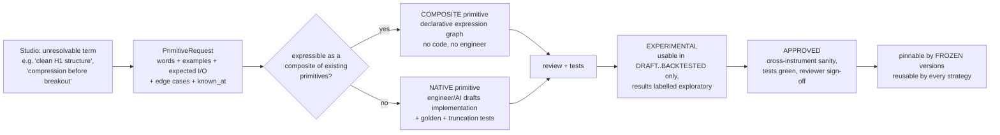

# Primitive registry

A **primitive** is a reusable, versioned, deterministic building block (indicator,
structure detector, price-action pattern, level builder, position measure) that
definitions reference by `id@version`.  The registry is what lets a new strategy be
authored without a new Python runner, and what stops a frozen strategy from changing
underneath itself.

Seed catalogue (illustrative, 25 entries, linted): `examples/primitive_catalog_v1_seed.yaml`.

## 1. What is stored per primitive version

| Field | Purpose |
|---|---|
| `id`, `version` | `family.name` + integer version; a **version is immutable** |
| `kind` | `FEATURE` (values as-of t) · `EVENT` (detector emitting ≤ 1 event with `event_time`) · `LEVEL` (price levels/zones with `known_at`) · `PREDICATE` (bool) · `TRANSFORM` (pure arithmetic) |
| `inputs` | typed ports: `series<bar,role>`, `event`, `level`, `scalar<price|ratio|atr_multiple>` |
| `outputs` | named typed fields (e.g. `swings[] {price, kind, bar_time, known_at}`) |
| `params` | name, type, unit, bounds, **no implicit defaults inside a definition** (linter rule) |
| `direction_aware` | whether the runtime passes the evaluated direction |
| `timeframe_requirements` | min warm-up bars, allowed roles/timeframes |
| **`causality`** | `known_at` rule (below), `max_lookahead = 0`, whether output may change when later bars arrive (must be **no**) |
| `determinism` | pure function, no randomness/clock/IO, numeric tolerance policy |
| `implementation` | `{kind: native, module, function, impl_hash}` **or** `{kind: composite, expression_graph}` |
| `explanation_template` | text with placeholders for `observed` and `threshold` values (feeds the DecisionTrace) |
| `reason_codes` | codes this primitive may emit on FAIL (`SETUP.LIQUIDITY_SWEEP.NO_RECLAIM`) |
| `tests` | golden vectors + the **truncation-invariance property test** (§4) + report hash |
| `status` | `EXPERIMENTAL → APPROVED → DEPRECATED → WITHDRAWN` |
| `provenance` | who introduced it, from which session/example/strategy, legacy references |

### The `known_at` rule is mandatory

The single most important field.  It states **when the result becomes knowable**, so the
compiler can prove no stage uses information from after the decision.  Examples:

| Primitive | `known_at` |
|---|---|
| `volatility.atr`, `ma.ema` | close of the last bar consumed |
| `structure.swing_points` | **close of bar `i + right`** — a pivot at bar *i* is not known at *i* (`confirmed_at` in `sr.py`) |
| `price_action.engulfing`, `liquidity.sweep` | close of the completing bar |
| `time.session_window` | bar open time |

## 2. Versioning semantics

* **Any change that can alter an output is a new version**, including a "bug fix".  There
  is no minor/patch: a corrected primitive is `@2`, and `@1` stays available so frozen
  strategies keep reproducing.  Additive, output-preserving changes (docs, a new *unused*
  output field) may republish the same version only if `impl_hash` is unchanged.
* A StrategyVersion **pins** every `id@version` **and its `impl_hash`**; the runtime
  verifies the pins at start and **refuses to run on mismatch** — the same guard the
  legacy runners implement with source hashes today (`decision_code_hash`, the
  liquidity `source_sha256_at_start` check), generalised.
* **Upgrades are explicit**: moving a strategy from `@1` to `@2` produces a new
  definition/version and a new evidence clock; nothing is upgraded in place.
* `WITHDRAWN` (defect found) does not delete; it flags every pinned version and its
  evidence, which connects to the ADR-0001 evidence classes (`SUPERSEDED_*`).

## 3. Evidence that the registry must version by *semantics*, not by name

Verified in the repository (read-only inventory):

| "Primitive" | Divergent implementations found | Registry treatment |
|---|---|---|
| **ATR** | (a) true-range mean **including** the current bar — `liquidity_displacement.find_candidate` (`atr(m5[i-119:i+1])[-1]`); (b) true-range mean **excluding** it — `context patterns.detect_patterns` (`atr(completed[-15:-1])[-1]`); (c) mean of plain **high–low ranges** excluding the current bar — `research/multitimeframe_liquidity_sniper/state_machine._atr` | `volatility.atr@1` with `include_current` parameter for (a)/(b); `volatility.range_mean@1` for (c). Never silently unified. |
| **Swing / pivot** | non-strict comparison (ties count), confirmation via `bar_end(i+lookback) ≤ as_of` — `sr.confirmed_swings`; **strict** comparison with separate left/right windows — `structure_sniper.engine.confirmed_swings`; a third in `paper_engine.swings` | one primitive with `strict`, `left`, `right`; each legacy variant is a *parameterisation*, parity-tested |
| **Displacement** | body ≥ ATR·0.5 **and** ≥ median-body multiple **and** close-location — `liquidity_displacement`; body/ATR and close-location only — `state_machine._displacement` | `price_action.displacement@1` includes the median condition as a parameter (`min_body_median_multiple` may be 0 to disable) |
| **Rejection wick** | implemented in `patterns.detect_patterns` **and again inline** in `context…forward._m5_mechanisms` | one primitive; the duplicate is a migration finding |
| **EMA** | identical formula in `paper_engine` and `context indicators` (one casts to float) | one primitive |
| **Micro break** | `m5[max(i-5, i-12):i]` — evaluates to `m5[i-5:i]`; the `i-12` operand is dead | `structure.micro_break@1` with `lookback_bars=5`; recorded as a **parity trap** |

Lesson: naming a primitive "ATR" and reusing it would have changed decisions.  Registry
identity is **behavioural**, proven by golden vectors against each legacy implementation.

## 4. Testing contract (required for `APPROVED`)

1. **Golden vectors**: input bars → exact outputs, including edge cases (insufficient
   history, ties, gaps, zero range).
2. **Truncation invariance** (the no-lookahead proof): for random `t`, the output at `t`
   computed on `bars[:t]` equals the output computed on the full series restricted to
   `known_at ≤ t`.  This is the executable form of `max_lookahead = 0` and is what the
   existing detectors only assert informally (`future_bars_excluded` provenance flags in
   `context patterns`, `as_of` parameters in the sniper research).
3. **Determinism**: same input twice ⇒ byte-identical output.
4. **Parity** (when `legacy_refs` exist): equality with each cited legacy implementation
   on a recorded corpus, or a documented, reviewed difference.
5. **Explanation rendering**: every reason code renders from its template with real values.

## 5. Introducing a genuinely new primitive (once, then reusable)

* **Composite primitives first.**  Most new ideas (a displacement variant, "breakout after
  compression") are compositions of existing events/features with parameters.  They are
  stored as declarative expression graphs, versioned and tested like native ones, and need
  **no engineering work** — the main lever that makes strategy intake scale.
* **Native primitives** need code, but the request arrives *specified*: words, anchored
  examples with expected outputs, edge cases and the `known_at` rule, so the implementer
  writes to a contract.  An AI may draft the implementation; approval still requires the
  test contract of §4 and a human reviewer.
* **`EXPERIMENTAL` primitives cannot be pinned by a frozen version destined for
  `PAPER`+.**  They may be used to explore; any evidence produced is labelled
  exploratory (`07_…`).

## 6. Seed families (from the request) and status

| Requested concept | Seed entry | Note |
|---|---|---|
| EMA / SMA / RSI / ATR / volatility | `ma.ema`, `ma.sma`, `momentum.rsi`, `volatility.atr`, `volatility.range_mean`, `stat.median_body` | `volume` **absent**: no volume primitive exists in the code (only tick volume is fetched); add when needed |
| swing high/low, trend, BOS, MSS | `structure.swing_points`, `structure.trend`, `structure.protected_swing`, `structure.break_of_structure` (`kind: BOS\|CHOCH`) | `MSS` is an unstable term: the code has "micro structure shift" (close beyond last-N-bar extreme), CHOCH, and BOS — three different things; **do not** create `market_structure_shift` until defined |
| support / resistance | `structure.support_resistance_zones` | clustering with ATR tolerance |
| engulfing, rejection wick, displacement, reclaim, breakout | `price_action.*` | `breakout` not yet defined in code beyond BOS; deferred |
| liquidity sweep | `liquidity.reference_levels`, `liquidity.sweep` | two legacy definitions of the levels differ |
| retracement, distance, range, session, time window | `position.retracement` (a *label* today, `measure_retracement`), `position.zone_interaction`, `position.bar_fraction_level`, `time.session_window` | `distance`/`range` are expression-level, not primitives |
| fill semantics | `execution.touch_and_hold` | "touched and held" appears in both live strategies |

Names in the request were explicitly **not** assumed correct: several (`market_structure_shift`,
`breakout`, `volume`) are left unregistered because today's code does not define them
unambiguously.
