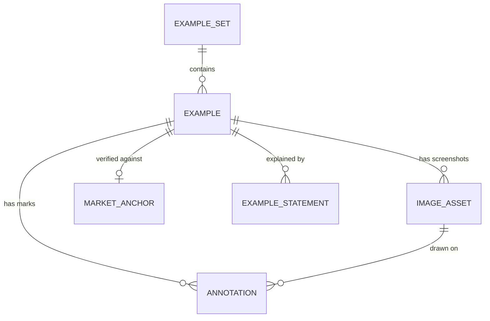
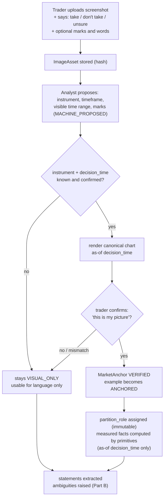

# Chart example intake and the clarification model

Two halves of "how the trader teaches the system".  Both obey one rule:
**nothing a human says or draws becomes a deterministic rule without an explicit,
recorded acceptance**, and **an image is never market data**.

## Part A — Chart examples

### A.1 Visual teaching evidence vs reproducible market evidence

| | **Visual teaching evidence** | **Reproducible market evidence** |
|---|---|---|
| Source | screenshot, drawing, description | canonical historical bars for `(instrument, timeframes, decision_time)` |
| Authority | conveys *intent and vocabulary* | is the only thing measured, replayed and validated |
| Usable for | language extraction, clarifying questions, hypothesis generation, showing the trader what was understood | threshold statistics, candidate-recall tests, blind validation cases, backtests |
| Counted in validation metrics | **no** | yes (only if partition allows) |

Every example carries `evidence_kind ∈ {VISUAL_ONLY, ANCHORED}`.  An image alone is
`VISUAL_ONLY` forever unless the anchoring workflow (A.3) verifies it.

### A.2 Data model



**`Example`** (immutable core once created; review status is separate):

| Field | Meaning |
|---|---|
| `example_id`, `set_id`, `strategy_lineage_id` | identity and where it belongs |
| `label` | `POSITIVE` ("I would take this") · `NEGATIVE` ("I would not") · `AMBIGUOUS` ("I need more context") |
| `partition_role` | `AUTHORING` (may shape rules) · `VALIDATION_REFINEMENT` · `VALIDATION_UNTOUCHED` · `DIAGNOSTIC_ONLY` — see `07_…` §4; **assigned at creation, immutable, and never `UNTOUCHED` for an example the author has already discussed** |
| `direction`, `instrument`, `timeframes` | as stated by the user (may be null → `VISUAL_ONLY`) |
| `decision_time` | the moment the trader would decide; **`visible_until`** if the screenshot shows candles beyond it |
| `hindsight_exposed` | true when the image shows candles after `decision_time` (outcome visible) — such an example must not be used as a *blind* case |
| `observed_geometry` | entry/stop/target/zones **as marked** (nullable prices) — the `external_cases.jsonl` idea generalised |
| `explanation` | the trader's words (kept verbatim as statements) |
| `provenance` | uploader, upload time, source app, feed name if known, tool that produced any machine annotation |

**`ImageAsset`**: content-addressed (`sha256`), immutable, blob in object storage; the
database holds hash, mime, dimensions, storage URI.

**`Annotation`** (versioned, human- or machine-authored):

| Field | Meaning |
|---|---|
| `type` | `ENTRY_MARK`, `STOP_MARK`, `TARGET_MARK`, `ZONE` (support/resistance), `REGION`, `ARROW`, `TRENDLINE`, `CANDLE_REF`, `TEXT` |
| `space` | `IMAGE` (pixel coordinates) or `MARKET` (price/time) |
| `calibration` | when converting image→market: two price ticks and two time ticks read from the axes, residual error, `calibration_confidence` |
| `origin` | `HUMAN`, or `MACHINE_PROPOSED` — a vision model may **propose** marks; they carry no weight until a human confirms (`confirmed_by`) |

**`MarketAnchor`** (the bridge from picture to data):

| Field | Meaning |
|---|---|
| `instrument`, `timeframe`, `decision_time`, `dataset_id` | the canonical data the example is tied to |
| `anchor_method` | `USER_ENTERED` · `OCR_PROPOSED` (header/axis text read from the image, then confirmed) · `SHAPE_MATCHED` (candle-ratio fingerprint search, then confirmed) |
| `verification` | `VERIFIED` (user confirmed a rendered canonical chart is the same picture) · `MISMATCH` · `UNVERIFIED` |
| `feed_mismatch_risk` | screenshot venue/feed differs from the canonical feed (spreads and wicks differ) |

### A.3 Intake workflow



Rules: the decision-time snapshot is generated by the same causal data service used for
blind validation (`04_…`), so nothing after `decision_time` can enter measured facts even
if the screenshot shows it.  Anchoring failure is a normal, recorded outcome, not an error.

---

## Part B — Clarification: discovering missing rules

### B.1 Objects

| Object | Meaning |
|---|---|
| **Statement** | one utterance from the trader (or a note on an example), verbatim, with `source_example_ids` — immutable |
| **Term** | a word/phrase extracted from statements that names a concept ("too deep", "clean", "support", "retracement complete") |
| **Ambiguity** | a *reason a term cannot yet be evaluated*: `type ∈ {UNDEFINED_TERM, UNDEFINED_THRESHOLD, MISSING_TIMEFRAME, MISSING_ANCHOR_EVENT, MISSING_ORDER, UNIT_UNSPECIFIED, CONFLICT, SUBJECTIVE_JUDGMENT, SCOPE_UNCLEAR}`; `status ∈ {OPEN, PROPOSED, RESOLVED, DEFERRED_TO_REVIEW_GATE, WONT_DEFINE}`; `question` (generated); `blocking_for` (which promotion it blocks) |
| **Interpretation** | a proposed **operationalisation**: a structured `definition_patch` (against the draft) plus `rationale`, `confidence`, `supporting_examples`, `contradicting_examples`, `measured_evidence`; `status ∈ {PROPOSED, ACCEPTED, REJECTED, SUPERSEDED}` |
| **ClarificationDecision** | the immutable act of accepting/rejecting an interpretation: who, when, why, the exact patch applied |

An interpretation is **never applied** while `PROPOSED`.  Every rule in a definition
carries an `origin` pointing at the accepted interpretation (and through it the
statements and examples), so any rule can be traced back to what the trader said.

### B.2 Where ambiguities come from (three independent detectors)

1. **Language analysis** (AI): extracts terms and marks unresolvable ones ("too deep",
   "clean", "strong", "near").  Advisory.
2. **Structural completeness** (deterministic): the definition schema has required slots;
   a missing stop, invalidation, timeframe binding or window is an `Ambiguity` regardless
   of what anyone said.
3. **Example contradiction** (deterministic, needs anchored examples): given the *currently
   accepted* rules, run the runtime on each example's decision time —
   * a `POSITIVE` example that is **not** a candidate ⇒ a rule is missing or too strict
     (ambiguity anchored to the first failing stage in the DecisionTrace);
   * a `NEGATIVE` example that **is** a signal ⇒ a rule is missing (a rejection reason
     the trader has not yet stated);
   * two examples the rules cannot separate but the labels differ ⇒ `CONFLICT` or
     a missing feature.

### B.3 Worked dialogue (matches `examples/htf_bias_retrace_engulf.v1.definition.yaml`)

```text
Trader   : "I don't take this trade."                          (NEGATIVE example EX-0031, anchored)
System   : "Why not?"
Trader   : "The retracement is too deep."                      -> Statement ST-0044
System   : term "too deep" (retracement) -> Ambiguity AMB-0004 UNDEFINED_THRESHOLD, OPEN
           "Deep relative to what? Options I can measure on your examples:
            (a) fraction of the prior impulse, (b) ATR multiples, (c) a structural level breaking.
            Your 9 POSITIVE examples pulled back 0.21–0.44 of the impulse; the 6 NEGATIVE
            examples you called 'too deep' pulled back 0.58–0.83 - but 3 of the 9 positives also
            touched 0.5. n is small; treat as a hint."          <- measured_evidence, not a rule
Trader   : "It's not the percentage. It's invalid if H1 closes below the previous protected higher low."
System   : Interpretation INT-0012 PROPOSED
             patch: invalidation h1_protected_low_broken
                    when closes_through(context, lv.h1_protected)   reason H1_STRUCTURE_INVALIDATED
             supporting: EX-0031, EX-0034, EX-0040   contradicting: none
             consistency check: applies to 6/6 'too deep' negatives; would also reject 1 of 9 positives (EX-0012)
System   : "This would also reject EX-0012, which you would take. Accept anyway?"
Trader   : accepts, notes EX-0012 was a different regime -> ClarificationDecision recorded
System   : AMB-0004 RESOLVED via INT-0012; rule added with origin INT-0012.
```

Then the same session surfaces `AMB-0007` (SUBJECTIVE_JUDGMENT: "the H1 structure has to
be clean"): the trader cannot define it, so it is `DEFERRED_TO_REVIEW_GATE` — which turns
the strategy into **HYBRID** with a declared, fail-closed review gate rather than a
pretend-deterministic rule.

### B.4 Guardrails against silent conversion

* The AI's output schema is **proposals only** (patch + evidence); it has no write path
  into a definition.  Only a `ClarificationDecision` by an authenticated human applies a
  patch.
* Measured evidence shown to the trader is computed **only on partitions the author may
  see** (`AUTHORING`, `DEVELOPMENT`); sealed partitions are unreadable to the analyst's
  tools by construction (`07_…` §4).
* A patch that fixes a threshold from a handful of examples is labelled with `n` and
  flagged `LOW_SAMPLE`; the system asks for a *reason*, not just a number.
* An unresolved `blocking_for: DETERMINISTIC` ambiguity **prevents** promotion to
  DETERMINISTIC; the only ways forward are define it, defer it to a review gate, or drop
  the rule.
* "Confidence" is descriptive evidence strength (counts, overlap), never a substitute for
  acceptance.
