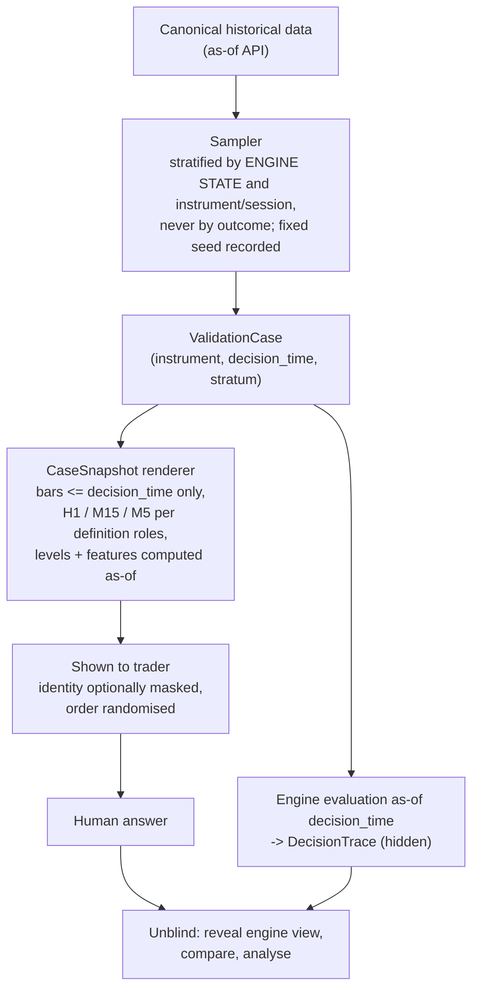

# Blind decision validation: "Would you take this trade?"

Purpose: measure how well the engine reproduces the trader's judgement **without
outcome leakage and without hindsight contamination**, and turn every disagreement into a
specific, traceable refinement — not into one agreement percentage.

## 1. Non-negotiable properties

1. **No future data.**  A case is rendered only from bars whose close ≤ `decision_time`.
   Enforced by the data service (an `as_of`-bounded API with no way to ask for later bars),
   not by the UI.
2. **No outcome.**  Cases are *sampled without regard to outcome*; nothing about P&L, hit/
   miss, or later structure is stored on the case or shown before answering.
3. **Blind to the engine** by default.  The trader answers **before** seeing the engine's
   view, so the engine cannot anchor the answer.  An `ASSISTED` mode exists for teaching,
   and its answers are excluded from validation metrics.
4. **Sealed vs spent.**  Cases that were reviewed after answering (to refine rules) are
   *spent*; only sealed cases count as untouched validation (§6).
5. **Everything is immutable and timestamped**: the case, the snapshot, the answer, the
   engine decision, the trace.

## 2. Case construction

**Strata** (each with its own target count, so rare-but-important cases are not drowned):

| Stratum | Definition (from the engine's trace at `decision_time`) | Why |
|---|---|---|
| `ENGINE_YES` | a signal (DETERMINISTIC) / candidate awaiting review (HYBRID) | measures false positives |
| `NEAR_MISS_LATE` | rejected at a late stage (last 1–2 stages) | most informative disagreements |
| `NEAR_MISS_EARLY` | rejected at an early stage | tests whether early gates are too strict |
| `NOT_CANDIDATE_CONTEXT` | setup context partly present but no candidate | finds missed setups |
| `RANDOM_CONTROL` | uniformly random decision times | measures how often the human says YES when the engine sees nothing (prevalence) |
| `AUTHOR_EXAMPLE` | the trader's own anchored examples | **contaminated for metrics**; included only for sanity and always labelled |

`ValidationSet` is created with its sampling spec and seed, then **sealed**: its case list
cannot change.  Cases are drawn from partitions the author has not touched (`07_…` §4).

## 3. What the trader sees

* Multi-timeframe charts per the definition's `timeframes` roles (e.g. H1 context, M15
  structure, M5 trigger), each ending at `decision_time`, with the levels/zones the
  definition would use drawn **as-of**.
* A compact **fact panel**: instrument (optionally masked), session, ATR, spread, the
  candidate's proposed entry/stop/target geometry *if the question is about a specific
  candidate*.  For strata where the engine has no candidate, the question is "would you
  take a trade *here*, and in which direction?" (direction and levels are then part of the
  answer).
* Not shown until after answering: the engine's decision, stage results, reason codes,
  and — always — anything after `decision_time`.

**Answers:** `YES` · `NO` · `NEED_MORE_CONTEXT`, plus optional structured
`reason_codes` (a taxonomy that maps to primitives/parameters, e.g. `RETRACE_TOO_DEEP`,
`HTF_AGAINST`, `NO_CLEAR_LEVEL`), free text, `missing_information` (e.g. "need H4", "need
session", "need news"), and an optional annotation on the snapshot.

`NEED_MORE_CONTEXT` is **its own outcome**, never folded into `NO`.  Progressive
disclosure is allowed *only* within the as-of limit (e.g. show H4 as of `decision_time`);
each disclosure is logged, and the case then records both the **first-impression** answer
and the **informed** answer.  Requests for missing information are a feedback channel to
the primitive registry (a frequently requested "H4" means the definition needs that role).

## 4. Engine decision at the same time

From the engine's `DecisionTrace` (`05_…`) at `decision_time`, mapped to a small,
stable outcome set:

`ENGINE_YES` · `ENGINE_NO(stage, reason_code)` · `NOT_A_CANDIDATE` ·
`AWAITING_REVIEW` (HYBRID) · `ENGINE_ERROR` (insufficient data etc. — reported, never
counted as agreement).

## 5. Comparison and analysis (not one number)

The 2×2 in the request, extended with the outcomes that actually occur:

| Human \ Engine | ENGINE_YES | ENGINE_NO (by stage) | NOT_A_CANDIDATE |
|---|---|---|---|
| **YES** | agree | **missed by engine** — blame attributed to the failing stage/rule | **not surfaced** — a missing detector or context |
| **NO** | **engine false positive** — human reason codes | agree | agree |
| **NEED_MORE_CONTEXT** | information gap | information gap | information gap |

Reported per stratum, instrument and session, each with counts and Wilson confidence
intervals (small samples are shown as small):

* **Engine recall of human-YES** and **precision of ENGINE_YES against human-YES**;
* prevalence-aware agreement (Cohen's κ and prevalence/bias-adjusted κ) *as supporting
  numbers*, never the headline;
* the **NEED_MORE_CONTEXT rate** and top `missing_information` requests;
* **human consistency**: planted repeated cases (same market moment, re-rendered with
  different order/scale) → intra-rater agreement (V1 has one trader; inter-rater is not
  available and this is stated in every report);
* **disagreement analysis** (the point of the exercise).  **Case-level** detail (which
  case, which trace) is available only for the `VALIDATION_REFINEMENT` pool, whose cases
  are spent by being reviewed.  For the sealed `VALIDATION_UNTOUCHED` pool only
  **aggregate** attribution is shown (counts and margins per stage/rule, no case
  identities) until freeze, so the sealed pool cannot be used to tune rules:
  * *blame table*: for human-YES/engine-NO cases, which stage and rule rejected them,
    ranked by count and by margin (`observed` vs `threshold` from the trace — a case
    missed by 2 % of a threshold is a different finding than one missed by 300 %);
  * *human-reason ↔ rule map*: for engine-YES/human-NO cases, which `reason_codes` co-occur
    → candidate new rule or new primitive;
  * *clusters*: disagreements grouped by feature values (session, volatility, HTF state)
    to expose systematic gaps;
  * *threshold sensitivity*: how many disagreements would flip under ± parameter changes
    — **computed on the current authoring partitions only**, never on sealed ones;
  * *unexplained residue*: disagreements no stage/reason explains (points to a missing
    primitive or a genuinely discretionary element → candidate `review_gate`).

**Outcome-linked analysis** (did the trades the trader liked make money?) is a *separate,
later* step, allowed only on untouched sets **after** the version is frozen (`07_…`).  It
is deliberately not part of validation so that rule changes are never tuned to P&L.

## 6. Leakage and contamination controls

| Risk | Control |
|---|---|
| future candles in a case | as-of data API; renderer has no handle to later bars; automated test: rendering with bars after `t` deleted is byte-identical |
| hindsight from the chart axis/scale | auto-scale only over visible bars; no "known-outcome" extents |
| memory of the market moment | optional masking of instrument/date; order randomised |
| engine anchoring the human | blind mode by default; answer stored before unblinding |
| refinement leaking into the "untouched" set | two case pools: **`VALIDATION_REFINEMENT`** (reviewable after answering; used to refine) and **`VALIDATION_UNTOUCHED`** (sealed; only aggregate results are visible until freeze) |
| reuse of a spent case | a **consumption ledger** records every exposure; a case reviewed for refinement can never again count as untouched for that strategy lineage |
| AI analyst learning from sealed cases | the analyst's tool API can read only `AUTHORING`/`DEVELOPMENT` partitions; sealed partitions are unreadable by construction |
| selection bias in what gets shown | stratified sampler with recorded seed; outcome never an input |
| repeated looks | each round draws **new** cases; number of rounds and looks recorded and displayed with the metrics |
| author examples counted as validation | `AUTHOR_EXAMPLE` stratum is excluded from headline metrics and labelled |

## 7. Promotion use

Validation results feed the `PromotionPolicy` (`01_…` §2, `07_…` §1.2): minimum per-stratum
counts, minimum recall/precision with confidence bounds, no dominant unexplained
disagreement cluster, minimum human consistency.  Thresholds are policy data, versioned,
and shown next to results; passing them is necessary, never sufficient — freezing still
requires an explicit human decision.
