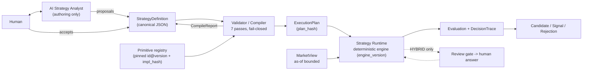
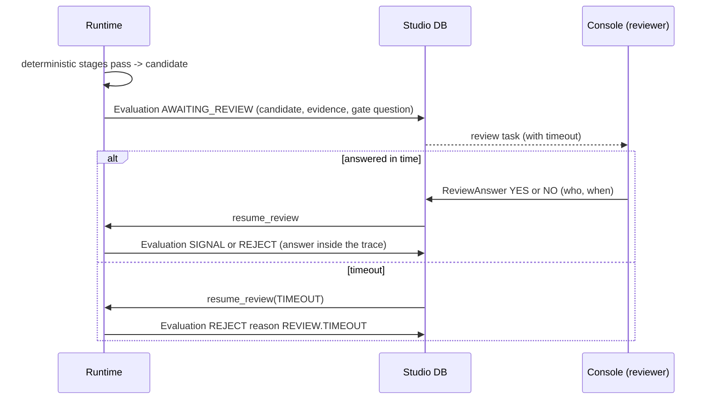

# Compiler, validator and runtime

## 1. Decision: compile to an ExecutionPlan, interpreted by a small deterministic engine

Three options were considered:

| Option | Verdict |
|---|---|
| **Interpret the YAML/JSON directly** each evaluation | rejected: validation is re-done or skipped at runtime, no place to prove lookahead-safety once, hard to pin behaviour |
| **Generate Python (or other code) from the definition** | rejected: executing generated code makes the audit surface unbounded, defeats hash-pinned reproducibility, and reintroduces "a strategy is arbitrary code" |
| **Compile to a typed `ExecutionPlan`, run it on a fixed engine** (**chosen**) | one place to validate and prove properties; plan is data (hashable, diffable, inspectable); the engine is small and versioned; the trace maps 1:1 to plan nodes |



The AI never appears on the right-hand side of the definition.  **Runtime has no network,
no model calls, no clock other than the supplied `as_of`, no randomness.**

## 2. ExecutionPlan

Produced by lowering a validated definition:

* **Feature graph**: primitives and derived values as a DAG in topological order, each
  node annotated with `role` (timeframe), `warmup`, `known_at`.
* **Stage machine**: for `SEQUENCE`, a table of stages with predecessor, window (bars of
  a role), selection rule, and the compiled predicate/event nodes.
* **Expression bytecode**: the tiny expression vocabulary of `01_…` §5 compiled to a
  flat, side-effect-free form.
* **Reason-code table** and explanation templates (from primitives and rules).
* **Pins**: every `id@version` + `impl_hash`, `engine_version`, `definition_hash`,
  `parameter_set_hash` ⇒ `plan_hash`.

`plan_hash` is stored on every Evaluation, so a decision can always be traced to the exact
plan that produced it.

## 3. Validation passes (all must succeed; any failure ⇒ **not compilable**)

| # | Pass | Rejects (compile error code) |
|---|---|---|
| 1 | **Schema & canonicalisation** | malformed document, YAML-1.1 implicit booleans, unknown fields (`COMPILE.SCHEMA`) |
| 2 | **Resolution** | unknown primitive (`COMPILE.UNKNOWN_PRIMITIVE`), version not present or `WITHDRAWN`/`EXPERIMENTAL` where not allowed (`COMPILE.INCOMPATIBLE_PRIMITIVE_VERSION`), undefined `$param`/`s.`/`f.`/`lv.`/`d.` reference (`COMPILE.UNDEFINED_VARIABLE`), unknown built-in function |
| 3 | **Types & units** | price vs ratio vs ATR-multiple mismatches, wrong output field, wrong port type (`COMPILE.TYPE`) |
| 4 | **Timeframes & data** | role bound to no timeframe, primitive not allowed on that timeframe, `data_requirements` below primitive warm-up (`COMPILE.MISSING_TIMEFRAME`, `COMPILE.INSUFFICIENT_WARMUP`) |
| 5 | **Parameters & consistency** | default outside bounds, `min > max`, fraction ≥ 1, non-positive window, stop on the wrong side of entry (interval reasoning on same-variable constraints), rule that can never be satisfiable, two rules that contradict (`COMPILE.IMPOSSIBLE_PARAMETER`, `COMPILE.CONTRADICTORY_RULE`) |
| 6 | **Causality (lookahead)** | any node whose inputs are not knowable at the evaluation's `decision_time` (§4); references to later stages; outcome-label primitives in a decision path (`COMPILE.LOOKAHEAD`) |
| 7 | **State machine & policy** | unreachable stage, no terminal reason for a window expiry, cyclic `after`, invalid invalidation scope, review gate that is not fail-closed, review gate in a DETERMINISTIC definition, missing review gate in HYBRID, signal-emitting mode without stop/target/exits, RESEARCH_ONLY reaching a signal (`COMPILE.INVALID_STATE_TRANSITION`, `COMPILE.UNSUPPORTED_DISCRETIONARY`, `COMPILE.MODE_VIOLATION`) |

Additional dynamic checks run in CI for every primitive and every frozen plan
(`07_…`): the **truncation-invariance** property test (`02_…` §4) applied to the whole
plan on a data corpus — evaluate on `bars[:t]` and on the full series restricted to `t`;
outputs at `t` must be byte-identical.  Static analysis proves the *definition* respects
`known_at`; the dynamic test proves the *implementations* do.

**Fail-closed** is uniform: a definition that cannot be proven safe does not compile; a
runtime that meets missing data yields `UNKNOWN` stages and `outcome = ERROR` (never a
signal); a pin mismatch stops the runtime at start; a review gate that times out rejects.

### Lookahead analysis

Every node has a `known_at` derived from its primitive (`02_…` §1).  A stage's
`event_time` is the `known_at` of the event it detects.  The plan is safe iff for every
node *n* used to decide at `decision_time` *T*: `known_at(n) ≤ T`, and every stage's
`event_time ≥` its predecessor's.  Consequently:

* a **confirmation-lag** primitive (swing pivots) is usable at *T* only if its confirming
  bar closed by *T* — the same rule `confirmed_swings` enforces by hand today;
* a **sequence-completion** stage (Liquidity Displacement's "displacement within 5 bars
  after the sweep") is legal because the sequence's decision time is the *last* stage's
  event time;
* an **outcome-label** primitive (`measure_retracement`'s future-path label) is illegal
  in a decision path.

## 4. Runtime interface

```python
class StrategyRuntime(Protocol):               # sketch; not implemented
    strategy_version_id: str
    def data_requirements(self) -> DataRequirements: ...
    def initial_state(self) -> RuntimeState: ...
    def on_bar_close(self, view: MarketView, state: RuntimeState) -> tuple[list[Evaluation], RuntimeState]: ...
    def resume_review(self, review: ReviewAnswer, view: MarketView, state: RuntimeState) -> tuple[list[Evaluation], RuntimeState]: ...
```

* **`MarketView`** is the only data handle: `bars(role, n)`, `quote()`, `instrument()`, all
  **bounded by `as_of`**.  There is no method that can return a later bar.  It is backed
  by the `MarketDataProvider` abstraction (ADR-0001 D7) — the runtime, and Strategy Studio
  as a whole, know nothing about MT5, a broker or an account.
* **Cadence:** evaluated on each closed bar of the trigger role, per instrument and per
  evaluated direction.
* **State** is the set of *open sequences* (stage progress, anchors).  A new first-stage
  event spawns an instance; instances expire by their windows; instances are deduplicated
  by `(direction, anchor_time)`.
* **State is a cache, not the source of truth.**  It is a pure function of the bars within
  `max(lookback) + Σ windows`, so after a restart it is **rebuilt by replay** and must
  equal what was persisted.  (The Context runner's persisted JSON state, by contrast,
  cannot be rebuilt from bars — a reproducibility gap this removes.)
* **One code path for live, forward and backtest.**  Backtest = the same runtime advanced
  bar by bar over history.  Today the forward runners and the research scripts implement
  detection separately, so a backtest can disagree with live; this removes the class.
* **Reference trade simulation is separate.**  Fills, stop/target hits, MFE/MAE and
  R-accounting (currently embedded in `context…forward._process_bar` and
  `paper_engine.PaperEngine`) become a `ReferenceTradeEngine` consuming
  `(EntrySignal, MarketView)` — it is what turns a signal into a `ClosedTrade` for
  evidence (ADR-0001 §performance) and is shared by every strategy.

### HYBRID execution



The human answer becomes part of the trace and of the evidence: a HYBRID strategy's
performance is evidence of *system plus human*, labelled `discretionary_confirmation`
so it can never be presented as autonomous performance.

## 5. Engine versioning

The engine (evaluator semantics: window counting, `select: FIRST`, tie-breaking,
numeric rounding, short-circuiting, reason precedence) has its own **`engine_version`**,
pinned by every StrategyVersion.  A change that alters any evaluation is a new engine
version; old versions keep running on the old engine build (or on a build that passes the
**golden-trace corpus** for that version).  This is what "silently changing behaviour
underneath a frozen strategy" looks like for the runtime, and it is closed the same way as
for primitives.

## 6. Legacy strategies behind the same interface

`LegacyStrategyRuntime` adapters implement the same `StrategyRuntime`/`Evaluation`
contract over existing Python strategies **without modifying them** (their source hashes
are execution guards).  Details and what is/is not wrappable: `10_CURRENT_STRATEGY_MIGRATION.md`.
Both runtime kinds emit the same `Evaluation`; the trace fidelity level (`05_…` §6) says how
much detail each can supply.
