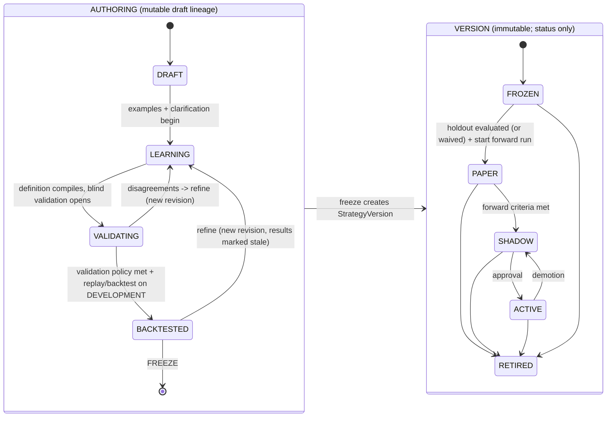

# Versions, promotion, evidence and dataset partitions

## 1. Two lifecycles, deliberately separate

The requested states mix two different things.  Treating "DRAFT" and "ACTIVE" as states
of one object is what would let a rule be edited after evidence exists.  So:

* the **authoring lifecycle** belongs to a mutable **draft lineage** (rules may change);
* the **version lifecycle** belongs to an **immutable `StrategyVersion`** (only its status
  advances).

### 1.1 Authoring states (on the draft lineage)

| State | Meaning | Permitted | Evidence produced |
|---|---|---|---|
| `DRAFT` | description only; may not compile | edit anything | none |
| `LEARNING` | examples + clarification; definition compiles or nearly | edit; run on `AUTHORING`/`DEVELOPMENT` partitions | `EXPLORATORY` only |
| `VALIDATING` | compiles; blind validation rounds in progress | edit only by returning to `LEARNING` (each edit stales validation results) | validation metrics (refinement vs untouched pools) |
| `BACKTESTED` | policy met on validation; replay/backtest run on `DEVELOPMENT` | freeze, or return to `LEARNING` | `BACKTEST/EXPLORATORY` |

Every edit creates a new immutable `draft_revision`; a definition's validation results
are keyed to its `definition_hash` and are **stale** for any other hash.

### 1.2 Version states (on the immutable StrategyVersion)

| State | Meaning | Produces evidence | Signals flow to |
|---|---|---|---|
| `FROZEN` | identity fixed; **one-shot holdout evaluation** performed here (§3) | `BACKTEST/UNTOUCHED_OOS` (once) | nobody |
| `PAPER` | runs forward on live data; reference trades only | `FORWARD` (clock starts at the freeze timestamp) | Studio/Console only |
| `SHADOW` | full pipeline dress rehearsal: EntrySignals enter orchestration in shadow mode | `FORWARD` | orchestration in shadow (no personal execution, no publication) |
| `ACTIVE` | may feed **active** streams | `FORWARD` (and later `LIVE`) | downstream per stream policy (V2 personal execution, later publication) |
| `RETIRED` | terminal; history retained | none | nobody |

Transitions and their guards (thresholds live in a versioned `PromotionPolicy`, not here):

| Transition | Guard (all recorded in the `PromotionRecord`) | Approver |
|---|---|---|
| draft → **FROZEN** | compiles (all 7 passes); every pin `APPROVED`; determinism + truncation tests green; golden-trace corpus recorded; validation policy met **on sealed cases**; exposure declaration complete; explicit human freeze decision | author + approver |
| FROZEN → PAPER | holdout `PASSED` or explicitly `WAIVED` with reason; reproducibility check (recompute stored traces) | approver |
| PAPER → SHADOW | minimum forward sample and duration; runtime `ERROR` rate ≤ policy; trace health (no unexplained `UNKNOWN`); reference-trade pipeline healthy | approver |
| SHADOW → ACTIVE | shadow parity (signals reach orchestration correctly, no divergence between recompute and recorded); risk/operational sign-off | approver (+ operator sign-off) |
| ACTIVE → SHADOW | demotion triggers: `WITHDRAWN` primitive, forward drift beyond policy, incident, manual | operator (any time) |
| any → RETIRED | manual; irreversible | approver |

Roles are `author`, `reviewer`, `approver`; V1 has one human, so the system still
records **separate decisions** for freeze and for each promotion (no implicit
auto-promotion), and the roles exist so they can be split later.

**Relation to ADR-0001 stream states.**  Version status answers *"may this rule set run
and where may its signals flow?"*; stream state (`DRAFT/SHADOW/LIVE_PERSONAL/PUBLISHING/
PAUSED/RETIRED`) answers *"what may consumers do with a stream's signals?"*.  A
`StreamBinding` role `PRIMARY` requires the bound version to be `ACTIVE`; `CHALLENGER`/
`SHADOW` bindings may be `PAPER` or `SHADOW`.  The names overlap on purpose (`SHADOW`
means "dress rehearsal, no effects") but are different state machines on different
objects.

## 2. What "freeze" creates

`StrategyVersion` (immutable) with a **freeze manifest** that generalises the existing
`freeze()` manifest of the Context strategy (which records `strategy_version`,
`freeze_timestamp`, `code_hash`, `configuration_hash`, `data_status_before_freeze:
EXPOSED_DEVELOPMENT_DATA`, `data_status_after_freeze: PROSPECTIVE_FORWARD_DATA`):

| Manifest field | Replaces / adds |
|---|---|
| `definition_hash`, `parameter_set_hash` | replaces `code_hash` + `configuration_hash` for declarative strategies |
| `primitive_pins[]` (`id@version`, `impl_hash`) | new: the "code" of a declarative strategy |
| `engine_version`, `plan_hash` | new |
| `freeze_timestamp` | as today; **starts the FORWARD clock** |
| `derived_from` (parent version or null) | lineage; evidence is **not** inherited |
| `exposure_declaration` | which partitions the authoring touched and for what (§4) — new |
| `promotion_policy_id` | thresholds in force |
| `legacy` (for `LEGACY_PYTHON` versions) | `{code_hash, decision_code_hash, config_hash}` **unchanged** |

Nothing in a version changes after freeze except its status (append-only
`version_status_history`).  Editing anything creates a new draft revision → new
definition/parameter set → new version with `derived_from`.

**Resolution guarantee:** every `EntrySignal`, `Evaluation`, `ClosedTrade` and
`PerformanceObservation` carries `strategy_version_id` (and `evaluation_id` where
relevant); from it the exact definition, parameter set, primitive versions +
implementation hashes, and engine version are recoverable.  A historical trade always
resolves.

## 3. Evidence integration

Studio produces, and only produces, evidence of these classes (ADR-0001 provenance):

| Evidence | Produced by | Class | Publishable |
|---|---|---|---|
| authoring-time replays/backtests, threshold sweeps | any draft revision on `DEVELOPMENT` | `BACKTEST` / `EXPLORATORY_DEVELOPMENT` | **never** |
| one-shot holdout evaluation | a `FROZEN` version on the sealed `HOLDOUT` | `BACKTEST` / `UNTOUCHED_OOS` | yes, labelled |
| forward paper / shadow / active | a version after freeze | `FORWARD` | yes |
| live | V2 personal execution | `LIVE` | yes (V2+) |
| results of a version derived from another's evidence | new version | `BACKTEST` / `POST_HOC_DERIVED` | labelled; never FORWARD/LIVE |

### How the four requested failure modes are prevented

| Failure | Mechanism |
|---|---|
| **Hindsight rule change reported as historical live** | evidence rows are keyed to `strategy_version_id`; FORWARD requires `event_time ≥ freeze_timestamp` of *that* version; a derived version starts a **new** FORWARD clock and cannot import its parent's FORWARD/LIVE rows (it may cite them as context); observations for hypothetical management are permanently BACKTEST (ADR-0001 H5) |
| **Validation examples leaking into authoring** | `partition_role` fixed at creation; AI analyst and author tools cannot read `VALIDATION_UNTOUCHED`/`HOLDOUT`; refinement pool is explicitly *spent* on review; consumption ledger is monotonic |
| **Parameter selection against final untouched data** | `HOLDOUT` is sealed, readable only by a `FROZEN` version, **once** (spend-once ledger); any tuning happens on `DEVELOPMENT`; tuning runs are logged with the number of configurations tried (multiple-testing disclosure) |
| **Silently changing primitive behaviour under a frozen strategy** | primitives immutable per version; pins include `impl_hash`; runtime verifies pins and engine version at start and refuses to run on mismatch; `WITHDRAWN` flags evidence rather than rewriting it |

## 4. Dataset partitions and provenance

Precedent already in the repository: `research-split-manifest-v1` (chronological
50/25/25 per symbol, frozen before search, "no final-period inspection for selection"),
walk-forward folds, and the liquidity sniper's ablation **controls A–D** (M5-only, M15,
M15+H1, H4+H1+M15) that measure the incremental value of each context layer.  Studio
generalises these into first-class objects.

| Partition | Created | Purpose | Author may read | AI analyst may read | Sealed |
|---|---|---|---|---|---|
| `AUTHORING` | with the session | anchored examples the trader uses to *write* rules | yes | yes | no |
| `DEVELOPMENT` | at strategy start (chronological window) | iterate rules, replays, threshold exploration | yes | yes | no |
| `VALIDATION_REFINEMENT` | per validation round | blind human decisions that **may** be reviewed and used to refine | after answering | after answering | no |
| `VALIDATION_UNTOUCHED` | per validation round | blind human decisions used for **promotion metrics** | aggregate only, until freeze | **no** | yes |
| `HOLDOUT` | before authoring begins (chronological, latest window) | one-shot final historical test of a frozen version | **no** | **no** | yes |
| `FORWARD` | by time (post-freeze) | prospective evidence | as it arrives | — | n/a (unseen by definition) |

Each `DatasetPartition` records: instruments, time ranges, sampling spec and seed,
`created_at`, `sealed_at`, and an **append-only exposure ledger** of `(actor/lineage,
purpose ∈ {TUNING, REVIEW, EVALUATION}, timestamp)`.

Rules:

1. **Exposure is monotonic.**  Once a partition was used for `TUNING` or `REVIEW` by a
   lineage, it can never again be "untouched" for that lineage.
2. **Access is purpose-declared and enforced in the data layer**, not by convention:
   sealed partitions require a `EVALUATION` purpose from an eligible frozen version, and
   the query itself writes the ledger entry.
3. **Spend-once holdout**: one `EVALUATION` per `(version, holdout)`; a waiver is
   possible but recorded with a reason and displayed with the evidence.
4. **Multiple-testing disclosure**: the number of versions/configurations evaluated
   against a holdout is stored and shown next to any holdout result.
5. **Controls are first-class**: a `ControlRun` evaluates the definition with context
   roles ablated, so the value added by each layer (e.g. H1 bias) is measured, not
   assumed.
6. Partition boundaries are chronological per instrument (no random splits across time),
   matching the existing manifest.

## 5. Status of legacy strategies in this model

Legacy strategies are `definition_kind = LEGACY_PYTHON` versions whose identity is their
existing hashes, carried **unchanged**.  Their historical evidence keeps its existing
classification (`PROSPECTIVE_PAPER` → `FORWARD`, etc.).  They gain traces via adapters
(`05_…` §6, `10_…`) but are never re-frozen by this design.
